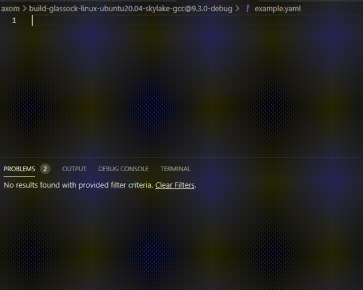

.. _inlet_quick_start_label:

Quick Start
===========

Inlet's workflow is broken into the four following steps:  

* Defining the schema of your input file and reading in the user-provided input file
* Verifying that the user-provided input file is valid
* Accessing the input data in your program
* *Optional* Generating documentation based on defined schema

.. _inlet_defining_schema_label:

Defining Schema
---------------

The first step in using Inlet is to define the schema of your input file.
Inlet defines an input file into two basic classes: Containers and Fields. Basically
Fields are individual values and Containers hold groups of Fields and Containers.

Define the schema by using the following functions, on either the main Inlet class, for
global Containers and Fields, or on individual Container instances, for Containers and Fields under that Container:

========================= ===================
Name                      Description
========================= ===================
addContainer              Adds a Container to the input file schema with the given name.
addBool                   Adds a boolean Field to the global or parent Container with the given name.
addDouble                 Adds a double Field to the global or parent Container with the given name.
addInt                    Adds a integer Field to the global or parent Container with the given name.
addString                 Adds a string Field to the global or parent Container with the given name.
========================= ===================

All possible Containers and Fields that are can be found in the input file must be defined
at this step.  The value of the Field is read and stored into the Sidre datastore when you call the appropriate
add function. Use the ``required`` class member function on the Container and Field class to indicate that
they have to present in the given input file. You can also set a default value to each field via the type-safe
``Field::defaultValue()`` member functions. Doing so will populate the corresponding Fields value
if the specific Field is not present in the input file. The following example shows these concepts:

.. literalinclude:: ../../examples/verification.cpp
   :start-after: _inlet_workflow_defining_schema_start
   :end-before: _inlet_workflow_defining_schema_end
   :language: C++

.. _inlet_verification_label:

Verification
------------

This step helps ensure that the given input file follows the rules expected by the code.  This should
be done after completely defining your schema, which also reads in the values in the input
file.  This allows you to access any other part of the user-provided input. These
rules are not verified until you call ``Inlet::verify()``.  Doing so will return true/false and
output SLIC warnings to indicate which Field or Container violated which rule.

As shown above, both Containers and Fields can be marked as ``required``. Fields have two additional
basic rules that can be enforced with the following ``Field`` class member functions:

========================= ===================
Name                      Description
========================= ===================
validValues               Indicates the Field can only be set to one of the given values.
range                     Indicates the Field can only be set to inclusively between two values.
========================= ===================

Inlet also provides functionality to write your own custom rules via callable lambda verifiers.
Fields and Containers can both register one lambda each via their ``registerVerifier()`` member functions.
The following example adds a custom verifier that simply verifies that the given ``dimensions`` field
match the length the given vector:

.. literalinclude:: ../../examples/verification.cpp
   :start-after: _inlet_workflow_verification_start
   :end-before: _inlet_workflow_verification_end
   :language: C++

.. note::  ``Inlet::getGlobalContainer()->registerVerifier()`` can be used to add a verifier to apply rules
  to the Fields at the global level.

For a full description of Inlet's verification rules, see :ref:`Verification <inlet_verification_page_label>`.

.. _inlet_accessing_data_label:

Accessing Data
--------------

After the input file has been read and verified by the previous steps, you can access the data by name
via ``Inlet::get()`` functions.  These functions are type-safe, fill the given variable with what is found,
and return a boolean whether the Field was present in the input file or had a default value it could fall
back on.  Variables, on the Inlet side, are used in a language-agnostic way and are then converted 
to the language-specific version inside of the appropriate ``Reader``. For example, Inlet refers to the
Lua variable ``vector={x=3}`` or ``vector.x`` as ``vector/x`` on all Inlet function calls.

For example, given the previous verificiation example, this access previously read values:

.. literalinclude:: ../../examples/verification.cpp
   :start-after: _inlet_workflow_accessing_data_start
   :end-before: _inlet_workflow_accessing_data_end
   :language: C++

.. _inlet_generating_documentation_label:

Generating Documentation
------------------------

We provide a slightly more complex but closer to a real world Inlet usage example of the usage of Inlet.
You can find that example in our repository `here <https://github.com/LLNL/axom/blob/develop/src/axom/inlet/examples/document_generation.cpp>`_.

Once you have defined your schema, call ``write()`` on your ``Inlet`` class, passing it a concrete
instantiation of a ``Writer`` class.

.. literalinclude:: ../../examples/documentation_generation.cpp
   :start-after: _inlet_documentation_generation_start
   :end-before: _inlet_documentation_generation_end
   :language: C++

We provided a basic Sphinx documentation writing class but you may want to customize it to your
own style.  The links below show the example output from the ``documentation_generation.cpp``,
``mfem_coefficient.cpp``, and ``nested_structs.cpp`` examples:

.. toctree::
   :maxdepth: 1

   example1_expected_documentation
   mfem_coefficient_expected_documentation
   nested_structs_expected_documentation

Inlet also provides a utility for generating a `JSON schema <https://json-schema.org/>`_ from your input file schema.
This allows for integration with text editors like Visual Studio Code, which allows you to associate a JSON schema
with an input file and subsequently provides autocompletion, linting, tooltips, and more.  VSCode and other editors
currently support verification of JSON and YAML input files with JSON schemas.

Using the same  ``documentation_generation.cpp`` example, the automatically generated schema can be used to assist
with input file writing:

