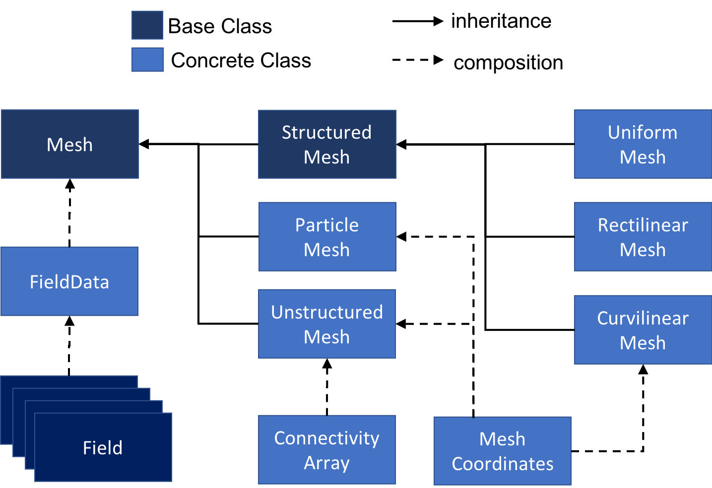
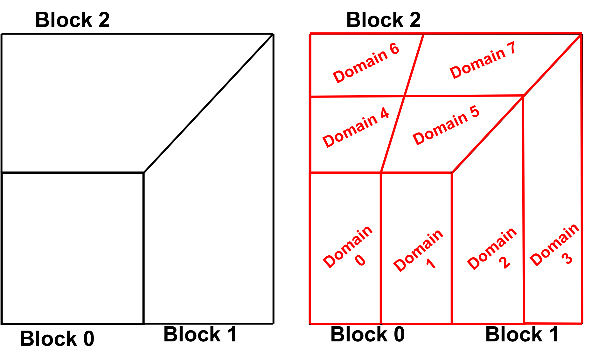
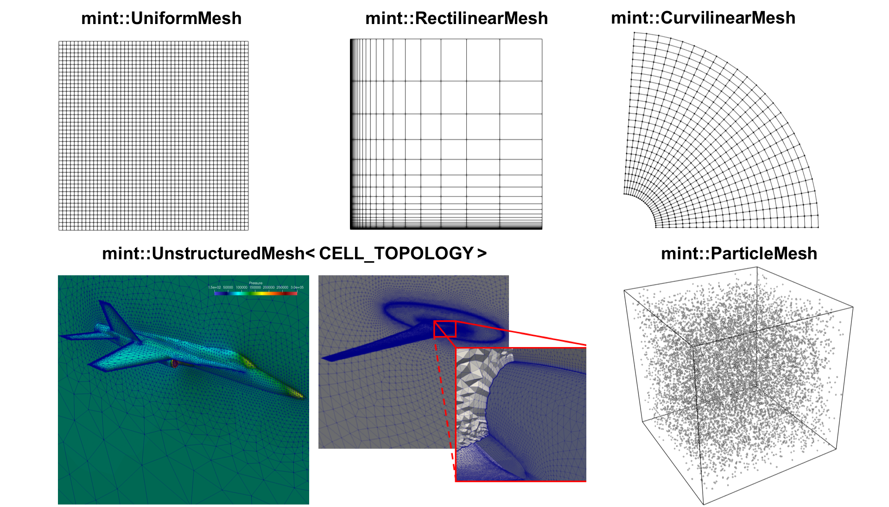

.. ## Copyright (c) 2017-2021, Lawrence Livermore National Security, LLC and
.. ## other Axom Project Developers. See the top-level LICENSE file for details.
.. ##
.. ## SPDX-License-Identifier: (BSD-3-Clause)

.. #############################################################################
..  COMPONENT ARCHITECTURE
.. #############################################################################

.. _Architecture:

Component Architecture
-----------------------

This section links the core concepts, presented in the
:ref:`MeshRepresentation` and :ref:`MeshTypes` sections, to the underlying
implementation of the Mint *mesh data model*.
The :ref:`Architecture` of Mint's *mesh data model* consists of a class
hierarchy that follows directly the taxonomy of :ref:`MeshTypes` discussed
earlier. The constituent classes of the *mesh data model* are combined
using a mix of class *inheritance* and *composition*, as illustrated in
the class diagram depicted in :numref:`figs/classDiagram`.

.. _figs/classDiagram:

   :ref:`Architecture` of the Mint *mesh data model*, depicting the
   core mesh classes and the inter-relationship between them.
   The solid arrows indicate an *inheritance* relationship, while the dashed
   arrows indicate an *ownership* relationship between two classes.

At the top level, :ref:`TheMeshBaseClass`, implemented in ``mint::Mesh``,
stores common mesh attributes and fields. Moreover, it defines a unified
Application Programming Interface (API) for the various :ref:`MeshTypes`. See the
`Mint Doxygen API Documentation`_ for a complete specification of
the API. The :ref:`ConcreteMeshClasses` extend :ref:`TheMeshBaseClass`
and implement the :ref:`MeshRepresentation` for each of the
:ref:`MeshTypes` respectively. The ``mint::ConnectivityArray`` and
``mint::MeshCoordinates`` classes, are the two main internal support classes
that underpin the implementation of the :ref:`ConcreteMeshClasses` and facilitate
the representation of the constituent :ref:`Geometry` and :ref:`Topology`
of the mesh.

.. note::

    All Mint classes and functions are encapsulated in the ``axom::mint``
    namespace.

.. _TheMeshBaseClass:

The Mesh Base Class
^^^^^^^^^^^^^^^^^^^^

:ref:`TheMeshBaseClass` stores common attributes associated with a mesh.
Irrespective of the mesh type, a Mint mesh has two identifiers. The mesh
*BlockID* and mesh *DomainID*, which are assigned by domain decomposition.
Notably, the computational domain can consist of one or more blocks, which are
usually defined by the user or application. Each block is then subsequently
partitioned to multiple domains that are distributed across processing units
for parallel computation. For example, a sample block and domain decomposition
is depicted in :numref:`figs/decomp`. Each of the constituent domains is
represented by a corresponding ``mint::Mesh`` instance, which in aggregate
define the entire problem domain.

.. _figs/decomp:

   Sample block & domain decomposition of the computational domain.
   The computational domain is defined using :math:`3` blocks (left). Each block
   is further partitioned into two or more domains(right). A ``mint::Mesh``
   instance represents one of the constituent domains used to define the
   overall problem domain.

.. note::

  A ``mint::Mesh`` instance provides the means to store the mesh
  *BlockID* and *DomainID* respectively. However, Mint does not impose a
  numbering or partitioning scheme. Assignment of the *BlockID* and *DomainID*
  is handled at the application level and by the underlying mesh partitioner
  that is being employed.

Moreover, each ``mint::Mesh`` instance has associated :ref:`MeshFieldData`,
represented by  the ``mint::FieldData`` class. Each of the constituent
topological mesh entities, i.e. the :ref:`Cells`, :ref:`Faces` and :ref:`Nodes`
comprising the mesh, has a handle to a corresponding ``mint::FieldData``
instance. The ``mint::FieldData`` object essentialy provides a container to
store and manage a collection of fields, defined over the corresponding mesh
entity.

.. warning::

   Since a :ref:`ParticleMesh` is defined by a set of :ref:`Nodes`, it
   can only store :ref:`FieldData` at its constituent :ref:`Nodes`. All
   other supported :ref:`MeshTypes` can have :ref:`FieldData` associated with
   their constituent :ref:`Cells`, :ref:`Faces` and :ref:`Nodes`.

.. _MeshFieldData:

Mesh Field Data
^^^^^^^^^^^^^^^^^

A ``mint::FieldData`` instance typically stores multiple fields.
Each field is represented by an instance of a ``mint::Field`` object
and defines a named numerical quantity, such as *mass*, *velocity*,
*temperature*, etc., defined on a given mesh. Moreover, a field can be either
*single-component*, i.e. a *scalar* quantity, or, *multi-component*, e.g.
a *vector* or *tensor* quantity. Typically, a field represents some physical
quantity that is being modeled, or, an auxiliary quantity that is needed to
perform a particular calculation.

In addition, each ``mint::Field`` instance can be of different data type.
The ``mint::FieldData`` object can store different types of fields.
For example, *floating point* quantities i.e., ``float`` or ``double``,
as well as, *integral* quantities, i.e. ``int32_t``, ``int64_t``, etc. This is
accomplished using a combination of C++ templates and *inheritance*. The
``mint::Field`` object is an abstract base class that defines a type-agnostic
interface to encapsulate a field. Since ``mint::Field`` is an abstract
base class, it is not instantiated directly. Instead, all fields are created by
instantiating a ``mint::FieldVariable`` object, a class templated on data type,
that derives from the ``mint::Field`` base class. For example, the code snippet
below illustrates how fields of different type can be instantiated.

.. code-block:: cpp

    ...

    // create a scalar field to store mass as a single precision quantity
    mint::Field* mass = new mint::FieldVariable< float >( "mass", size );

    // create a velocity vector field as a double precision floating point quantity
    constexpr int NUM_COMPONENTS = 3;
    mint::Field* vel = new mint::FieldVariable< double >( "vel", size, NUM_COMPONENTS );

    ...

Generally, in application code, it is not necessary to create fields using the
``mint::FieldVariable`` class directly. The ``mint::Mesh`` object provides
convenience methods for adding, removing and accessing fields on a mesh.
Consult the :ref:`sections/tutorial` for more details on
:ref:`workingWithFields` on a Mesh.

.. _ConcreteMeshClasses:

Concrete Mesh Classes
^^^^^^^^^^^^^^^^^^^^^^

The :ref:`ConcreteMeshClasses`, extend :ref:`TheMeshBaseClass` and implement
the underlying :ref:`MeshRepresentation` of the various :ref:`MeshTypes`,
depicted in :numref:`figs/meshtypes`.

.. _figs/meshtypes:

   Depiction of the supported :ref:`MeshTypes` with labels of the corresponding
   Mint class used for the underlying :ref:`MeshRepresentation`.

Structured Mesh
""""""""""""""""

All :ref:`StructuredMesh` types in Mint can be represented by an instance of
the ``mint::StructuredMesh`` class, which derives directly from :ref:`TheMeshBaseClass`,
``mint::Mesh``. The ``mint::StructuredMesh`` class is also an abstract base class
that encapsulates the implementation of the *implicit*, *ordered* and *regular*
:ref:`Topology` that is common to all :ref:`StructuredMesh` types. The
distinguishing characteristic of the different :ref:`StructuredMesh` types is
the representation of the constituent :ref:`Geometry`. Mint implements each of
the different :ref:`StructuredMesh` types by a corresponding class, which
derives directly from ``mint::StructuredMesh`` and thereby inherit its
implicit :ref:`Topology` representation.

Consequently, support for the :ref:`UniformMesh` is implemented in
``mint::UniformMesh``. The :ref:`Geometry` of a :ref:`UniformMesh` is
*implicit*, given by two attributes, the mesh *origin* and *spacing*.
Consequently, the ``mint::UniformMesh`` consists of two data members to
store the *origin* and *spacing* of  the :ref:`UniformMesh` and provides
functionality for evaluating the spatial coordinates of a node given its
corresponding IJK lattice coordinates.

Similarly, support for the :ref:`RectilinearMesh` is implemented in
``mint::RectilinearMesh``. The constituent :ref:`Geometry` representation of
the :ref:`RectilinearMesh` is *semi-implicit*. The spatial coordinates
of the :ref:`Nodes` along each axis are specified explicitly while the
coordinates of the interior :ref:`Nodes` are evaluated by taking the
*Cartesian* product of the corresponding coordinate along each coordinate
axis. The ``mint::RectilinearMesh`` consists of seperate arrays to
store the coordinates along each axis for the *semi-implicit* :ref:`Geometry`
representation of the :ref:`RectilinearMesh`.

Support for the :ref:`CurvilinearMesh` is implemented by the
``mint::CurvilinearMesh`` class. The :ref:`CurvilinearMesh` requires *explicit*
representation of its constituent :ref:`Geometry`. The ``mint::CurvilinearMesh``
makes use of the ``mint::MeshCoordinates`` class to explicitly represent the
spatial coordinates associated with the constituent :ref:`Nodes` of the mesh.

Unstructured Mesh
""""""""""""""""""

Mint's :ref:`UnstructuredMesh` representation is provided by the
``mint::UnstructuredMesh`` class, which derives directly from the
:ref:`TheMeshBaseClass`, ``mint::Mesh``. An :ref:`UnstructuredMesh` has both
*explicit* :ref:`Geometry` and :ref:`Topology`. As with the
``mint::CurvilinearMesh`` class, the *explicit* :ref:`Geometry` representation
of the :ref:`UnstructuredMesh` employs the ``mint::MeshCoordinates``. The
constituent :ref:`Topology` is handled by the ``mint::ConnectivityArray``,
which is employed for the representation of all the topological
:ref:`Connectivity` information, i.e. *cell-to-node*, *face-to-node*,
*face-to-cell*, etc.

.. note::

  Upon construction, a ``mint::UnstructuredMesh`` instance consists of the
  *minimum sufficient* representation for an :ref:`UnstructuredMesh` comprised
  of the *cell-to-node* :ref:`Connectivity` information.
  Applications that require face :ref:`Connectivity` information must
  explicitly call the ``initializeFaceConnectivity()`` method on the
  corresponding :ref:`UnstructuredMesh` object.

Depending on the cell :ref:`Topology` being employed, an :ref:`UnstructuredMesh`
can be classified as either a :ref:`SingleCellTopology` :ref:`UnstructuredMesh`
or a :ref:`MixedCellTopology` :ref:`UnstructuredMesh`. To accomodate these
two different representations, the ``mint::UnstructuredMesh`` class, is templated
on ``CELL_TOPOLOGY``. Internally, the template argument is used to indicate
the type of ``mint::ConnectivityArray`` to use, i.e. whether,
*stride access addressing* or *indirect addressing* is used, for
:ref:`SingleCellTopology` and :ref:`MixedCellTopology` respectively.

Particle Mesh
""""""""""""""

Support for the :ref:`ParticleMesh` representation is implemented in
``mint::ParticleMesh``, which derives directly from :ref:`TheMeshBaseClass`,
``mint::Mesh``. A :ref:`ParticleMesh` discretizes the domain by a set
of particles, which correspond to the constituent :ref:`Nodes` of the mesh.
The :ref:`Nodes` of a :ref:`ParticleMesh` can also be thought of as :ref:`Cells`,
however, since this information is trivially obtrained, there is not need
to be stored explicitly, e.g. using a :ref:`SingleCellTopology`
:ref:`UnstructuredMesh` representation. Consequently, the :ref:`ParticleMesh`
representation consists of *explicit* :ref:`Geometry` and *implicit*
:ref:`Topology`. As with the ``mint::CurvilinearMesh`` and
``mint::UnstructuredMesh``, the explicit :ref:`Geometry` of the
:ref:`ParticleMesh` is represented by employing the ``mint::MeshCoordinates``
as an internal class member.

The following code snippet provides a simple examples illustrating how to
construct and operate on a :ref:`ParticleMesh`.

.. literalinclude:: ../../../examples/mint_particle_mesh.cpp
   :language: C++
   :linenos:

.. #############################################################################
..  MESH STORAGE
.. #############################################################################

.. _MeshStorageManagement:

Mesh Storage Management
^^^^^^^^^^^^^^^^^^^^^^^

Mint provides a flexible :ref:`MeshStorageManagement` system that can
optionally interoperate with `Sidre`_ as the underlying, in-memory,
hierarchichal datastore. This enables Mint to natively conform to
`Conduit`_'s `Blueprint`_ protocol for representing a computational mesh in
memory and thereby, facilitate with the integration across different physics
packages.

Mint's :ref:`MeshStorageManagement` substrate supports three storage options.
The applicable operations and ownership state of each storage option are
summarized in the table below, followed by a brief description of each option.

.. |check| unicode:: U+2713

.. raw:: html

      

+------------------------+---------+------------+--------------+
|                        | Modify  | Reallocate | Ownership    |
|                        |         |            |              |
+========================+=========+============+==============+
| :ref:`NativeStorage`   | |check| |  |check|   | Mint         |
+------------------------+---------+------------+--------------+
| :ref:`ExternalStorage` | |check| |            | Application  |
+------------------------+---------+------------+--------------+
| :ref:`SidreStorage`    | |check| |  |check|   |  `Sidre`_    |
+------------------------+---------+------------+--------------+

.. raw:: html

      

.. _NativeStorage:

Native Storage
"""""""""""""""

A Mint object using :ref:`NativeStorage` owns all memory and associated data.
The data can be modified and the associated memory space can be reallocated
to grow and shrink as needed. However, once the Mint object goes out-of-scope,
all data is deleted and the memory is returned to the system.

See the :ref:`sections/tutorial` for more information and a set of concrete
examples on how to create a mesh using :ref:`NativeStorage`.

.. _ExternalStorage:

External Storage
"""""""""""""""""

A Mint object using :ref:`ExternalStorage` has a pointer to a supplied
application buffer. In this case, the data can be modified, but the application
maintains ownership of the underlying memory. Consequently, the memory space
cannot be reallocated and once the Mint object goes out-of-scope, the data is not
deleted. The data remains persistent in the application buffers until it is
deleted by the application.

See the :ref:`sections/tutorial` for more information on
:ref:`usingExternalStorage`.

.. _SidreStorage:

Sidre Storage
""""""""""""""

A Mint object using :ref:`SidreStorage` is associated with a `Sidre`_ Group
object which has owneship of the mesh data. In this case the data can be
modified and the associated memory can be reallocated to grow and shrink as
needed. However, when the Mint object goes out-of-scope, the data remains
persistent in `Sidre`_.

See the :ref:`sections/tutorial` for more information and a set of concrete
examples on :ref:`usingSidre`.

.. #############################################################################
..  CITATIONS
.. #############################################################################

.. include:: citations.rst
