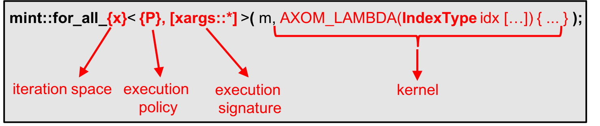

.. ## Copyright (c) 2017-2019, Lawrence Livermore National Security, LLC and
.. ## other Axom Project Developers. See the top-level COPYRIGHT file for details.
.. ##
.. ## SPDX-License-Identifier: (BSD-3-Clause)

.. _sections/execution_model:

Execution Model
----------------

Mint provides a mesh-aware :ref:`sections/execution_model`, that
is based on the `RAJA`_ programming model abstraction layer, enabling the
implementation of computational kernels that are born *parallel* and *portable*
to emerging architectures.

.. note::
   To utilize NVIDIA GPUs, using the `RAJA`_ CUDA backend, Axom needs to be
   compiled with CUDA support and linked to a CUDA-enabled `RAJA`_ library.
   Consult the `Axom Quick Start Guide`_ for more information.

The execution model consists of a set of templated functions that accept
two arguments:

#. A pointer to a mesh object corresponding to one of the supported
   :ref:`MeshTypes`.

#. The *kernel* that defines the operations on the supplied mesh, which, is
   usually specified by a C++11 `Lambda Expression`.

.. note::

  Instead of a C++11 `Lambda Expression`_ a C++ functor may also be used
  to encapsulate a kernel. However, in our experience, using C++11 functors,
  usually requires more boiler plate code, which reduces readability and may
  potentially have a negative impact on performance.

The :ref:`sections/execution_model` provides :ref:`NodeTraversalFunctions`,
:ref:`CellTraversalFunctions` and :ref:`FaceTraversalFunctions` to iterate and
operate on the constituent :ref:`Nodes`, :ref:`Cells` and :ref:`Faces` of the
mesh respectively. The general form of these functions is shown
in :numref:`figs/execModel`.

.. _figs/execModel:

   General form of the constituent templated functions of the
   :ref:`sections/execution_model`

As shown in :numref:`figs/execModel`, the key elements of the functions
that comprise the :ref:`sections/execution_model` are:

* **The Iteration Space:** Indicated by the function suffix, used to
  specify the mesh entities to traverse and operate upon, e.g., the
  :ref:`Nodes`, :ref:`Cells` or :ref:`Faces` of the mesh.

* The :ref:`executionPolicy`: Specified as as the first, *required*, template
  argument to the constituent functions of the :ref:`sections/execution_model`.
  The :ref:`executionPolicy` specifies *where* and *how* the kernel is executed.

* The :ref:`executionSignature`: Specified by a second, *optional*, template
  argument to the constituent functions of the :ref:`sections/execution_model`.
  The :ref:`executionSignature` specifies the type of arguments supplied to
  a given *kernel*.

* **The Kernel:** Supplied as an argument to the constituent functions of the
  :ref:`sections/execution_model`. It defines the body of operations
  performed on the supplied mesh.

See the :ref:`sections/tutorial` for code snippets that illustrate how to use
the :ref:`NodeTraversalFunctions`, :ref:`CellTraversalFunctions` and
:ref:`FaceTraversalFunctions` of the :ref:`sections/execution_model`.

.. _executionPolicy:

Execution Policy
^^^^^^^^^^^^^^^^^

The :ref:`ExecutionPolicy` is specifed as the first template argument and is
required by all of the constituent functions of the
:ref:`sections/execution_model`. Mint defines a set of high-level execution
policies, summarized in the table below.

+-------------------------+------------------------+---------------------------------+
| Execution Policy        |     Requirements       |          Description            |
|                         |                        |                                 |
+=========================+========================+=================================+
| **serial**              |    None.               | Serial execution on             |
|                         |                        | the CPU.                        |
+-------------------------+------------------------+---------------------------------+
| **parallel_cpu**        |  `RAJA`_ + OpenMP      | Parallel execution on           |
|                         |                        | the CPU with OpenMP.            |
+-------------------------+------------------------+---------------------------------+
| **parallel_gpu**        |  `RAJA`_ + CUDA        | Parallel execution on           |
|                         |                        | CUDA-enabled GPUs.              |
+-------------------------+------------------------+---------------------------------+
| **parallel_gpu_async**  |  `RAJA`_ + CUDA        | Asynchronous parallel           |
|                         |                        | execution on CUDA-enabled GPUs. |
+-------------------------+------------------------+---------------------------------+

These policies are mapped to corresponding `RAJA`_ execution policies internally.

.. note::

   Mint's execution policies are encapsulated in the ``axom::mint::policy::``
   namespace.

.. _executionSignature:

Execution Signature
^^^^^^^^^^^^^^^^^^^^

The :ref:`executionSignature` is specified as the second, *optional* template
argument to the constituent functions of the :ref:`sections/execution_model`.
The :ref:`executionSignature` indicates the list of arguments that are
supplied to the user-specified kernel.

.. note::

    If not specified, the default :ref:`executionSignature` to is set to
    ``mint::xargs::index``, which, indicates that the supplied kernel takes
    a single argument that corresponds to the index of the corresponding
    iteration space, i.e, the loop index.

The list of available :ref:`executionSignature` options is summarized below:

* ``mint::xargs::index``
   * Default :ref:`ExecutionSignature` to all functions of the
     :ref:`sections/execution_model`
   * Indicates that the supplied kernel takes a single argument that corresponds
     to the index of the iteration space, i.e., the loop index.

* ``mint::xargs::ij``/``mint::xargs::ijk``
   * Applicable only with a :ref:`StructuredMesh`.
   * Used with :ref:`NodeTraversalFunctions` (``mint::for_all_nodes()``)
     and :ref:`CellTraversalFunctions` (``mint::for_all_cells()``).
   * Indicates that the supplied kernel takes the corresonding :math:`(i,j)`
     or :math:`(i,j,k)` indices, in 2D or 3D respectively, as additional arguments.

* ``mint::xargs::x``/``mint::xargs::xy``/``mint::xargs::xyz``
   * Used with :ref:`NodeTraversalFunctions` (``mint::for_all_nodes()``).
   * Indicates that the supplied kernel takes the corresponding nodal
     coordinates, :math:`x` in 1D, :math:`(x,y)` in 2D and :math:`(x,y,z)`
     in 3D, in addition to the corresponding node index, ``nodeIdx``.

* ``mint::xargs::nodeids``
   * Used with :ref:`CellTraversalFunctions` (``mint::for_all_cells()``)
     and :ref:`FaceTraversalFunctions` (``mint::for_all_faces()``).
   * Indicates that the specified kernel is supplied the constituent node IDs
     as an array argument to the kernel.

* ``mint::xargs::coords``
   * Used with :ref:`CellTraversalFunctions` (``mint::for_all_cells()``).
     and :ref:`FaceTraversalFunctions` (``mint::for_all_faces()``)
   * Indicates that the specified kernel is supplied the constituent
     node IDs and corresponding coordinates as arguments to the kernel.

* ``mint::xargs::faceids``
   * Used with the :ref:`CellTraversalFunctions` (``mint::for_all_cells()``).
   * Indicates that the specified kernel is supplied an array consisting of
     the constituent cell face IDs as an additional argument.

* ``mint::xargs::cellids``
   * Used with the :ref:`FaceTraversalFunctions` (``mint::for_all_faces()``).
   * Indicates that the specified kernel is supplied the ID of the two abutting
     :ref:`Cells` to the given. By conventions, tor *external* *boundary*
     :ref:`Faces`, that are bound to a single cell, the second cell is set
     to :math:`-1`.

.. #############################################################################
..  CITATIONS
.. #############################################################################

.. include:: citations.rst
