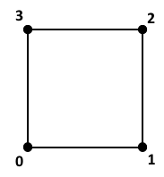
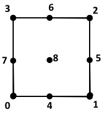
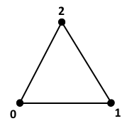
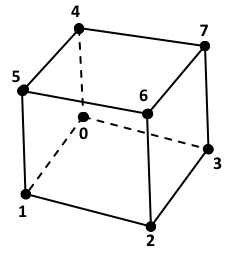
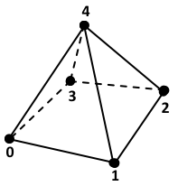
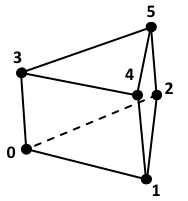

.. ## Copyright (c) 2017-2021, Lawrence Livermore National Security, LLC and
.. ## other Axom Project Developers. See the top-level LICENSE file for details.
.. ##
.. ## SPDX-License-Identifier: (BSD-3-Clause)

.. _sections/fem:

Finite Elements
-----------------

The Finite Element Method (FEM) is a widely used numerical technique, employed
for the solution of *partial differential equations* (PDEs), arising in
*structural engineering analysis* and more broadly in the field of
*continuum mechanics*.

However, due to their generality and mathematically sound foundation,
:ref:`sections/fem`, are often employed in the implementation of other numerical
schemes and for various computational operators, e.g. interpolation,
integration, etc.

Mint provides basic support for :ref:`sections/fem` that consists:

#. :ref:`LagrangeBasis` *shape functions* for commonly employed :ref:`CellTypes`
#. Corresponding :ref:`Quadratures` (under development)
#. Routines for forward/inverse :ref:`IsoparametricMapping`, and
#. Infrastructure to facilitate adding *shape functions* for
   new :ref:`CellTypes`, as well as, to :ref:`AddABasis`.

This functionality is collectively exposed to the application through the
``mint::FiniteElement`` class. Concrete examples illustrating the usage of the
``mint::FiniteElement`` class within an application code are provided in the
:ref:`femTutorial` tutorial section.

A *Finite Element Basis* consists of a family of *shape functions*
corresponding to different :ref:`CellTypes`. Mint currently supports
Lagrange isoparametric :ref:`sections/fem`.

.. _LagrangeBasis:

Lagrange Basis
^^^^^^^^^^^^^^^

The Lagrange basis consists of :ref:`CellTypes` whose *shape functions* are
formed from products of the one-dimensional Lagrange polynomial. This
section provides a summary of supported :ref:`LagrangeBasis` :ref:`CellTypes`,
their associated *shape functions*, and summarize the process to
:ref:`AddALagrangeElement`.

.. note::

  The shape functions of **all** Lagrange :ref:`Cells` in Mint, follow the
  `CGNS Numbering Conventions`_ and are defined within a reference coordinate
  system, on the closed interval :math:`\hat{\xi} \in [0,1]`.

QUAD: *Linear Quadrilateral*
""""""""""""""""""""""""""""

.. math::
   :nowrap:

   \begin{array}{r c l c l}
     N_0 &=& (1 - \xi) &\times& (1 - \eta)  \\
     N_1 &=& \xi       &\times& (1 - \eta)  \\
     N_2 &=& \xi       &\times& \eta        \\
     N_3 &=& (1 - \xi) &\times& \eta        \\
   \end{array}

QUAD9: *Quadratic Quadrilateral*
"""""""""""""""""""""""""""""""""

.. math::
  :nowrap:

   \begin{array}{r c l c l}
     N_0 &=&  (\xi-1)( 2\xi -1) &\times& (\eta-1)(2\eta-1) \\
     N_1 &=&  \xi(2\xi-1)       &\times& (\eta-1)(2\eta-1) \\
     N_2 &=&  \xi(2\xi-1)       &\times& \eta(2\eta-1)     \\
     N_3 &=&  (\xi-1)( 2\xi -1) &\times& \eta(2\eta-1)     \\
                                                           \\
     N_4 &=&  4\xi(1-\xi)       &\times& (\eta-1)(2\eta-1) \\
     N_5 &=&  \xi(2\xi-1)       &\times& 4\eta(1-\eta)     \\
     N_6 &=&  4\xi(1-\xi)       &\times& \eta(2\eta-1)     \\
     N_7 &=&  (\xi-1)( 2\xi -1) &\times& 4\eta(1-\eta)     \\
                                                           \\
     N_8 &=&  4\xi(1-\xi)       &\times& 4\eta(1-\eta)     \\
  \end{array}

TRIANGLE: *Linear Triangle*
"""""""""""""""""""""""""""""

.. math::
   :nowrap:

   \begin{array}{r c l}
      N_0 & = & 1 - \xi - \eta  \\
      N_1 & = & \xi             \\
      N_2 & = & \eta            \\
   \end{array}

HEX: *Linear Hexahedron*
"""""""""""""""""""""""""

.. math::
   :nowrap:

   \begin{array}{r c l c l c l}
      N_0 &=& (1-\xi) &\times& (1-\eta) &\times& (1-\zeta) \\
      N_1 &=& \xi     &\times& (1-\eta) &\times& (1-\zeta) \\
      N_2 &=& \xi     &\times& \eta     &\times& (1-\zeta) \\
      N_3 &=& (1-\xi) &\times& \eta     &\times& (1-\zeta) \\
                                                           \\
      N_4 &=& (1-\xi) &\times& (1-\eta) &\times& \zeta     \\
      N_5 &=& \xi     &\times& (1-\eta) &\times& \zeta     \\
      N_6 &=& \xi     &\times& \eta     &\times& \zeta     \\
      N_7 &=& (1-\xi) &\times& \eta     &\times& \zeta     \\
   \end{array}

HEX27: *Quadratic Hexahedron*
""""""""""""""""""""""""""""""

.. image:: ../figures/hex27.png
   :scale: 100%
   :alt: Quadratic Lagrangian Hexahedron Element

.. math::
  :nowrap:

   \begin{array}{r c l c l c l}
     N_0 &=& (\xi-1)(2\xi-1)  &\times& (\eta-1)(2\eta-1) &\times& (\zeta-1)(2\zeta-1) \\
     N_1 &=& \xi(2\xi-1)      &\times& (\eta-1)(2\eta-1) &\times& (\zeta-1)(2\zeta-1) \\
     N_2 &=& \xi(2\xi-1)      &\times& \eta(2\eta-1)     &\times& (\zeta-1)(2\zeta-1) \\
     N_3 &=& (\xi-1)(2\xi-1)  &\times& \eta(2\eta-1)     &\times& (\zeta-1)(2\zeta-1) \\
                                                                                      \\
     N_4 &=& (\xi-1)(2\xi-1)  &\times& (\eta-1)(2\eta-1) &\times& \zeta(2\zeta-1)     \\
     N_5 &=& \xi(2\xi-1)      &\times& (\eta-1)(2\eta-1) &\times& \zeta(2\zeta-1)     \\
     N_6 &=& \xi(2\xi-1)      &\times& \eta(2\eta-1)     &\times& \zeta(2\zeta-1)     \\
     N_7 &=& (\xi-1)(2\xi-1)  &\times& \eta(2\eta-1)     &\times& \zeta(2\zeta-1)     \\
                                                                                      \\
     N_8 &=& 4\xi(1-\xi)      &\times& (\eta-1)(2\eta-1) &\times& (\zeta-1)(2\zeta-1) \\
     N_9 &=& \xi(2\xi-1)      &\times& 4\eta(1-\eta)     &\times& (\zeta-1)(2\zeta-1) \\
  N_{10} &=& 4\xi(1-\xi)      &\times& \eta(2\eta-1)     &\times& (\zeta-1)(2\zeta-1) \\
  N_{11} &=& (\xi-1)(2\xi-1)  &\times& 4\eta(1-\eta)     &\times& (\zeta-1)(2\zeta-1) \\
                                                                                      \\
  N_{12} &=& 4\xi(1-\xi)      &\times& (\eta-1)(2\eta-1) &\times& \zeta(2\zeta-1)     \\
  N_{13} &=& \xi(2\xi-1)      &\times& 4\eta(1-\eta)     &\times& \zeta(2\zeta-1)     \\
  N_{14} &=& 4\xi(1-\xi)      &\times& \eta(2\eta-1)     &\times& \zeta(2\zeta-1)     \\
  N_{15} &=& (\xi-1)(2\xi-1)  &\times& 4\eta(1-\eta)     &\times& \zeta(2\zeta-1)     \\
                                                                                      \\
  N_{16} &=& (\xi-1)(2\xi-1)  &\times& (\eta-1)(2\eta-1) &\times& 4\zeta(1-\zeta)     \\
  N_{17} &=& \xi(2\xi-1)      &\times& (\eta-1)(2\eta-1) &\times& 4\zeta(1-\zeta)     \\
  N_{18} &=& \xi(2\xi-1)      &\times& \eta(2\eta-1)     &\times& 4\zeta(1-\zeta)     \\
  N_{19} &=& (\xi-1)(2\xi-1)  &\times& \eta(2\eta-1)     &\times& 4\zeta(1-\zeta)     \\
                                                                                      \\
  N_{20} &=& (\xi-1)(2\xi-1)  &\times& 4\eta(1-\eta)     &\times& 4\zeta(1-\zeta)     \\
  N_{21} &=& \xi(2\xi-1)      &\times& 4\eta(1-\eta)     &\times& 4\zeta(1-\zeta)     \\
  N_{22} &=& 4\xi(1-\xi)      &\times& (\eta-1)(2\eta-1) &\times& 4\zeta(1-\zeta)     \\
  N_{23} &=& 4\xi(1-\xi)      &\times& \eta(2\eta-1)     &\times& 4\zeta(1-\zeta)     \\
  N_{24} &=& 4\xi(1-\xi)      &\times& 4\eta(1-\eta)     &\times& (\zeta-1)(2\zeta-1) \\
  N_{25} &=& 4\xi(1-\xi)      &\times& 4\eta(1-\eta)     &\times& \zeta(2\zeta-1)     \\
                                                                                      \\
  N_{26} &=& 4\xi(1-\xi)      &\times& 4\eta(1-\eta)     &\times& 4\zeta(1-\zeta)     \\
    \end{array}

PYRAMID: *Linear Pyramid*
""""""""""""""""""""""""""

.. math::
   :nowrap:

   \begin{array}{r c l c l c l}
      N_0 &=& (1-\xi) &\times& (1-\eta) &\times& (1-\zeta) \\
      N_1 &=& \xi     &\times& (1-\eta) &\times& (1-\zeta) \\
      N_2 &=& \xi     &\times& \eta     &\times& (1-\zeta) \\
      N_3 &=& (1-\xi) &\times& \eta     &\times& (1-\zeta) \\
      N_4 &=& \zeta                                        \\
   \end{array}

PRISM: *Linear Prism/Wedge*
""""""""""""""""""""""""""""

.. math::
  :nowrap:

   \begin{array}{r c l c l c l}
     N_0 &=& (1-\xi) - \eta &\times& (1-\zeta) \\
     N_1 &=& \xi            &\times& (1-\zeta) \\
     N_2 &=& \eta           &\times& (1-\zeta) \\
     N_3 &=& (1-\xi) - \eta &\times& \zeta     \\
     N_4 &=& \xi            &\times& \zeta     \\
     N_5 &=& \eta           &\times& \zeta     \\
  \end{array}

.. _AddALagrangeElement:

Add a New Lagrange Element
"""""""""""""""""""""""""""

.. warning::
   This section is under construction.

.. _IsoparametricMapping:

Isoparametric Mapping
^^^^^^^^^^^^^^^^^^^^^^

.. warning::
   This section is under construction.

.. _Quadratures:

Quadratures
^^^^^^^^^^^^^

.. warning::
    Support for Quadratures in Mint is under development.

.. _AddABasis:

Add a New Finite Element Basis
^^^^^^^^^^^^^^^^^^^^^^^^^^^^^^^

.. warning::
   This section is under construction.

.. include:: citations.rst
