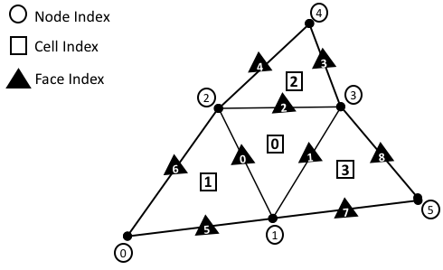
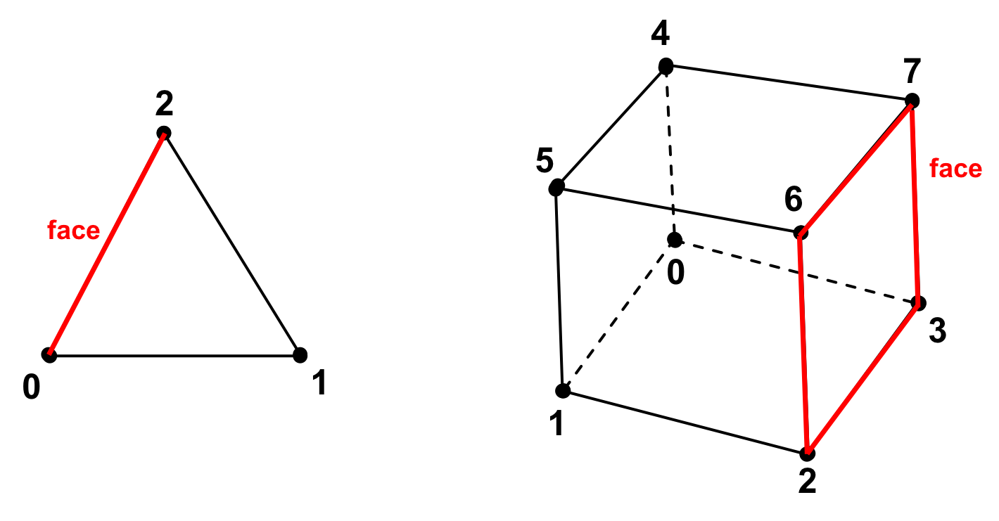
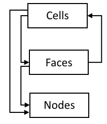

.. ## Copyright (c) 2017-2021, Lawrence Livermore National Security, LLC and
.. ## other Axom Project Developers. See the top-level LICENSE file for details.
.. ##
.. ## SPDX-License-Identifier: (BSD-3-Clause)

.. _sections/mesh_representation:

.. #############################################################################
..  MESH Representation
.. #############################################################################

.. _MeshRepresentation:

Mesh Representation
-------------------

Irrespective of the mesh type, a mesh essentially provides a data structure
that enables efficient *storage*, *management* and *access* of:

#. Mesh :ref:`Geometry` information (i.e., nodal coordinates),

#. Mesh :ref:`Topology` information (i.e., cell-to-node connectivity, etc.), and

#. :ref:`FieldData` stored on a mesh

The underlying, concrete representation of the :ref:`Geometry` and
:ref:`Topology` of a mesh is the key distinguishing characteristic used to
classify a mesh into the different :ref:`MeshTypes`. As a prerequisite to the
proceeding discussion on the taxonomy of the various :ref:`MeshTypes`, this
section provides a high level description of the key constituents of the
:ref:`MeshRepresentation`. Namely, the :ref:`Topology`, :ref:`Geometry` and
:ref:`FieldData` comprising a mesh.

.. _Topology:

Topology
^^^^^^^^

The topology of a mesh, :math:`\mathcal{M}(\Omega) \in \mathbb{R}^d`, is
defined by the collection of topological entities, e.g. the :ref:`Cells`,
:ref:`Faces` and :ref:`Nodes`, comprising the mesh and the associated
*adjacency* information that encodes the topological connections between them,
broadly referred to as :ref:`Connectivity` information.
Each topological entity in the mesh is identified by a unique index, as depicted
in the sample :ref:`UnstructuredMesh` shown in
:numref:`figs/meshRepresentation`. This provides a convenient way to traverse
and refer to individual entities in the mesh.

.. _figs/meshRepresentation:

  Sample unstructured mesh. Each node, cell and face on the mesh has a unique
  index.

In Mint, the three fundamental topological entities comprising a mesh are
(1) :ref:`Cells`, (2) :ref:`Faces`, and (3) :ref:`Nodes`.

.. note::
  The current implementation does not provide first class support for edges and
  associated edge data in 3D. However, this is a feature we are planning
  to support in future versions of Mint.

.. _Cells:

Cells
""""""

A cell, :math:`\mathcal{C}_i`, is given by an ordered list of :ref:`Nodes`,
:math:`\mathcal{C}_i=\{n_0,n_1,...n_k\}`, where each entry,
:math:`n_j \in \mathcal{C}_i`, corresponds to a
unique node index in the mesh. The order of :ref:`Nodes` defining a cell is
determined according to a prescribed local numbering convention for a
particular cell type. See :numref:`figs/linearCells` and :numref:`figs/q2Cells`.
All Mint :ref:`CellTypes` follow the `CGNS Numbering Conventions`_.

.. _Faces:

Faces
"""""

Similarly, a face, :math:`\mathcal{F}_i`, is defined by an ordered list of
:ref:`Nodes`, :math:`\mathcal{F}_i=\{n_0,n_1,...,n_k\}`. Faces are essentially
:ref:`Cells` whose topological dimension is one less than the dimension of the
:ref:`Cells` they are bound to. See :numref:`figs/cellFaces`.
Consequently, the constituent faces of a 3D cell are 2D topological entities,
such as *triangles* or *quads*, depending on the cell type. The faces of a 2D
cell are 1D topological entities, i.e. *segments*. Last, the faces of a 1D cell
are 0D topological entities, i.e. :ref:`Nodes`.

.. note::

  In 1D the :ref:`Faces` of a cell are equivalent to the constituent
  mesh :ref:`Nodes`, hence, Mint does not explicitly support :ref:`Faces`
  in 1D.

.. _figs/cellFaces:

  Constituent faces of a cell in 2D and 3D respectively. the constituent faces
  of a 3D cell are 2D topological entities, such as *triangles* or *quads*,
  depending on the cell type. The faces of a 2D cell are 1D topological
  entities, i.e. *segments*.

.. admonition:: Face Types

  A mesh face can be bound to either *one* or *two* :ref:`Cells`:

  * :ref:`Faces` bound to two :ref:`Cells`, within the same domain, are called
    **internal faces**.

  * :ref:`Faces` bound to two :ref:`Cells`, across different domains
    (or partitions), are called **internal boundary faces**. Internal boundary
    faces define the communication boundaries where ghost data is exchanged
    between domains.

  * :ref:`Faces` bound to a single cell are called **external boundary faces**.
    External boundary faces (and/or their consistuent nodes) are typically
    associated with a boundary condition.

.. topic:: Face Orientation

   As with :ref:`Cells`, the ordering of the constituent nodes of a face is
   determined by the cell type. However, by convention, the orientation of a
   face is according to an outward pointing face normal, as illustrated in
   :numref:`figs/faceOrientation`.

   .. _figs/faceOrientation:
   .. figure:: ../figures/face_orientation.png
      :align: center
      :alt: Face Orientation

      Face Orientation. (a) From the viewpoint of a cell, its constituent faces
      are oriented according to an outward facing normal. (b) From the viewpoint
      of a face, a face is oriented according to an outward facing normal with
      respect to the first cell abutting to the face, denoted by,
      :math:`\mathcal{C}_0`.

   From the viewpoint of a cell, :math:`\mathcal{C}_k`, its constituent faces,
   defined in the local node numbering of the cell, are oriented
   according to an outward facing normal with respect to the cell,
   :math:`\mathcal{C}_k`. For example, in :numref:`figs/faceOrientation` (a),
   the triangle, :math:`\mathcal{C}_k`, has three faces that are oriented
   according to an outward facing normal and defined using local node numbers
   with respect to their cell as follows, :math:`\mathcal{F}_0=\{0,1\}`,
   :math:`\mathcal{F}_1=\{1,2\}` and :math:`\mathcal{F}_2=\{2,0\}`

   As noted earlier, a face can have at most two adjacent :ref:`Cells`,
   denoted by :math:`\mathcal{C}_0` and :math:`\mathcal{C}_1`. By convention,
   from the viewpoint of a face, :math:`\mathcal{F}_k`, defined using global node
   numbers, the face is oriented according to an outward facing normal with
   respect to the cell corresponding to :math:`\mathcal{C}_0`. As depicted in
   :numref:`figs/faceOrientation` (b), the face denoted by :math:`\mathcal{F}_k`
   has an outward facing normal with respect to :math:`\mathcal{C}_0`,
   consequently it is defined as follows, :math:`\mathcal{F}_k=\{1,2\}`.

.. note::

    By convention, :math:`\mathcal{C}_1` is set to :math:`-1` for
    *external boundary faces*, which are bound to a single cell.

.. _Nodes:

Nodes
"""""

  The :ref:`Nodes` are *zero* dimensional topological entities and hence, are the
  lowest dimensional constituent entities of a mesh. The :ref:`Nodes` are
  associated with the spatial coordinates of the mesh and are used in defining
  the topology of the higher dimensional topological entities comprising the mesh,
  such as the :ref:`Cells`, :ref:`Faces`, etc., as discussed earlier.
  In a sense, the :ref:`Nodes` provide the means to link the :ref:`Topology`
  of the mesh to its constituent :ref:`Geometry` and thereby instantiate the mesh
  in physical space.

.. admonition:: Definition

   A mesh node, :math:`\mathcal{n_i}`, is associated with a point,
   :math:`p_i \in \mathbb{R}^d` and provides the means to:

   #. Link the :ref:`Topology` of the mesh to its constituent :ref:`Geometry`

   #. Support one or more *degrees of freedom*, evaluated at the given node
      location.

Notably, the nodes of a mesh may be more than just the *vertices* of the mesh.
As discussed in the :ref:`PreliminaryConcepts` section, a mesh is a
discretization of a PDE. Recall, the primary purpose of the mesh is to define
the discrete locations, in both *space* and *time*, at which the
*unknown variables* or *degrees of freedom* of the governing PDE are evaluated.
Depending on the numerical scheme employed and the :ref:`CellTypes` used,
additional mesh :ref:`Nodes` may be located on the constituent cell faces,
edges and in the cell interior.
For example, in the Finite Element Method (FEM), the nodes for the linear
Lagrange Finite Elements, see :numref:`figs/linearCells`, are located at the
cell *vertices*. However, for quadratic :ref:`CellTypes`,
see :numref:`figs/q2cells`, the *Lagrange* :math:`P^2` finite element,
for the quadrilateral and hexahedron (in 3D) cells, includes as :ref:`Nodes`,
the cell, face and edge (in 3D) centroids in addition to the cell *vertices*.
Other higher order finite elements may involve additional nodes for each edge
and face as well as in the interior of the cell.

.. _Connectivity:

Connectivity
""""""""""""

The topological connections or *adjecencies* between the :ref:`Cells`,
:ref:`Faces` and :ref:`Nodes` comprising the mesh, give rise to a hierarchical
topological structure, depicted in :numref:`figs/topological_structure`, that is
broadly referred to as :ref:`Connectivity` information. At the top level, a
mesh consists of one or more :ref:`Cells`, which constitute the highest
dimensional entity comprising the mesh. Each cell is bounded by zero or more
:ref:`Faces`, each of which is bounded by one or more :ref:`Nodes`.

.. _figs/topological_structure:

  Hierarchical topological structure illustrating the *downward* and *upward*
  topological connections of the constituent mesh entities supported in Mint.

The topological connections between the constituent entities of the mesh can be
distinguished in (a) *downward* and (b) *upward* topological connections, as
illustrated in :numref:`figs/topological_structure`.

* The downward topological connections encode the connections from
  higher dimensional mesh entities to lower dimensional entities,
  such as *cell-to-node*, *face-to-node* or *cell-to-face*.

* The upward topological connections, also called *reverse connectivities*,
  encode the connections from lower dimensional mesh entities to higher
  dimensional entities, such as *face-to-cell*.

Two key guiding considerations in the design and implementation of mesh data
structures are *storage* and *computational efficiency*.  In that respect,
the various :ref:`MeshTypes` offer different advantages and tradeoffs. For
example, the inherent regular topology of a :ref:`StructuredMesh` implicitly
defines the :ref:`Connectivity` information. Consequently, the topological
connections between mesh entities can be efficiently computed on-the-fly.
However, for an :ref:`UnstructuredMesh`, the :ref:`Connectivity` information has
to be extracted and stored explicitly so that it is readily available for
computation.

An :ref:`UnstructuredMesh` representation that explicitly stores all :math:`0`
to :math:`d` topological entities and associated *downward* and *upward*
:ref:`Connectivity` information is said to be a *full mesh representation*.
Otherwise, it is called a *reduced mesh representation*. In practice,
it can be prohibitively expensive to store a *full mesh representation*.
Consequently, most applications keep a *reduced mesh representation*.

The question that needs to be addressed at this point is what
:ref:`Connectivity` information is generally required. The answer can vary
depending on the application. The type of operations performed on the mesh
impose the requirements for the :ref:`Connectivity` information needed.
The *minimum sufficient* representation for an :ref:`UnstructuredMesh` is
the *cell-to-node* :ref:`Connectivity`, since, all additional
:ref:`Connectivity` information can be subsequently computed based on
this information.

In an effort to balance both flexibility and simplicity, Mint, in its simplest
form, employs the *minumum sufficient* :ref:`UnstructuredMesh` representation,
consisting of the *cell-to-node* :ref:`Connectivity`. This allows applications
to employ a fairly *light-weight* mesh representation when possible. However,
for applications that demand additional :ref:`Connectivity` information, Mint
provides methods to compute the needed additional information.

.. warning::

   The present implementation of Mint provides first class support for
   *cell-to-node*, *cell-to-face*, *face-to-cell* and *face-to-node*
   :ref:`Connectivity` information for all the :ref:`MeshTypes`.
   Support for additional :ref:`Connectivity` information will be added
   in future versions based on demand by applications.

.. _Geometry:

Geometry
^^^^^^^^^

The :ref:`Geometry` of a mesh is given by a set of :ref:`Nodes`.
Let :math:`\mathcal{N}=\{n_0, n_1, n_2, ..., n_k\}` be the finite set of nodes
comprising a mesh, :math:`\mathcal{M}(\Omega) \in \mathbb{R}^d`, where :math:`d`
is the spatial dimension, :math:`d \in \{1,2,3\}`. Each node,
:math:`n_i \in \mathcal{N}`, corresponds to a point,
:math:`p_i \in \mathbb{R}^d`, whose spatial coordinates, i.e. an ordered tuple,
define the physical location of the node in space,
:math:`n_i \in \mathbb{R}^d` . The :ref:`Nodes` link the
:ref:`Geometry` of the mesh to its :ref:`Topology`. The :ref:`Geometry` and
:ref:`Topology` of the mesh collectively define the physical *shape*, *size*
and *location* of the mesh in space.

.. _FieldData:

Field Data
^^^^^^^^^^^

The :ref:`FieldData` are used to define various physical quantities over
the constituent mesh entities, i.e. the :ref:`Cells`, :ref:`Faces` and
:ref:`Nodes` of the mesh. Each constituent mesh entity can be associated with
zero or more *fields*, each of which may correspond to a *scalar*, *vector* or
*tensor* quantity, such as temperature, velocity, pressure, etc.
Essentially, the :ref:`FieldData` are used to define the solution to the
unknown variables of the governing PDE that are evaluated on a given mesh,
as well as, any other auxiliary variables or derived quantities that an
application may need.

.. warning::

   The present implementation of Mint supports :ref:`FieldData` defined on
   :ref:`Cells`, :ref:`Faces` and :ref:`Nodes`. Support for storing
   :ref:`FieldData` on edges will be added in future versions based on
   application demand.

.. #############################################################################
..  CITATIONS
.. #############################################################################

.. include:: citations.rst

