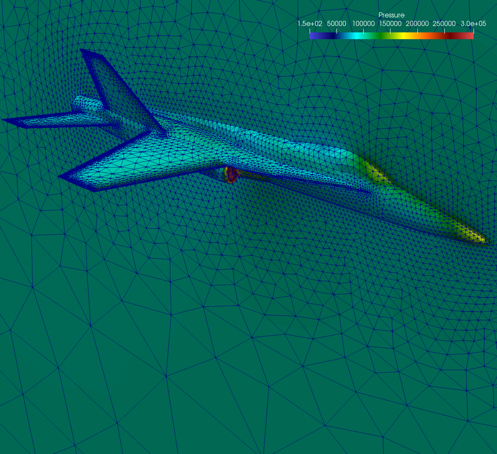
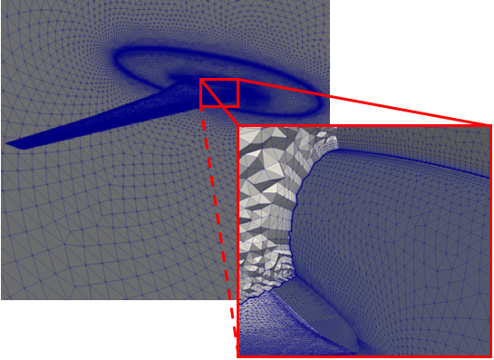
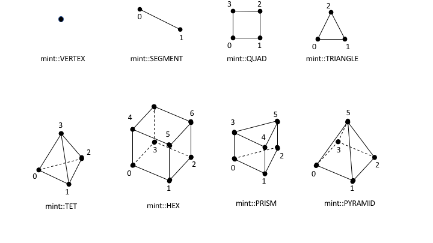
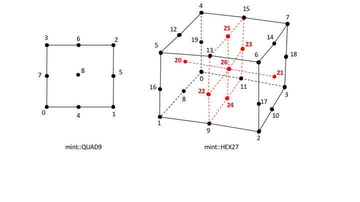
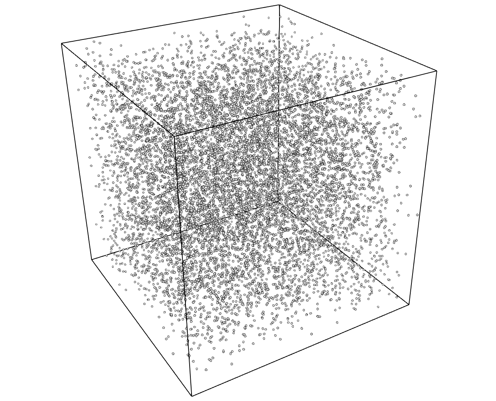

.. ## Copyright (c) 2017-2021, Lawrence Livermore National Security, LLC and
.. ## other Axom Project Developers. See the top-level LICENSE file for details.
.. ##
.. ## SPDX-License-Identifier: (BSD-3-Clause)

.. #############################################################################
..  MESH TYPES
.. #############################################################################

.. _MeshTypes:

Mesh Types
-----------

The underlying, concrete, representation of the constituent :ref:`Geometry`
and :ref:`Topology` of a mesh is the key defining charachteristic
used in classifying a mesh into the different :ref:`MeshTypes`.
The :ref:`Geometry` and :ref:`Topology` of a mesh is specified in one of the
following three representations:

#. **Implicit Representation**: based on mesh metadata

#. **Explicit Representation**: employs explicitly stored information.

#. **Semi-Implicit Representation**: combines mesh metadata and explicitly
   stored information.

The possible representation combinations of the constituent :ref:`Geometry` and
:ref:`Topology` comprising a mesh define a taxonomy of :ref:`MeshTypes`
summarized in the table below.

.. |structured|   replace:: **Structured Mesh**
.. |curvilinear|  replace:: :ref:`CurvilinearMesh`
.. |rectilinear|  replace:: :ref:`RectilinearMesh`
.. |uniform|      replace:: :ref:`UniformMesh`
.. |unstructured| replace:: :ref:`UnstructuredMesh`
.. |particles|    replace:: :ref:`ParticleMesh`
.. |implicit|     replace:: *implicit*
.. |explicit|     replace:: *explicit*
.. |semi|         replace:: *semi-implicit*

.. raw:: html

      

+------------------+------------+------------+
|   Mesh Type      | Geometry   | Topology   |
|                  |            |            |
+==================+============+============+
| |curvilinear|    | |explicit| | |implicit| |
+------------------+------------+------------+
| |rectilinear|    | |semi|     | |implicit| |
+------------------+------------+------------+
| |uniform|        | |implicit| | |implicit| |
+------------------+------------+------------+
| |unstructured|   | |explicit| | |explicit| |
+------------------+------------+------------+
| |particles|      | |explicit| | |implicit| |
+------------------+------------+------------+

.. raw:: html

      

A brief overview of the distinct characteristics of each of the :ref:`MeshTypes`
is provided in the following sections.

.. #############################################################################
..  STRUCTURED MESH
.. #############################################################################

.. _StructuredMesh:

Structured Mesh
^^^^^^^^^^^^^^^^

A :ref:`StructuredMesh` discretization is characterized by its *ordered*,
*regular*, :ref:`Topology`. A :ref:`StructuredMesh` divides the computational
domain into :ref:`Cells` that are logically arranged on a *regular grid*. The
regular grid topology allows for the constituent :ref:`Nodes`, :ref:`Cells`
and :ref:`Faces` of the mesh to be identified using an *IJK* ordering scheme.

.. admonition:: Numbering and Ordering Conventions in a Structured Mesh

  The *IJK* ordering scheme employs indices along each dimension, typically
  using the letters *i,j,k* for the 1st, 2nd and 3rd dimension respectively.
  The IJK indices can be thought of as counters. Each index counts the number
  of :ref:`Nodes` or :ref:`Cells` along a given dimension. As noted in
  the general :ref:`MeshRepresentation` section, the constituent entities of
  the mesh :ref:`Topology` are associated with a unique index.
  Therefore, a convention needs to be established for mapping the IJK indices to
  the corresponding unique index and *vice-versa*.

  The general convention and what Mint employs is the following:

  * All :ref:`Nodes` and :ref:`Cells` of a :ref:`StructuredMesh` are indexed
    first along the *I*-direction, then along the *J*-direction and last along
    the *K*-direction.

  * Likewise, the :ref:`Faces` of a :ref:`StructuredMesh` are indexed by first
    counting the :ref:`Faces` of each of the :ref:`Cells` along the
    *I*-direction (*I-Faces*), then the *J*-direction (*J-Faces*) and
    last the *K*-direction (*K-Faces*).

One of the important advantages of a :ref:`StructuredMesh` representation is
that the constituent :ref:`Topology` of the mesh is *implicit*. This enables
a convenient way for computing the :ref:`Connectivity` information
automatically without the need to store this information explicitly. For example,
an interior 2D cell (i.e., not at a boundary) located at :math:`C=(i,j)`,
will always have four face neighbors given by the following indices:

* :math:`N_0=(i-1,j)`,
* :math:`N_1=(i+1,j)`,
* :math:`N_2=(i,j-1)` and
* :math:`N_3=(i,j+1)`

Notably, the neighboring information follows directly from the *IJK* ordering
scheme and therefore does not need to be stored explicitly.

In addition to the convenience of having automatic :ref:`Connectivity`, the
*IJK* ordering of a :ref:`StructuredMesh` offers one other important advantage
over an :ref:`UnstructuredMesh` discretization. The *IJK* ordering
results in coefficient matrices that are *banded*. This enables the use of
specialized algebraic solvers that rely on the *banded* structure of the matrix
that are generally more efficient.

While a :ref:`StructuredMesh` discretization offers several advantages, there
are some notable tradeoffs and considerations. Chief among them,
is the implied restriction imposed by the regular topology of the
:ref:`StructuredMesh`. Namely, the number of :ref:`Nodes` and :ref:`Cells` on
opposite sides must be matching. This requirement makes *local refinement*
less effective, since grid lines need to span across the entire range along
a given dimension. Moreover, meshing of complex geometries, consisting of
sharp features, is complicated and can lead to degenerate :ref:`Cells` that can be
problematic in the computation. These shortcomings are alleviated to an extent
using a *block-structured meshing strategy* and/or *patch-based AMR*, however
the fundamental limitations still persist.

All :ref:`StructuredMesh` types have implicit :ref:`Topology`. However, depending
on the underlying, concrete representation of the consituent mesh
:ref:`Geometry`, a :ref:`StructuredMesh` is distinguished into three
subtypes:

#. :ref:`CurvilinearMesh`,
#. :ref:`RectilinearMesh`, and,
#. :ref:`UniformMesh`

The key characteristics of each of theses types is discussed in more detail in
the following sections.

.. _CurvilinearMesh:

Curvilinear Mesh
"""""""""""""""""

The :ref:`CurvilinearMesh`, shown in :numref:`figs/curvilinearMeshExample`, is
logically a *regular* mesh, however in contrast to the :ref:`RectilinearMesh`
and :ref:`UniformMesh`, the :ref:`Nodes` of a :ref:`CurvilinearMesh` are not
placed along the *Cartesian* grid lines. Instead, the equations of the governing
PDE are transformed from the *Cartesian* coordinates to a new coordinate system,
called a *curvilinear coordinate system*. Consequently, the :ref:`Topology` of
a :ref:`CurvilinearMesh` is *implicit*, however its :ref:`Geometry`, given
by the constituent :ref:`Nodes` of the mesh, is *explicit*.

.. _figs/curvilinearMeshExample:
.. figure:: ../figures/structured_curvilinear_mesh.png
  :align: center
  :scale: 55%
  :alt: Sample Curvilinear Mesh

  Sample Curvilinear Mesh example.

The mapping of coordinates to the *curvilinear coordinate system*
facilitates the use of structured meshes for bodies of arbitrary shape. Note,
the axes defining the *curvilinear coordinate system* do not need to be straight
lines. They can be curves and align with the contours of a solid body. For this
reason, the resulting :ref:`CurvilinearMesh` is often called a *mapped mesh* or
*body-fitted mesh*.

See the :ref:`sections/tutorial` for an example that demonstrates how to
:ref:`createACurvilinearMesh`.

.. _RectilinearMesh:

Rectilinear Mesh
"""""""""""""""""

A :ref:`RectilinearMesh`, depicted in :numref:`figs/rectilinearMeshExample`,
divides the computational domain into a set of rectangular :ref:`Cells`,
arranged on a *regular lattice*. However, in contrast to the
:ref:`CurvilinearMesh`, the :ref:`Geometry` of the mesh is not mapped to a
different coordinate system. Instead, the rows and columns of :ref:`Nodes`
comprising a :ref:`RectilinearMesh` are parallel to the axis of the *Cartesian*
coordinate system. Due to this restriction, the geometric domain and resulting
mesh are always rectangular.

.. _figs/rectilinearMeshExample:
.. figure:: ../figures/structured_rectilinear_mesh.png
  :align: center
  :scale: 35%
  :alt: Sample Rectilinear Mesh

  Sample Rectilinear Mesh example.

The :ref:`Topology` of a :ref:`RectilinearMesh` is *implicit*, however its
constituent :ref:`Geometry` is *semi-implicit*. Although, the
:ref:`Nodes` are aligned with the *Cartesian* coordinate axis, the spacing
between adjacent :ref:`Nodes` can vary. This allows a :ref:`RectilinearMesh`
to have tighter spacing over regions of interest and be sufficiently coarse in
other parts of the domain. Consequently, the spatial coordinates of the
:ref:`Nodes` along each axis are specified explicitly in a seperate array
for each coordinate axis, i.e. :math:`x`, :math:`y` and :math:`z` arrays for
each dimension respectively. Given the *IJK* index of a node, its corresponding
physical coordinates can be obtained by taking the *Cartesian* product of the
corresponding coordinate along each coordinate axis. For this reason, the
:ref:`RectilinearMesh` is sometimes called a *product* mesh.

See the :ref:`sections/tutorial` for an example that demonstrates how to
:ref:`createARectilinearMesh`.

.. _UniformMesh:

Uniform Mesh
"""""""""""""

A :ref:`UniformMesh`, depicted in :numref:`figs/uniformMeshExample`, is the
simplest of all three :ref:`StructuredMesh` types, but also, relatively the most
restrictive of all :ref:`MeshTypes`. As with the :ref:`RectilinearMesh`,
a :ref:`UniformMesh` divides the computational domain into a set of rectangular
:ref:`Cells` arranged on a *regular lattice*. However, a :ref:`UniformMesh`
imposes the additional restriction that :ref:`Nodes` are uniformly distributed
parallel to each axis. Therefore, in contrast to the :ref:`RectilinearMesh`, the
spacing between adjacent :ref:`Nodes` in a :ref:`UniformMesh` is constant.

.. _figs/uniformMeshExample:
.. figure:: ../figures/structured_uniform_mesh.png
  :align: center
  :scale: 35%
  :alt: Sample Uniform Mesh

  Sample Uniform Mesh example.

The inherent constraints of a :ref:`UniformMesh` allow for a more compact
representation. Notably, both the :ref:`Topology` and :ref:`Geometry` of a
:ref:`UniformMesh` are *implicit*. Given the origin of the mesh,
:math:`X_0=(x_0,y_0,z_0)^T`, i.e. the coordinates of the lowest corner of the
rectangular domain, and spacing along each direction, :math:`H=(h_x,h_y,h_z)^T`,
the spatial coordinates of any point, :math:`\hat{p}=(p_x,p_y,p_z)^T`,
corresponding to a node with lattice coordinates, :math:`(i,j,k)`, are
computed as follows:

.. math::
    :nowrap:

    \begin{eqnarray}
      p_x &=& x_0 &+& i &\times& h_x \\
      p_y &=& y_0 &+& j &\times& h_y \\
      p_z &=& z_0 &+& k &\times& h_z \\
    \end{eqnarray}

See the :ref:`sections/tutorial` for an example that demonstrates how to
:ref:`createAUniformMesh`.

.. #############################################################################
..  UNSTRUCTURED MESH
.. #############################################################################

.. _UnstructuredMesh:

Unstructured Mesh
^^^^^^^^^^^^^^^^^^

The impetus for an :ref:`UnstructuredMesh` discretization is largely prompted
by the need to model physical phenomena on complex geometries. In relation to
the various :ref:`MeshTypes`, an :ref:`UnstructuredMesh` discretization provides
the most flexibility. Notably, an :ref:`UnstructuredMesh` can accomodate
different :ref:`CellTypes` and does not enforce any constraints or particular
ordering on the constituent :ref:`Nodes` and :ref:`Cells`. This makes an
:ref:`UnstructuredMesh` discretization particularly attractive, especially for
applications that require *local adaptive mesh refinement* (i.e., local h-refinement)
and deal with complex geometries.

Generally, the advantages of using an :ref:`UnstructuredMesh` come at the cost
of an increase in memory requirements and computational intensity. This is
due to the inherently *explicit*, :ref:`MeshRepresentation`
required for an :ref:`UnstructuredMesh`. Notably, both :ref:`Topology` and
:ref:`Geometry` are represented explicitly thereby increasing the storage
requirements and computational time needed per operation. For example, consider
a stencil operation. For a :ref:`StructuredMesh`, the neighbor indices needed
by the stencil can be automatically computed directly from the *IJK* ordering,
a relatively fast and local operation. However, to obtain the neighbor indices
in an :ref:`UnstructuredMesh`, the arrays that store the associated
:ref:`Connectivity` information need to be accessed, resulting in additional
load/store operations that are generaly slower.

Depending on the application, the constituent :ref:`Topology` of an
:ref:`UnstructuredMesh` may employ a:

#. :ref:`SingleCellTopology`, i.e. consisting of :ref:`Cells` of the *same type*, or,
#. :ref:`MixedCellTopology`, i.e. consisting of :ref:`Cells` of different type, i.e. *mixed cell type*.

There are subtle differrences in the underlying :ref:`MeshRepresentation` that
can result in a more compact and efficient representation when the
:ref:`UnstructuredMesh` employs a :ref:`SingleCellTopology`. The following
sections discuss briefly these differences and other key aspects of the
:ref:`SingleCellTopology` and :ref:`MixedCellTopology` representations.
Moreover, the list of natively supported :ref:`CellTypes` that can be used with
an :ref:`UnstructuredMesh` is presented, as well as, the steps necessary to
:ref:`AddACellType` in Mint.

.. note::
    In an effort to balance both flexibility and simplicity, Mint, in its simplest
    form, employs the *minumum sufficient* :ref:`UnstructuredMesh`
    :ref:`MeshRepresentation`, consisting of the *cell-to-node*
    :ref:`Connectivity`. This allows applications to employ a fairly
    *light-weight* mesh representation when possible. However, for applications
    that demand additional :ref:`Connectivity` information, Mint provides
    methods to compute the needed additional information.

.. _SingleCellTopology:

Single Cell Type Topology
""""""""""""""""""""""""""

An :ref:`UnstructuredMesh` with :ref:`SingleCellTopology` consists of a
collection of :ref:`Cells` of the same cell type. Any :ref:`StructuredMesh`
can be treated as an :ref:`UnstructuredMesh` with :ref:`SingleCellTopology`,
in which case, the resulting :ref:`Cells` would either be *segments* (in 1D),
*quadrilaterals* (in 2D) or *hexahedrons* (in 3D). However, an
:ref:`UnstructuredMesh` can have arbitrary :ref:`Connectivity` and does not
impose any ordering constraints. Moreover, the :ref:`Cells` can also be
*triangular* (in 2D) or *tetrahedral* (in 3D). The choice of cell type generally
depends on the application, the physics being modeled, and the numerical
scheme employed. An example tetrahedral :ref:`UnstructuredMesh` of the F-17
blended wing fuselage configuration is shown in
:numref:`figs/UnstructuredMeshSingleShape`. For this type of complex geometries
it is nearly impossible to obtain a :ref:`StructuredMesh` that is adequate for
computation.

.. _figs/unstructuredMeshSingleShape:

   Sample unstructured tetrahedral mesh of the F-17 blended wing fuselage
   configuration.

Mint's :ref:`MeshRepresentation` of an :ref:`UnstructuredMesh` with
:ref:`SingleCellTopology` consists of a the cell type specification and the
cell-to-node :ref:`Connectivity` information. The :ref:`Connectivity` information
is specified with a flat array consisting of the node indices that comprise
each cell. Since the constituent mesh :ref:`Cells` are of the same type,
cell-to-node information for a particular cell can be obtained by accessing
the :ref:`Connectivity` array with a constant stride, where the stride
corresponds to the number of :ref:`Nodes` of the cell type being used. This is
equivalent to a 2D row-major array layout where the number of rows corresponds
to the number of :ref:`Cells` in the mesh and the number of columns corresponds
to the *stride*, i.e. the number of :ref:`Nodes` per cell.

.. _figs/singleCellTypeRep:

    :ref:`MeshRepresentation` of an :ref:`UnstructuredMesh` with
    :ref:`SingleCellTopology` consiting of *triangular* :ref:`Cells`. Knowing
    the cell type enables traversing the cell-to-node :ref:`Connectivity` array
    with a constant stride of :math:`3`, which corresponds to the number of
    constituent :ref:`Nodes` of each triangle.

This simple concept is best illustrated with an example.
:numref:`figs/singleCellTypeRep` depicts a sample :ref:`UnstructuredMesh` with
:ref:`SingleCellTopology` consisting of :math:`N_c=4` triangular :ref:`Cells`.
Each triangular cell, :math:`C_i`, is defined by :math:`||C_i||` :ref:`Nodes`.
In this case, :math:`||C_i||=3`.

.. note::

    The number of :ref:`Nodes` of the cell type used to define an
    :ref:`UnstructuredMesh` with :ref:`SingleCellTopology`,
    denoted by :math:`||C_i||`, corresponds to the constant stride used to
    access the flat cell-to-node :ref:`Connectivity` array.

Consequently, the length of the cell-to-node :ref:`Connectivity` array
is then given by :math:`N_c \times ||C_i||`. The node indices for each of the
cells are stored from left to right. The base offset for a given cell is given
as a multiple of the cell index and the *stride*. As illustrated in
:numref:`figs/singleCellTypeRep`, the base offset for cell :math:`C_0` is
:math:`0 \times 3 = 0`, the offest for cell :math:`C_1` is
:math:`1 \times 3 = 3`, the offset for cell :math:`C_2` is
:math:`2 \times 3 = 6` and so on.

.. admonition:: Direct Stride Cell Access in a Single Cell Type Topology UnstructuredMesh

    In general, the :ref:`Nodes` of a cell, :math:`C_i`, of an :ref:`UnstructuredMesh`
    with :ref:`SingleCellTopology` and cell stride :math:`||C_i||=k`, can be
    obtained from a given cell-to-node :ref:`Connectivity` array as follows:

    .. math::
      :nowrap:

      \begin{eqnarray}
        n_0 &=& cell\_to\_node[ i \times k     ] \\
        n_1 &=& cell\_to\_node[ i \times k + 1 ] \\
        ... \\
        n_k &=& cell\_to\_node[ i \times k + (k-1)]
      \end{eqnarray}

.. raw:: html

      

+------------------+------------+------------+------------+
|   Cell Type      | Stride     | Topological| Spatial    |
|                  |            | Dimension  | Dimension  |
+==================+============+============+============+
| *Quadrilateral*  |     4      |  2         | 2,3        |
+------------------+------------+------------+------------+
| *Triangle*       |     3      |  2         | 2,3        |
+------------------+------------+------------+------------+
| *Hexahdron*      |     8      |  3         |  3         |
+------------------+------------+------------+------------+
| *Tetrahedron*    |     4      |  3         |  3         |
+------------------+------------+------------+------------+

.. raw:: html

      

The same procedure follows for any cell type. Thereby, the stride for a mesh
consisting of *quadrilaterals* is :math:`4`, the stride for a mesh consisting
of *tetrahedrons* is :math:`4` and the stride for a mesh consisting of
*hexahedrons* is :math:`8`. The table above summarizes the possible
:ref:`CellTypes` that can be employed for an :ref:`UnstructuredMesh` with
:ref:`SingleCellTopology`, corresponding *stride* and applicalble topological
and spatial dimension.

See the :ref:`sections/tutorial` for an example that demonstrates how to
:ref:`createAnUnstructuredMesh`.

.. _MixedCellTopology:

Mixed Cell Type Topology
"""""""""""""""""""""""""

An :ref:`UnstructuredMesh` with :ref:`MixedCellTopology` provides the most
flexibility relative to the other :ref:`MeshTypes`. Similar to the
:ref:`SingleCellTopology` :ref:`UnstructuredMesh`,  the constituent
:ref:`Nodes` and :ref:`Cells` of a :ref:`MixedCellTopology` :ref:`UnstructuredMesh`
can have arbitrary ordering. Both :ref:`Topology` and :ref:`Geometry` are
*explicit*. However, a :ref:`MixedCellTopology` :ref:`UnstructuredMesh` may
consist :ref:`Cells` of different cell type. Hence, the cell topology and
cell type is said to be *mixed*.

.. note::
   The constituent :ref:`Cells` of an :ref:`UnstructuredMesh` with
   :ref:`MixedCellTopology` have a *mixed cell type*. For this reason,
   an :ref:`UnstructuredMesh` with :ref:`MixedCellTopology` is sometimes also
   called a *mixed cell mesh* or *hybrid mesh*.

.. _figs/unstructuredMeshMixedShape:

   Sample :ref:`UnstructuredMesh` with :ref:`MixedCellTopology` of a Generic
   wing/fuselage configuration. The mesh consists of high-aspect ratio prism
   cells in the viscous region of the computational domain to accurately capture
   the high gradients across the boundary layer and tetrahedra cells for the
   inviscid/Euler portion of the mesh.

Several factors need to be taken in to account when selecting
the cell topology of the mesh. The physics being modeled, the PDE
discretization employed and the required simulation fidelity are chief among
them. Different :ref:`CellTypes` can have superior properties for certain
calculations. The continuous demand for increasing fidelity in physics-based
predictive modeling applications has prompted practitioners to employ a
:ref:`MixedCellTopology` :ref:`UnstructuredMesh` discretization in order to
accurately capture the underlying physical phenomena.

For example, for Navier-Stokes *viscous* fluid-flow computations, at high
Reynolds numbers, it is imperative to capture the high gradients across the
boundary layer normal to the wall. Typically, high-aspect ratio, anisotropic
*triangular prisms* or *hexahedron* :ref:`Cells` are used for discretizing the
viscous region of the computational domain, while isotropic *tetrahedron* or
*hexahedron* :ref:`Cells` are used in the *inviscid* region to solve the Euler
equations. The sample :ref:`MixedCellTopology` :ref:`UnstructuredMesh`, of a
Generic Wing/Fuselage configuration, depicted in
:numref:`figs/unstructuredMeshMixedShape`, consists of *triangular prism*
:ref:`Cells` for the *viscous* boundary layer portion of the domain that are
stitched to *tetrahedra* :ref:`Cells` for the inviscid/Euler portion of the
mesh.

The added flexibility enabled by employing a :ref:`MixedCellTopology`
:ref:`UnstructuredMesh` imposes additional requirements to the underlying
:ref:`MeshRepresentation`. Most notably, compared to the
:ref:`SingleCellTopology` :ref:`MeshRepresentation`, the cell-to-node
:ref:`Connectivity` array can consist :ref:`Cells` of different cell type,
where each cell can have a different number of :ref:`Nodes`. Consequently, the
simple stride array access indexing scheme, used for
the :ref:`SingleCellTopology` :ref:`MeshRepresentation`, cannot be employed to
obtain cell-to-node information. For a :ref:`MixedCellTopology` an
*indirect addressing* access scheme must be used instead.

.. _figs/mixedCellTypeRep:

    :ref:`MeshRepresentation` of a :ref:`MixedCellTopology`
    :ref:`UnstructuredMesh` with a total of :math:`N=3` :ref:`Cells`,
    :math:`2` *triangles* and :math:`1` *quadrilateral*. The
    :ref:`MixedCellTopology` representation consists of two additional arrays.
    First, the *Cell Offsets* array, an array of size :math:`N+1`, where the
    first :math:`N` entries store the starting position to the flat
    cell-to-node :ref:`Connectivity` array for each cell. The last entry of
    the *Cell Offsets* array stores the total length of the :ref:`Connectivity`
    array. Second, the :ref:`CellTypes` array , an array of size :math:`N`,
    which stores the cell type of each constituent cell of the mesh.

There are a number of ways to represent a :ref:`MixedCellTopology` mesh.
In addition to the cell-to-node :ref:`Connectivity` array, Mint's
:ref:`MeshRepresentation` for a :ref:`MixedCellTopology` :ref:`UnstructuredMesh`
employs two additional arrays. See sample mesh and corresponding
:ref:`MeshRepresentation` in :numref:`figs/mixedCellTypeRep`.
First, the *Cell Offsets* array is used to provide indirect addressing to
the cell-to-node information of each constituent mesh cell. Second, the
:ref:`CellTypes` array is used to store the cell type of each cell in the
mesh.

The *Cell Offsets* is an array of size :math:`N+1`, where the first
:math:`N` entries, corresponding to each cell in the mesh, store the
start index position to the cell-to-node :ref:`Connectivity` array for the
given cell. The last entry of the *Cell Offsets* array stores the total
length of the :ref:`Connectivity` array. Moreover, the number of constituent
cell :ref:`Nodes` for a given cell can be directly computed by subtracting a
Cell's start index from the next adjacent entry in the  *Cell Offsets* array.

However, knowing the start index position to the cell-to-node
:ref:`Connectivity` array and number of constituent :ref:`Nodes` for a given
cell is not sufficient to disambiguate and deduce the cell type. For example,
both *tetrahedron* and *quadrilateral* :ref:`Cells` are defined by :math:`4`
:ref:`Nodes`. The cell type is needed in order to correctly interpret the
:ref:`Topology` of the cell according to the cell's local numbering.
Consequently, the :ref:`CellTypes` array, whose length is :math:`N`,
corresponding to the number of cells in the mesh, is used to store the cell
type for each constituent mesh cell.

.. admonition:: Indirect Address Cell Access in a Mixed Cell Type Topology UnstructuredMesh

    In general, for a given cell, :math:`C_i`, of a :ref:`MixedCellTopology`
    :ref:`UnstructuredMesh`, the number of :ref:`Nodes` that define the
    cell, :math:`||C_i||`, is given by:

    .. math::
      :nowrap:

      \begin{eqnarray}
        k = ||C_i|| &=& cells\_offset[ i + 1 ] - cells\_offset[ i ] \\
      \end{eqnarray}

    The corresponding cell type is directly obtained from the :ref:`CellTypes`
    array:

    .. math::
      :nowrap:

      \begin{eqnarray}
        ctype &=& cell\_types[ i ] \\
      \end{eqnarray}

    The list of constituent cell :ref:`Nodes` can then obtained from the
    cell-to-node :ref:`Connectivity` array as follows:

    .. math::
      :nowrap:

      \begin{eqnarray}

        offset &=& cells\_offset[ i+1 ] \\
        k      &=& cells\_offset[ i + 1 ] - cell\_offset[ i ] \\

        \\

        n_0 &=& cell\_to\_node[ offset     ] \\
        n_1 &=& cell\_to\_node[ offset + 1 ] \\
        ... \\
        n_k &=& cell\_to\_node[ offset + (k-1)]
      \end{eqnarray}

See the :ref:`sections/tutorial` for an example that demonstrates how to
:ref:`createAMixedUnstructuredMesh`.

.. _CellTypes:

Cell Types
"""""""""""

Mint currently supports the common Linear :ref:`CellTypes`,
depicted in :numref:`figs/linearCells`, as well as, support for
quadratic, quadrilateral and hexahedron :ref:`Cells`, see :numref:`figs/q2Cells`.

.. _figs/linearCells:

  List of supported linear cell types and their respective local node
  numbering.

.. _figs/q2Cells:

  List of supported quadratic cell types and their respective local node
  numbering.

.. note::

  All Mint :ref:`CellTypes` follow the `CGNS Numbering Conventions`_.

Moreover, Mint is designed to be extensible. It is relatively straightforward
to :ref:`AddACellType` in Mint. Each of the :ref:`CellTypes` in Mint simply
encode the following attributes:

* the cell's topology, e.g. number of nodes, faces, local node numbering etc.,
* the corresponding VTK type, used for VTK dumps, and,
* the associated blueprint name, conforming to the `Blueprint`_
  conventions, used for storing the mesh in `Sidre`_

.. warning::
   The `Blueprint`_ specification does not currently support the following
   cell types:

   #. Transitional cell types,  Pyramid(``mint::PYRAMID``)
      and Prism(``mint::PRISM``)

   #. Quadratic cells, the 9-node, quadratic Quadrilateral(``mint::QUAD9``) and
      the 27-node, quadratic Hexahedron(``mint::HEX27``)

.. _AddACellType:

Add a New Cell Type
"""""""""""""""""""

.. warning::
   This section is under construction.

.. #############################################################################
..  PARTICLE MESH
.. #############################################################################

.. _ParticleMesh:

Particle Mesh
^^^^^^^^^^^^^^

A :ref:`ParticleMesh`, depicted in :numref:`figs/particleMesh`, discretizes the
computational domain by a set of *particles* which correspond to the :ref:`Nodes`
at which the solution is evaluated. A :ref:`ParticleMesh` is commonly employed in
the so called *particle* methods, such as *Smoothed Particle Hydrodynamics*
(SPH) and *Particle-In-Cell* (PIC) methods, which are used in a variety
of applications ranging from astrophysics and cosmology simulations to plasma
physics.

There is no special ordering imposed on the particles. Therefore, the particle
coordinates are explicitly specified by nodal coordinates, similar to an
:ref:`UnstructuredMesh`. However, the particles are not connected to form a
*control volume*, i.e. a filled region of space. Consequently,
a :ref:`ParticleMesh` does not have :ref:`Faces` and any associated
:ref:`Connectivity` information.  For this reason, methods that
employ a :ref:`ParticleMesh` discretization are often referred to as
*meshless* or *mesh-free* methods.

.. _figs/particleMesh:

   Sample :ref:`ParticleMesh` within a box domain.

A :ref:`ParticleMesh` can be thought of as having *explicit* :ref:`Geometry`,
but, *implicit* :ref:`Topology`. Mint's :ref:`MeshRepresentation` for a
:ref:`ParticleMesh`, associates the constituent particles with the :ref:`Nodes`
of the mesh. The :ref:`Nodes` of the :ref:`ParticleMesh` can
also be thought of as :ref:`Cells` that are defined by a single node index.
However, since this information can be trivially obtained there is no need to
be stored explicitly.

.. note::

    A :ref:`ParticleMesh` can only store variables at its constituent
    particles, i.e. the :ref:`Nodes` of the mesh. Consequently,
    a :ref:`ParticleMesh` in Mint can only be associated with node-centered
    :ref:`FieldData`.

.. #############################################################################
..  CITATIONS
.. #############################################################################

.. include:: citations.rst

