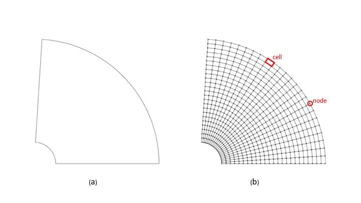

.. ## Copyright (c) 2017-2021, Lawrence Livermore National Security, LLC and
.. ## other Axom Project Developers. See the top-level LICENSE file for details.
.. ##
.. ## SPDX-License-Identifier: (BSD-3-Clause)

.. _sections/preliminary_concepts:

.. _PreliminaryConcepts:

Preliminary Concepts
--------------------

A mesh (sometimes also called a *grid*), denoted by :math:`\mathcal{M}(\Omega)`, provides a discrete
represenation of a geometric domain of interest, :math:`\Omega`, on which, the
underlying *mathematical model* is evaluated. The mathematical model
is typically defined by a system of governing *Partial Differential Equations
(PDEs)* and associated boundary and initial conditions. The solution
to the governing PDE predicts a physical process that occurs and evolves on
:math:`\Omega` over time. For example, consider the flow around an aircraft,
turbulence modeling, blast wave propagation over complex terrains, or,
heat transfer in contacting objects, to name a few.
Evolving the mathematical model to predict such a physical process is typically
done numerically, which requires discretizing the governing PDE by a numerical
scheme, such as a Finite Difference (FD), Finite Volume (FV), or, the
Finite Element Method (FEM), chief among them.

.. _figs/meshedDomain:

   Mesh discretization of a geometric domain: (a) Sample geometric domain,
   :math:`\Omega`. (b) Corresponding mesh of the domain,
   :math:`\mathcal{M}(\Omega)`. The *nodes* and *cells* of the mesh, depicted in
   red, correspond to the discrete locations where the unknown variables of the
   governing PDE are stored and evaluated.

Discretization of the governing PDE requires the domain to be approximated
with a mesh. For example, :numref:`figs/meshedDomain` (a) depicts a geometric
domain, :math:`\Omega`. The corresponding mesh, :math:`\mathcal{M}(\Omega)`,
is illustrated in :numref:`figs/meshedDomain` (b). The mesh approximates
the geometric domain, :math:`\Omega`, by a finite number of simple geometric
entities, such as *nodes* and *cells*, depicted in red in
:numref:`figs/meshedDomain` (b). These geometric entities comprising the mesh
define the discrete locations, in space and time, at which the unknown variables,
i.e., the *degrees of freedom* of the governing PDE, are evaluated, by the
numerical scheme being employed.

There are a variety of different :ref:`MeshTypes` one can choose from.
The type of mesh employed depends on the choice of the underlying
numerical discretization scheme. For example, a finite difference scheme
typically requires a :ref:`StructuredMesh`. However, the finite volume and
finite element methods may be implemented for both :ref:`StructuredMesh` and
:ref:`UnstructuredMesh` types. In contrast, *meshless* or *mesh-free* methods,
such as *Smoothed Particle Hydrodynamics (SPH)*, discretize the governing PDE
over a set of *particles* or *nodes*, using a :ref:`ParticleMesh`
representation.
