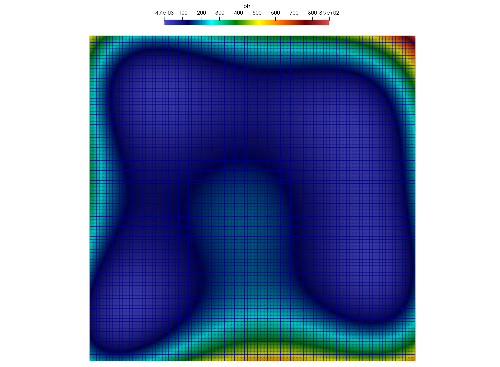

.. ## Copyright (c) 2017-2019, Lawrence Livermore National Security, LLC and
.. ## other Axom Project Developers. See the top-level COPYRIGHT file for details.
.. ##
.. ## SPDX-License-Identifier: (BSD-3-Clause)

.. _sections/quick_introduction:

Quick Introduction to Mint
---------------------------

This section provides a quick introduction to Mint by presenting a
complete walk-through of an example Mint application, illustrating some of the
key concepts and capabilities. The complete :ref:`MintApplicationCodeExample`,
presented herein, is included in the :ref:`sections/appendix` section and is
also available in the Axom source code under
``src/axom/mint/examples/mint_uniform_mesh.cpp``.

The example Mint application illustrates:

* Construction of a simple 2D :ref:`UniformMesh`
* Creation of node-centered and cell-centered :ref:`FieldData` on the mesh
* Using the :ref:`sections/execution_model` to implement *mesh-agnostic*
  and *device-agnostic* kernels.
* Output of the resulting mesh and data in VTK for visualization.

.. tip::
    Mint's `RAJA`_-based :ref:`sections/execution_model` helps facilitate
    the implementation of various computational kernels that are both
    *mesh-agnostic* and *device-agnostic*. Both kernels discussed in
    this example do not make any assumptions about the underlying mesh
    type or the target execution device, e.g., CPU or GPU. Consequently, the
    same implementation can operate on any of the supported :ref:`MeshTypes`
    and run in parallel on all execution devices supported through `RAJA`_.

.. _step1:

Step 1: Add Header Includes
^^^^^^^^^^^^^^^^^^^^^^^^^^^

First, the Mint header must be included for the
definition of the various Mint classes and functions. Note, this example also
makes use of Axom's Matrix class, which is also included by the following:

.. literalinclude:: ../../../examples/mint_uniform_mesh.cpp
   :start-after: sphinx_tutorial_walkthrough_includes_start
   :end-before: sphinx_tutorial_walkthrough_includes_end
   :language: C++
   :linenos:

.. _step2:

Step 2: Create a UniformMesh
^^^^^^^^^^^^^^^^^^^^^^^^^^^^

Next, a :math:`100 \times 100` :ref:`UniformMesh`, defined on a
domain given by the interval :math:`\mathcal{I}:[-5.0,5.0] \times [-5.0,5.0]`,
is constructed by the following:

.. literalinclude:: ../../../examples/mint_uniform_mesh.cpp
   :start-after: sphinx_tutorial_walkthrough_construct_mesh_start
   :end-before: sphinx_tutorial_walkthrough_construct_mesh_end
   :language: C++
   :linenos:

.. _step3:

Step 3: Add Fields
^^^^^^^^^^^^^^^^^^

Fields are added to the mesh by calling the ``createField()`` method
on the mesh object:

.. literalinclude:: ../../../examples/mint_uniform_mesh.cpp
   :start-after: sphinx_tutorial_walkthrough_add_fields_start
   :end-before: sphinx_tutorial_walkthrough_add_fields_end
   :language: C++
   :linenos:

* The *node-centered* field, ``phi``, stores the result computed in :ref:`step4`
* The *cell-centered* field, ``xc``, stores the result computed in :ref:`step5`

Note, the template argument to the ``createField()`` method indicates the
underlying field type, e.g., ``double``, ``int`` , etc. In this case, both
fields are of ``double`` field type.

The first required argument to the ``createField()`` method is a *string*
corresponding to the *name* of the field. The second argument, which, is also
required, indicates the centering of the field, i.e., *node-centered*,
*cell-centered* or *face-centered*.

A third, *optional*, argument *may* be specified to indicate the number of
components of the corresponding field. In this case, the node-centered field,
``phi``, is a scalar field. However, the cell-centered field, ``xc``,
is a 2D vector quantity, which is specified explicitly by
supplying the third argument in the ``createField()`` method invocation.

.. note::
    Absence of the third argument when calling ``createField()`` indicates
    that the number of components of the field defaults to :math:`1` and thereby
    the field is assumed to be a scalar quantity.

.. _step4:

Step 4: Himmelblau's Function
^^^^^^^^^^^^^^^^^^^^^^^^^^^^^

The first kernel employs the ``for_all_nodes()`` traversal function
of the :ref:`sections/execution_model` to iterate over the constituent mesh
:ref:`Nodes` and evaluate `Himmelblau's Function`_ (an analytic function):

.. literalinclude:: ../../../examples/mint_uniform_mesh.cpp
   :start-after: sphinx_tutorial_walkthrough_compute_hf_start
   :end-before: sphinx_tutorial_walkthrough_compute_hf_end
   :language: C++
   :linenos:

* The arguments to the ``for_all_nodes()`` function consists of:

  #. A pointer to the mesh object, and
  #. The *kernel* that defines the *per-node* operations, encapsulated within a
     `Lambda Expression`_, using the convenience :ref:`axomLambdaMacro`.

* In addition, the ``for_all_nodes()`` function has two template arguments:

  #. ``ExecPolicy``:
     The execution policy specifies, *where* and *how* the kernel is executed.
     It is a required template argument that corresponds to an
     :ref:`executionPolicy` defined by the :ref:`sections/execution_model`.

  #. ``xargs::xy``:
     Indicates that in addition to the index of the node, ``nodeIdx``, the
     kernel takes the ``x`` and ``y`` node coordinates as additional arguments.

Within the body of the kernel, `Himmelblau's Function`_ is evaluated using the
supplied ``x`` and ``y`` node coordinates. The result is stored in the
corresponding field array, ``phi``, which, is captured by the
`Lambda Expression`_, at the corresponding node location, ``phi[ nodeIdx ]``.

.. _step5:

Step 5: Cell Centers
^^^^^^^^^^^^^^^^^^^^

The second kernel employs the ``for_all_cells()`` traversal function of the
:ref:`sections/execution_model` to iterate over the constituent mesh
:ref:`Cells` and compute the corresponding cell centroid, a 2D *vector*
quantity, as follows:

.. literalinclude:: ../../../examples/mint_uniform_mesh.cpp
   :start-after: sphinx_tutorial_walkthrough_cell_centers_start
   :end-before: sphinx_tutorial_walkthrough_cell_centers_end
   :language: C++
   :linenos:

* Similarly, the arguments to the ``for_all_cells()`` function consists of:

  #. A pointer to the mesh object, and
  #. The *kernel* that defines the *per-cell* operations, encapsulated within a
     `Lambda Expression`_, using the convenience :ref:`axomLambdaMacro`.

* In addition, the ``for_all_cells()`` function has two template arguments:

  #. ``ExecPolicy``:
     As with the ``for_all_nodes()`` function, the execution policy specifies,
     *where* and *how* the kernel is executed.

  #. ``xargs::coords``:
     Indicates that in addition to the index of the cell, ``cellIdx``, the
     supplied kernel takes two additional arguments:

      a. ``coords``, a matrix that stores the node coordinates of the cell, and
      b. ``nodeIds``, an array that stores the IDs of the constituent cell nodes.

.. note::

   Since in this kernel the ``nodeIds`` are not used, the third kernel argument
   is annotated with the ``AXOM_NOT_USED`` macro to silence compiler warnings.

The cell node coordinates matrix, defined by ``axom::numerics::Matrix`` is
organized such that:

  * The number of rows of the matrix corresponds to the cell dimension, and,
  * The number of columns of the matrix corresponds to the number of cell nodes.
  * The :math:`ith` column vector of the matrix stores the coordinates of the
    :math:`ith` cell node.

In this example, the 2D :ref:`UniformMesh`, consists of 2D rectangular cells,
which are defined by :math:`4` nodes. Consequently, the supplied node coordinates
matrix to the kernel, ``coords``, will be a :math:`2 \times 4` matrix of the
following form:

.. math::
   :nowrap:

   \[ \left(
   \begin{array}{ c c c c }
      x_0 & x_1 & x_2 & x_3 \\
      y_0 & y_1 & y_2 & y_3
   \end{array}
   \right) \]

Within the body of the kernel, the centroid of the cell is calculated by
averaging the node coordinates. The code loops over the columns of the
``coords`` matrix (i.e., the cell nodes) and computes the sum of each
node coordinate in ``xsum`` and ``ysum`` respectively. Then, the average is
evaluated by multiplying each coordinate sum with :math:`1/4`. The result is
stored in the corresponding field array, ``xc``, which, is captured by the
`Lambda Expression`_.

Since, the cell centroid is a 2D vector quantity, each cell entry has an
x-component and y-component. Multi-component fields in Mint are stored using a
2D row-major contiguous memory layout, where, the number of rows corresponds to
the number of cells, and the number of columns correspond to the number of
components of the field. Consequently, the x-component of the centroid of a cell
with ID, ``cellIdx`` is stored at ``xc[ cellIIdx * NUM_COMPONENTS  ]`` and the
y-component is stored at ``xc[ cellIdx * NUM_COMPONENTS + 1 ]``, where
``NUM_COMPONENTS=2``.

.. _step6:

Step 6: Output the Mesh in VTK
^^^^^^^^^^^^^^^^^^^^^^^^^^^^^^

Last, the resulting mesh and data can be output in the Legacy `VTK File Format`_,
which can be visualized by a variety of visualization tools, such as, `VisIt`_
and `ParaView`_ as follows:

.. literalinclude:: ../../../examples/mint_uniform_mesh.cpp
   :start-after: sphinx_tutorial_walkthrough_vtk_start
   :end-before: sphinx_tutorial_walkthrough_vtk_end
   :language: C++
   :linenos:

The resulting VTK file is stored in the specified file, ``uniform_mesh.vtk``.
A depiction of the mesh showing a plot of `Himmelblau's Function`_ computed
over the constituent :ref:`Nodes` of the mesh is illustrated in
:numref:`figs/intro_mesh`.

.. _figs/intro_mesh:

   Plot of `Himmelblau's Function`_ computed over the constituent mesh
   :ref:`Nodes`.

.. _step7:

Step 7: Run the Example
^^^^^^^^^^^^^^^^^^^^^^^

After building the `Axom Toolkit`_, the basic Mint example may be run
from within the build space directory as follows:

.. code-block:: bash

   > ./example/mint_uniform_mesh_ex

.. note::

   This example is designed to run:

   * In parallel on the GPU when the `Axom Toolkit`_ is compiled
     with `RAJA`_ and CUDA enabled.
   * In parallel on the CPU when the `Axom Toolkit`_ is compiled
     with `RAJA`_ and OpenMP enabled.
   * Sequentially on the CPU, otherwise.

.. #############################################################################
..  CITATIONS
.. #############################################################################

.. include:: citations.rst
