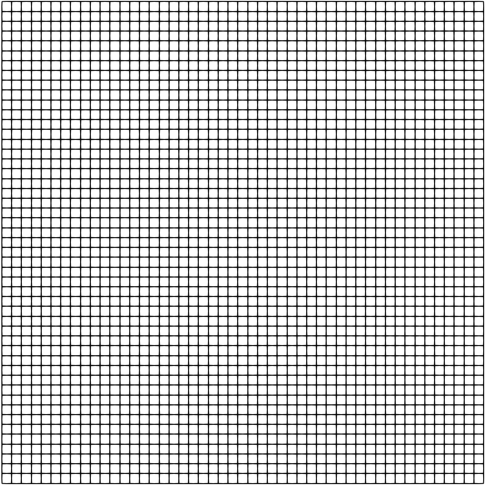
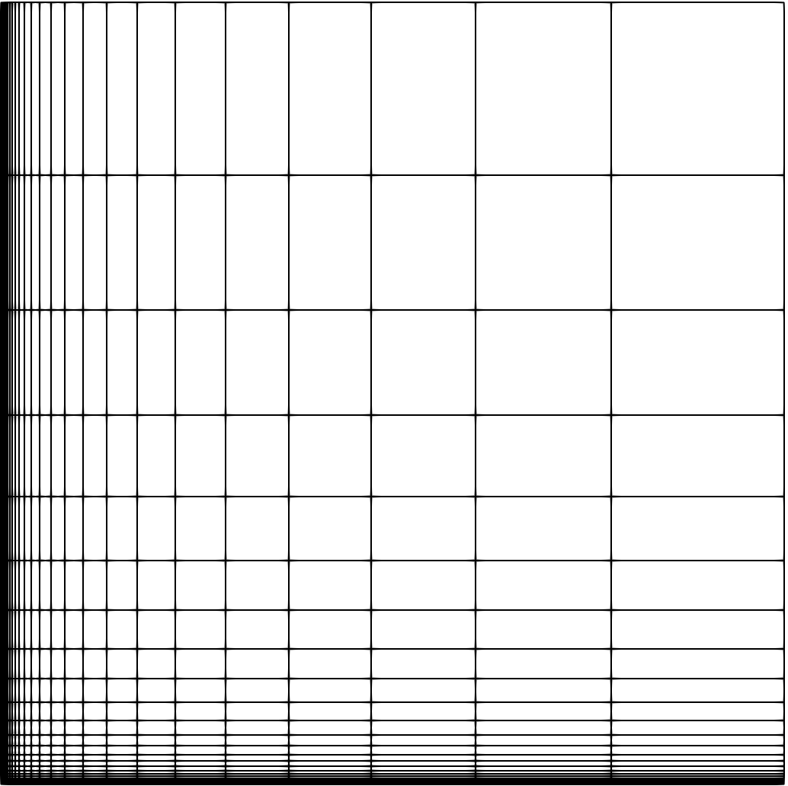
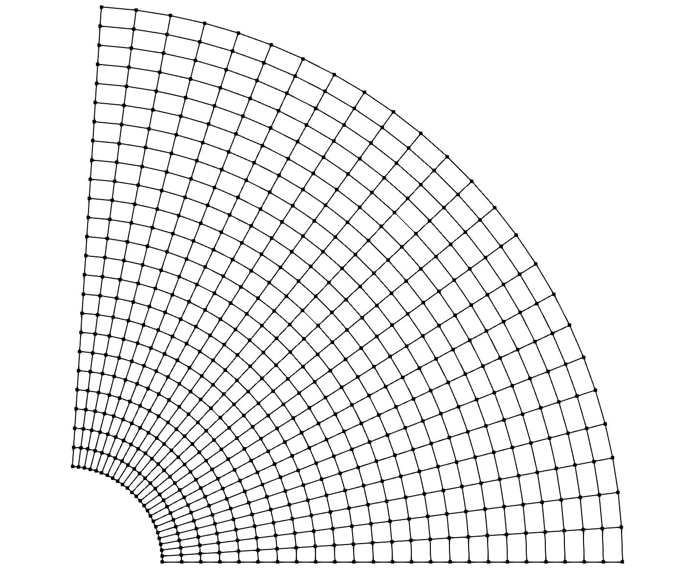

.. ## Copyright (c) 2017-2021, Lawrence Livermore National Security, LLC and
.. ## other Axom Project Developers. See the top-level LICENSE file for details.
.. ##
.. ## SPDX-License-Identifier: (BSD-3-Clause)

.. _sections/tutorial:

Tutorial
---------

The :ref:`sections/tutorial` section consists of simple examples and
code snippets that illustrate how to use Mint's core classes and
functions to construct and operate on the various supported :ref:`MeshTypes`.
The examples presented herein aim to illustrate specific Mint concepts and
capabilities in a structured and simple format.
To quickly learn basic Mint concepts and capabilities through an illustrative
walk-through of a complete working code example, see the
:ref:`sections/mint/getting_started` section. Additional code examples, based on
Mint mini-apps, are provided in the :ref:`sections/examples` section. For
thorough documentation of the interfaces of the various classes and functions
in Mint, developers are advised to consult the
`Mint Doxygen API Documentation`_, in conjunction with this
:ref:`sections/tutorial`.

.. _createAUniformMesh:

Create a Uniform Mesh
^^^^^^^^^^^^^^^^^^^^^^

A :ref:`UniformMesh` is relatively the simplest :ref:`StructuredMesh` type,
but also, the most restrictive mesh out of all :ref:`MeshTypes`.
The constituent :ref:`Nodes` of the :ref:`UniformMesh` are *uniformly* spaced
along each axis on a regular lattice. Consequently, a :ref:`UniformMesh` can
be easily constructed by simply specifying the spatial extents of the domain
and desired dimensions, e.g. the number of :ref:`Nodes` along each dimension.

For example, a :math:`50 \times 50` :ref:`UniformMesh`, defined on a bounded
domain given by the interval :math:`\mathcal{I}:[-5.0,5.0] \times [-5.0,5.0]`,
can be easily constructed as follows:

.. literalinclude:: ../../../examples/user_guide/mint_tutorial.cpp
   :start-after: sphinx_tutorial_construct_uniform_start
   :end-before: sphinx_tutorial_construct_uniform_end
   :language: C++
   :linenos:

The resulting mesh is depicted in :numref:`figs/uniformMesh50x50`.

.. _figs/uniformMesh50x50:

  Resulting Uniform Mesh.

.. _createARectilinearMesh:

Create a Rectilinear Mesh
^^^^^^^^^^^^^^^^^^^^^^^^^^

A :ref:`RectilinearMesh`, also called a *product mesh*, is similar to a
:ref:`UniformMesh`. However, the constituent :ref:`Nodes` of a
:ref:`RectilinearMesh` are not uniformly spaced. The spacing between adjacent
:ref:`Nodes` can vary arbitrarily along each axis, but the :ref:`Topology` of
the mesh remains a regular :ref:`StructuredMesh` :ref:`Topology`. To allow for
this flexibility, the coordinates of the :ref:`Nodes` along each axis are
explicitly stored in separate arrays, i.e. :math:`x`, :math:`y` and :math:`z`,
for each coordinate axis respectively.

The following code snippet illustrates how to construct a :math:`25 \times 25`
:ref:`RectilinearMesh` where the spacing of the :ref:`Nodes` grows according
to an exponential *stretching function* along the :math:`x` and :math:`y` axis
respectively. The resulting mesh is depicted in
:numref:`figs/rectilinearMesh25x25`.

.. literalinclude:: ../../../examples/user_guide/mint_tutorial.cpp
   :start-after: sphinx_tutorial_construct_rectilinear_start
   :end-before: sphinx_tutorial_construct_rectilinear_end
   :language: C++
   :linenos:

.. _figs/rectilinearMesh25x25:

  Resulting :ref:`RectilinearMesh`.

.. _createACurvilinearMesh:

Create a Curvilinear Mesh
^^^^^^^^^^^^^^^^^^^^^^^^^

A :ref:`CurvilinearMesh`, also called a *body-fitted mesh*, is the most
general of the :ref:`StructuredMesh` types. Similar to the :ref:`UniformMesh`
and :ref:`RectilinearMesh` types, a :ref:`CurvilinearMesh` also has regular
:ref:`StructuredMesh` :ref:`Topology`. However, the coordinates of the
:ref:`Nodes` comprising a :ref:`CurvilinearMesh` are defined explicitly,
enabling the use of a :ref:`StructuredMesh` discretization with more general
geometric domains,  i.e., the domain may not be necessarily Cartesian.
Consequently, the coordinates of the :ref:`Nodes` are specified explicitly in
separate arrays, :math:`x`, :math:`y`, and :math:`z`.

The following code snippet illustrates how to construct a :math:`25 \times 25`
:ref:`CurvilinearMesh`. The coordinates of the :ref:`Nodes` follow from the
equation of a cylinder with a radius of :math:`2.5`. The resulting mesh is
depicted in :numref:`figs/curvilinearMesh25x25`.

.. literalinclude:: ../../../examples/user_guide/mint_tutorial.cpp
   :start-after: sphinx_tutorial_construct_curvilinear_start
   :end-before: sphinx_tutorial_construct_curvilinear_end
   :language: C++
   :linenos:

.. _figs/curvilinearMesh25x25:

   Resulting :ref:`CurvilinearMesh`.

.. _createAnUnstructuredMesh:

Create an Unstructured Mesh
^^^^^^^^^^^^^^^^^^^^^^^^^^^

An :ref:`UnstructuredMesh` with :ref:`SingleCellTopology` has
both explicit :ref:`Topology` and :ref:`Geometry`. However, the cell type
that the mesh stores is known *a priori*, allowing for an optimized
underlying :ref:`MeshRepresentation`, compared to the more general
:ref:`MixedCellTopology` :ref:`MeshRepresentation`.

Since both :ref:`Geometry` and :ref:`Topology` are explicit, an
:ref:`UnstructuredMesh` is created by specifying:

#. the coordinates of the constituent :ref:`Nodes`, and
#. the :ref:`Cells` comprising the mesh, defined by the *cell-to-node*
   :ref:`Connectivity`

.. _figs/triangularMesh:

    Resulting :ref:`SingleCellTopology` :ref:`UnstructuredMesh`

The following code snippet illustrates how to create  the simple
:ref:`UnstructuredMesh` depicted in :numref:`figs/triangularMesh`.

.. literalinclude:: ../../../examples/user_guide/mint_tutorial.cpp
   :start-after: sphinx_tutorial_construct_unstructured_start
   :end-before: sphinx_tutorial_construct_unstructured_end
   :language: C++
   :linenos:

An :ref:`UnstructuredMesh` is represented by the ``mint::UnstructuredMesh``
template class. The template argument of the class, ``mint::SINGLE_SHAPE``
indicates the mesh has :ref:`SingleCellTopology`.  The two arguments to the
class constructor correspond to the problem  dimension and cell type, which
in this case, is :math:`2` and ``mint::TRIANGLE`` respectively. Once the mesh
is constructed, the :ref:`Nodes` and :ref:`Cells` are appended to the mesh by
calls to the ``appendNode()`` and ``appendCell()`` methods respectively.
The resulting mesh is shown in :numref:`figs/triangularMesh`.

.. tip::

  The storage for the ``mint::UstructuredMesh`` will grow dynamically as new
  :ref:`Nodes` and :ref:`Cells` are appended on the mesh. However, reallocations
  tend to be costly operations. For best performance, it is advised the node
  capacity and cell capacity for the mesh are specified in the constructor if
  known *a priori*. Consult the `Mint Doxygen API Documentation`_ for more
  details.

.. _createAMixedUnstructuredMesh:

Create a Mixed Unstructured Mesh
^^^^^^^^^^^^^^^^^^^^^^^^^^^^^^^^

Compared to the :ref:`SingleCellTopology` :ref:`UnstructuredMesh`, a
:ref:`MixedCellTopology` :ref:`UnstructuredMesh` has also explicit
:ref:`Topology` and :ref:`Geometry`. However, the cell type is not fixed.
Notably, the mesh can store different :ref:`CellTypes`, e.g. triangles and quads,
as shown in the simple 2D mesh depicted in :numref:`figs/mixedMesh`.

.. _figs/mixedMesh:

    Sample :ref:`MixedCellTopology` :ref:`UnstructuredMesh`

As with the :ref:`SingleCellTopology` :ref:`UnstructuredMesh`, a
:ref:`MixedCellTopology` :ref:`UnstructuredMesh` is created by specifying:

#. the coordinates of the constituent :ref:`Nodes`, and
#. the :ref:`Cells` comprising the mesh, defined by the *cell-to-node*
   :ref:`Connectivity`

The following code snippet illustrates how to create  the simple
:ref:`MixedCellTopology` :ref:`UnstructuredMesh` depicted in
:numref:`figs/mixedMesh`, consisting of :math:`2` *triangles* and
:math:`1` *quadrilateral* :ref:`Cells`.

.. literalinclude:: ../../../examples/user_guide/mint_tutorial.cpp
   :start-after: sphinx_tutorial_construct_unstructured_mixed_start
   :end-before: sphinx_tutorial_construct_unstructured_mixed_end
   :language: C++
   :linenos:

Similarly, a :ref:`MixedCellTopology` :ref:`UnstructuredMesh` is represented
by the ``mint::UnstructuredMesh`` template class. However, the template argument
to the class is ``mint::MIXED_SHAPE``, which indicates that the mesh has
:ref:`MixedCellTopology`.  In this case, the class constructor takes only a
single argument that corresponds to the problem  dimension, i.e. :math:`2`.
Once the mesh is constructed, the constituent :ref:`Nodes` of the mesh are
specified by calling the ``appendNode()`` method on the mesh. Similarly, the
:ref:`Cells` are specified by calling the ``appendCell()`` method. However,
in this case, ``appendCell()`` takes one additional argument that specifies the
cell type, since that can vary.

.. tip::

  The storage for the ``mint::UstructuredMesh`` will grow dynamically as new
  :ref:`Nodes` and :ref:`Cells` are appended on the mesh. However, reallocations
  tend to be costly operations. For best performance, it is advised the node
  capacity and cell capacity for the mesh are specified in the constructor if
  known *a priori*. Consult the `Mint Doxygen API Documentation`_ for more
  details.

.. _workingWithFields:

Working with Fields
^^^^^^^^^^^^^^^^^^^

A mesh typically has associated :ref:`FieldData` that store various numerical
quantities on the constituent :ref:`Nodes`, :ref:`Cells` and :ref:`Faces` of
the mesh.

.. warning::

   Since a :ref:`ParticleMesh` is defined by a set of :ref:`Nodes`, it
   can only store :ref:`FieldData` at its constituent :ref:`Nodes`. All
   other supported :ref:`MeshTypes` can have :ref:`FieldData` associated with
   their constituent :ref:`Cells`, :ref:`Faces` and :ref:`Nodes`.

Add Fields
""""""""""

Given a ``mint::Mesh`` instance, a field is created by specifying:

#. The name of the field,
#. The field association, i.e. centering, and
#. Optionally, the number of components of the field, required if the field
   is not a scalar quantity.

For example, the following code snippet creates the *scalar density* field,
``den``, stored at the cell centers, and the *vector velocity* field, ``vel``,
stored at the :ref:`Nodes`:

.. literalinclude:: ../../../examples/user_guide/mint_tutorial.cpp
   :start-after: sphinx_tutorial_add_fields_start
   :end-before: sphinx_tutorial_add_fields_end
   :language: C++
   :linenos:

.. note::

    If `Sidre`_ is used as the backend :ref:`MeshStorageManagement` substrate,
    ``createField()`` will populate the `Sidre`_ tree hierarchy accordingly.
    See :ref:`usingSidre` for more information.

* Note, the template argument to the ``createField()`` method indicates the
  underlying field type, e.g. ``double``, ``int`` , etc. In this case, both
  fields are of ``double`` field type.

* The *name* of the field is specified by the first required argument to the
  ``createField()`` call.

* The field association, is specified by the second argument to the
  ``createField()`` call.

* A third, *optional*, argument *may* be specified to indicate the number of
  components of the corresponding field. In this case, since ``vel`` is a
  *vector quantity* the number of components must be explicitly specified.

* The ``createField()`` method returns a raw pointer to the data corresponding
  to the new field, which can be used by the application.

.. note::
    Absence of the third argument when calling ``createField()`` indicates
    that the number of components of the field defaults to :math:`1` and thereby
    the field is assumed to be a scalar quantity.

Request Fields by Name
"""""""""""""""""""""""

Specific, existing fields can be requested by calling ``getFieldPtr()`` on
the target mesh as follows:

.. literalinclude:: ../../../examples/user_guide/mint_tutorial.cpp
   :start-after: sphinx_tutorial_get_field_by_name_start
   :end-before: sphinx_tutorial_get_field_by_name_end
   :language: C++
   :linenos:

* As with the ``createField()`` method, the template argument indicates the
  underlying field type, e.g. ``double``, ``int`` , etc.

* The first argument specifies the name of the requested field

* The second argument specifies the corresponding association of the
  requested field.

* The third argument is optional and it can be used to get back the number of
  components of the field, i.e. if the field is not a *scalar* quantity.

.. note::

   Calls to ``getFieldPtr()`` assume that the caller knows *a priori* the:

   * Field name,
   * Field association, i.e. centering, and
   * The underlying field type, e.g. ``double``, ``int``, etc.

Check Fields
""""""""""""

An application can also check if a field exists by calling ``hasField()`` on the
mesh, which takes as arguments the field name and corresponding field
association as follows:

.. literalinclude:: ../../../examples/user_guide/mint_tutorial.cpp
   :start-after: sphinx_tutorial_check_fields_start
   :end-before: sphinx_tutorial_check_fields_end
   :language: C++
   :linenos:

The ``hasField()`` method returns ``true`` or ``false`` indicating whether a
given field is defined on the mesh.

Remove Fields
""""""""""""""

A field can be removed from a mesh by calling ``removeField()`` on the target
mesh, which takes as arguments the field name and corresponding field
association as follows:

.. literalinclude:: ../../../examples/user_guide/mint_tutorial.cpp
   :start-after: sphinx_tutorial_remove_fields_start
   :end-before: sphinx_tutorial_remove_fields_end
   :language: C++
   :linenos:

The ``removeField()`` method returns ``true`` or ``false`` indicating whether
the corresponding field was removed successfully from the mesh.

Query Fields
"""""""""""""

In some cases, an application may not always know *a priori* the name or type
of the field, or, we may want to write a function to process all fields,
regardless of their type.

The following code snippet illustrates how to do that:

.. literalinclude:: ../../../examples/user_guide/mint_tutorial.cpp
   :start-after: sphinx_tutorial_query_fields_start
   :end-before: sphinx_tutorial_query_fields_end
   :language: C++
   :linenos:

* The ``mint::FieldData`` instance obtained by calling ``getFieldData()`` on the
  target mesh holds all the fields with a field association given by
  ``FIELD_ASSOCIATION``.

* The total number of fields can be obtained by calling ``getNumFields()`` on
  the ``mint::FieldData`` instance, which allows looping over the fields with
  a simple ``for`` loop.

* Within the loop, a pointer to a ``mint::Field`` instance, corresponding to
  a particular field, can be requested by calling ``getField()`` on the
  ``mint::FieldData`` instance, which takes the field index, ``ifield``,
  as an argument.

* Given the pointer to a ``mint::Field`` instance, an application can query
  the following field metadata:

   * The field name, by calling ``getName``,
   * The number of tuples of the field, by calling ``getNumTuples()``
   * The number of components of the field, by calling ``getNumComponents()``
   * The underlying field type by calling ``getType()``

* Given the above metadata, the application can then obtain a pointer to the
  raw field data by calling ``getFieldPtr()`` on the target mesh, as shown in
  the code snippet above.

.. _usingExternalStorage:

Using External Storage
^^^^^^^^^^^^^^^^^^^^^^^

A Mint mesh may also be constructed from :ref:`ExternalStorage`. In this
case, the application holds buffers that describe the constituent
:ref:`Geometry`, :ref:`Topology` and :ref:`FieldData` of the mesh, which are
wrapped in Mint for further processing.

The following code snippet illustrates how to use :ref:`ExternalStorage` using
the :ref:`SingleCellTopology` :ref:`UnstructuredMesh` used to demonstrate
how to :ref:`createAnUnstructuredMesh` with :ref:`NativeStorage`:

.. literalinclude:: ../../../examples/user_guide/mint_tutorial.cpp
   :start-after: sphinx_tutorial_using_external_storage_start
   :end-before: sphinx_tutorial_using_external_storage_end
   :language: C++
   :linenos:

* The application has the following buffers:

  * ``x`` and ``y`` buffers to hold the coordinates of the :ref:`Nodes`
  * ``cell_connectivity``, which stores the *cell-to-node* connectivity
  * ``den`` which holds a *scalar density* field defined over the constituent
    :ref:`Cells` of the mesh.

* The mesh is created by calling the ``mint::UnstructuredMesh`` class
  constructor, with the following arguments:

  * The cell type, i.e, ``mint::TRIANGLE``,
  * The total number of cells, ``NUM_CELLS``,
  * The ``cell_connectivity`` which specifies the :ref:`Topology` of the
    :ref:`UnstructuredMesh`,
  * The total number of nodes, ``NUM_NODES``, and
  * The  ``x``, ``y`` coordinate buffers that specify the :ref:`Geometry` of
    the :ref:`UnstructuredMesh`.

* The *scalar density* field is registered with Mint by calling the
  ``createField()`` method on the target mesh instance, as before, but also
  passing the raw pointer to the application buffer in a third argument.

.. note::

   The other :ref:`MeshTypes` can be similarly constructed using
   :ref:`ExternalStorage` by calling the appropriate constructor.
   Consult the `Mint Doxygen API Documentation`_ for more details.

The resulting mesh instance points to the application's buffers. Mint may be
used to process the data e.g., :ref:`outputToVTK`
etc. The values of the data may also be modified, however the mesh cannot
dynamically grow or shrink when using :ref:`ExternalStorage`.

.. warning::

   A mesh using :ref:`ExternalStorage` may modify the values of the application
   data. However, the data is owned by the application that supplied the
   external buffers. Mint cannot reallocate external buffers to grow or shrink
   the the mesh. Once the mesh is deleted, the data remains
   persistent in the application buffers until it is deleted by the application.

.. _usingSidre:

Using Sidre
^^^^^^^^^^^

Mint can also use `Sidre`_ as the underlying :ref:`MeshStorageManagement`
substrate, thereby, facilitate the integration of packages or
codes within the overarching `WSC`_ software ecosystem. `Sidre`_ is another
component of the `Axom Toolkit`_ that provides a centralized data management
system that enables efficient coordination of data across the constituent
packages of a multi-physics application.

There are two primary operations a package/code may want to perform:

#. :ref:`createANewMeshInSidre` so that it can be shared with other packages.
#. :ref:`importAMeshFromSidre`, presumably created by different package or code
   upstream, to operate on, e.g. evaluate a new field on the mesh, etc.

Code snippets illustrating these two operations are presented in the following
sections using a simple :ref:`UnstructuredMesh` example. However, the basic
concepts extend to all supported :ref:`MeshTypes`.

.. note::

   To use `Sidre`_ with Mint, the `Axom Toolkit`_ must be compiled with
   `Conduit`_ support and `Sidre`_ must be enabled (default). Consult the
   `Axom Quick Start Guide`_ for the details on how to build the
   `Axom Toolkit`_.

.. _createANewMeshInSidre:

Create a new Mesh in Sidre
""""""""""""""""""""""""""

Creating a mesh using `Sidre`_ is very similar to creating a mesh that uses
:ref:`NativeStorage`. The key difference is that when calling the mesh
constructor, the target ``sidre::Group``, that will consist of the mesh, must
be specified.

.. warning::

   The target ``sidre::Group`` supplied to the mesh constructor is expected
   to be empty.

The following code snippet illustrates this capability using the
:ref:`SingleCellTopology` :ref:`UnstructuredMesh` used to demonstrate
how to :ref:`createAnUnstructuredMesh` with :ref:`NativeStorage`. The key
differences in the code are highlighted below:

.. literalinclude:: ../../../examples/user_guide/mint_tutorial.cpp
   :start-after: sphinx_tutorial_using_sidre_create_mesh_start
   :end-before: sphinx_tutorial_using_sidre_create_mesh_end
   :language: C++
   :linenos:
   :emphasize-lines: 5-6

.. note::

   A similar construction follows for all supported :ref:`MeshTypes`. To
   :ref:`createANewMeshInSidre` the target ``sidre::Group`` that will consist
   of the mesh is specified in the constructor in addition to any other
   arguments. Consult the `Mint Doxygen API Documentation`_ for more details.

When the constructor is called, the target ``sidre::Group`` is populated
according to the `Conduit`_ `Blueprint`_ mesh description. Any subsequent
changes to the mesh are reflected accordingly to the corresponding
``sidre::Group``. The :ref:`rawSidreData` generated after the above code
snippet executes are included for reference in the :ref:`sections/mint/appendix`.

However, once the mesh object goes out-of-scope the mesh description and any
data remains persisted in `Sidre`_. The mesh can be deleted from `Sidre`_ using
the corresponding `Sidre`_ API calls.

.. warning::

   A Mint mesh, bound to a `Sidre`_ Group, can only be deleted from `Sidre`_
   when the Group consisting the mesh is deleted from `Sidre`_, or, when the
   `Sidre`_ Datastore instance that holds the Group is deleted. When a mesh,
   bound to a `Sidre`_ Group is deleted, its mesh representation and any data
   remain persistent within the corresponding `Sidre`_ Group hierarchy.

.. _importAMeshFromSidre:

Import a Mesh from Sidre
""""""""""""""""""""""""

Support for importing an existing mesh from `Sidre`_, that conforms to the
`Conduit`_ `Blueprint`_ mesh description, is provided by the
``mint::getMesh()`` function. The ``mint::getMesh()`` function takes the
``sidre::Group`` instance consisting of the mesh as an argument and returns a
corresponding ``mint::Mesh`` instance. Notably, the returned ``mint:Mesh``
instance can be any of the supported :ref:`MeshTypes`.

The following code snippet illustrates this capability:

.. literalinclude:: ../../../examples/user_guide/mint_tutorial.cpp
   :start-after: sphinx_tutorial_sidre_import_start
   :end-before: sphinx_tutorial_sidre_import_end
   :language: C++
   :linenos:

* The mesh is imported from `Sidre`_ by calling ``mint::getMesh()``, passing
  the ``sidre::Group`` consisting of the mesh as an argument.

* The mesh type of the imported mesh can be queried by calling the
  ``getMeshType()`` on the imported mesh object.

* Moreover, an application can check if the mesh is bound to a `Sidre`_ group
  by calling ``hasSidreGroup()`` on the mesh.

* Once the mesh is imported, the application can operate on it, e.g.
  :ref:`outputToVTK`, etc., as illustrated in the above code snippet.

* Any subsequent changes to the mesh are reflected accordingly to the
  corresponding ``sidre::Group``

However, once the mesh object goes out-of-scope the mesh description and any
data remains persisted in `Sidre`_. The mesh can be deleted from `Sidre`_ using
the corresponding `Sidre`_ API calls.

.. warning::

   * When a Mint mesh bound to a `Sidre`_ Group is deleted, its mesh
     representation and any data remain persistent within the corresponding
     `Sidre`_ Group hierarchy.

   * A Mint mesh, bound to a `Sidre`_ Group, is deleted from `Sidre`_
     by deleting the corresponding `Sidre`_ Group, or, when the
     `Sidre`_ Datastore instance that holds the Group is deleted.

.. .. _usingTheExecutionModel:

  Using the Execution Model
  --------------------------

  Mint provides a mesh-aware :ref:`sections/execution_model` that is built on
  top of the `RAJA`_ parallel execution and portability abstraction layer. The
  :ref:`sections/execution_model` provides a set of functions to iterate over
  the mesh entities and facilitate in the implementation of kernels that are
  born *parallel* and *portable*.

  Moreover, kernels that do not expose the underlying :ref:`MeshRepresentation`
  can be implemented in a *mesh-agnostic* way, such that, a single implementation
  can be employed for all supported :ref:`MeshTypes`. Unless stated otherwise,
  all kernels discussed in this section are *mesh-agnostic*.

  This section presents code snippets of simple examples that illustrate how to
  use the :ref:`NodeTraversals`, :ref:`CellTraversals` and :ref:`FaceTraversals`
  functions of the :ref:`sections/execution_model`.

.. _NodeTraversalFunctions:

Node Traversal Functions
^^^^^^^^^^^^^^^^^^^^^^^^

The :ref:`NodeTraversalFunctions` iterate over the constituent :ref:`Nodes`
of the mesh and apply a user-supplied kernel operation, often specified with a
`Lambda Expression`_. The :ref:`NodeTraversalFunctions` are implemented by the
``mint::for_all_nodes()`` family of functions, which take an
:ref:`ExecutionPolicy` as the first template argument, and optionally, a
second template argument to indicate the :ref:`ExecutionSignature` of the
supplied kernel.

.. note::

  If a second template argument is not specified, the
  default :ref:`ExecutionSignature` is set to ``xargs::index``, which indicates
  that the supplied kernel takes a single argument corresponding to the index
  of the iteration space, in this case the node index, ``nodeIdx``.

Simple Loop Over Nodes
""""""""""""""""""""""

The following code snippet illustrates a simple loop over the :ref:`Nodes` of a
2D mesh that computes the velocity magnitude, ``vmag``, given the corresponding
velocity components, ``vx`` and ``vy``.

.. literalinclude:: ../../../examples/user_guide/mint_tutorial.cpp
   :start-after: sphinx_tutorial_for_all_nodes_index_start
   :end-before: sphinx_tutorial_for_all_nodes_index_end
   :language: C++
   :linenos:

Loop with Coordinates
"""""""""""""""""""""

The coordinates of a node are sometimes also required in addition to
its index. This additional information may be requested by supplying
``xargs::x`` (in 1D), ``xargs::xy`` (in 2D) or ``xargs::xyz`` (in 3D),
as the second template argument to the ``for_all_nodes()`` method to
specify the :ref:`executionSignature` for the kernel.

This capability is demonstrated by the following code snippet, consisting of
a kernel that updates the nodal velocity components, based on
old node positions, stored at the ``xold`` and ``yold`` node-centered fields,
respectively.

.. literalinclude:: ../../../examples/user_guide/mint_tutorial.cpp
   :start-after: sphinx_tutorial_for_all_nodes_xy_start
   :end-before: sphinx_tutorial_for_all_nodes_xy_end
   :language: C++
   :linenos:

.. note::

  * The second template argument, ``mint::xargs::xy``, indicates that the
    supplied kernel expects the ``x`` and ``y`` node coordinates as arguments
    in addition to its ``nodeIdx``.

Loop with IJK Indices
"""""""""""""""""""""

When working with a :ref:`StructuredMesh`, it is sometimes required to expose
the regular :ref:`Topology` of the :ref:`StructuredMesh` to obtain higher
performance for a particular algorithm. This typically entails using the
*logical* *IJK* ordering of the :ref:`StructuredMesh` to implement
certain operations. The template argument, ``xargs::ij`` or ``xargs::ijk``,
for 2D or 3D respectively, may be used as the second template argument to
the ``for_all_nodes()`` function to specify the :ref:`executionSignature` of
the supplied kernel.

For example, the following code snippet illustrates how to obtain a node's
``i`` and ``j`` indices within a sample kernel that computes the linear index of
each node and stores the result in a node-centered field, ``ID``.

.. literalinclude:: ../../../examples/user_guide/mint_tutorial.cpp
   :start-after: sphinx_tutorial_for_all_nodes_ij_start
   :end-before: sphinx_tutorial_for_all_nodes_ij_end
   :language: C++
   :linenos:

.. warning::

   In this case, the kernel makes use of the IJK indices and hence it is
   only applicable for a :ref:`StructuredMesh`.

.. _CellTraversalFunctions:

Cell Traversal Functions
^^^^^^^^^^^^^^^^^^^^^^^^

The :ref:`CellTraversalFunctions` iterate over the constituent
:ref:`Cells` of the mesh and apply a user-supplied kernel operation, often
specified with a `Lambda Expression`_. The :ref:`CellTraversalFunctions`
are implemented by the ``mint::for_all_cells()`` family of functions,
which take an :ref:`ExecutionPolicy` as the first template argument, and
optionally, a second template argument to indicate the :ref:`ExecutionSignature`
of the supplied kernel.

.. note::

  If a second template argument is not specified, the
  default :ref:`ExecutionSignature` is set to ``xargs::index``, which indicates
  that the supplied kernel takes a single argument corresponding to the index
  of the iteration space, in this case the cell index, ``cellIdx``.

Simple Loop Over Cells
""""""""""""""""""""""

The following code snippet illustrates a simple loop over the constituent
:ref:`Cells` of the mesh that computes the cell density (``den``), given
corresponding mass (``mass``) and volume (``vol``) quantities.

.. literalinclude:: ../../../examples/user_guide/mint_tutorial.cpp
   :start-after: sphinx_tutorial_for_all_cells_index_start
   :end-before: sphinx_tutorial_for_all_cells_index_end
   :language: C++
   :linenos:

Loop with Node IDs
"""""""""""""""""""

Certain operations may require the IDs of the constituent cell :ref:`Nodes` for
some calculation. The template argument, ``xargs::nodeids``,  may be used as
the second template argument to the ``for_all_cells()`` function to specify
the :ref:`executionSignature` for the kernel. The ``xargs::nodeids`` indicates
that the supplied kernel also takes the the IDs of the constituent cell
:ref:`Nodes` as an argument.

This feature is demonstrated with the following code snippet, which averages
the node-centered velocity components to corresponding cell-centered fields:

.. literalinclude:: ../../../examples/user_guide/mint_tutorial.cpp
   :start-after: sphinx_tutorial_for_all_cells_nodeids_start
   :end-before: sphinx_tutorial_for_all_cells_nodeids_end
   :language: C++
   :linenos:

.. note::

  * ``xargs::nodeids`` indicates that the specified kernel takes three arguments:

    * ``cellIdx``, the ID of the cell,

    * ``nodeIDs``, an array of the constituent node IDs, and

    * ``N``, the number of :ref:`Nodes` for the given cell.

Loop with Coordinates
""""""""""""""""""""""

The coordinates of the constituent cell :ref:`Nodes` are often required in
some calculations. A cell's node coordinates may be supplied to the specified
kernel as an argument using ``xargs::coords`` as the second template argument
to the ``for_all_cells()`` function, to specify the :ref:`executionSignature`
of the supplied kernel.

This feature is demonstrated with the following code snippet, which computes
the cell centroid by averaging the coordinates of the constituent cell
:ref:`Nodes`:

.. note::

   Since this kernel does not use the node IDs, the argument to the kernel
   is annotated using the ``AXOM_NOT_USED`` macro to silence compiler
   warnings.

.. literalinclude:: ../../../examples/user_guide/mint_tutorial.cpp
   :start-after: sphinx_tutorial_for_all_cells_coords_start
   :end-before: sphinx_tutorial_for_all_cells_coords_end
   :language: C++
   :linenos:

.. note::

  * ``xargs::coords`` indicates that the specified kernel takes the following
    arguments:

    * ``cellIdx``, the ID of the cell,

    * ``coords``, a matrix that stores the cell coordinates, such that:

        * The number of rows corresponds to the problem dimension, and,
        * The number of columns corresponds to the number of nodes.
        * The :math:`ith` column vector of the matrix stores the coordinates of the
          :math:`ith` node.

    * ``nodeIdx`` array of corresponding node IDs.

Loop with Face IDs
"""""""""""""""""""

The IDs of the constituent cell :ref:`Faces` are sometimes needed to access the
corresponding face-centered quantities for certain operations. The face IDs
can be obtained using ``xargs::faceids`` as the second template argument to
the ``for_all_faces()`` function, to specify the :ref:`executionSignature` of
the supplied kernel.

This feature is demonstrated with the following code snippet, which computes
the perimeter of each cell by summing the pre-computed face areas:

.. literalinclude:: ../../../examples/user_guide/mint_tutorial.cpp
   :start-after: sphinx_tutorial_for_all_cells_faceids_start
   :end-before: sphinx_tutorial_for_all_cells_faceids_end
   :language: C++
   :linenos:

.. note::

  * ``xargs::faceids`` indicates that the specified kernel takes the following
    arguments:

    * ``cellIdx``, the ID of the cell,

    * ``faceIDs``, an array of the constituent face IDs, and,

    * ``N``, the number of :ref:`Faces` for the given cell.

Loop with IJK Indices
""""""""""""""""""""""

As with the :ref:`NodeTraversalFunctions`, when working with a
:ref:`StructuredMesh`, it is sometimes required to expose the regular
:ref:`Topology` of the :ref:`StructuredMesh` to obtain higher performance
for a particular algorithm. This typically entails using the *logical*
*IJK* ordering of the :ref:`StructuredMesh` to implement certain operations.
The template argument, ``xargs::ij`` (in 2D) or ``xargs::ijk`` (in 3D) may be
used as the second template argument to the ``for_all_cells()`` function, to
specify the :ref:`executionSignature` of the supplied kernel.

For example, the following code snippet illustrates to obtain a cell's
``i`` and ``j`` indices within a kernel that computes the linear index of each
cell and stores the result in a cell-centered field, ``ID``.

.. literalinclude:: ../../../examples/user_guide/mint_tutorial.cpp
   :start-after: sphinx_tutorial_for_all_cells_ij_start
   :end-before: sphinx_tutorial_for_all_cells_ij_end
   :language: C++
   :linenos:

.. warning::

   In this case, the kernel makes use of the IJK indices and hence it is
   only applicable for a :ref:`StructuredMesh`.

.. _FaceTraversalFunctions:

Face Traversal Functions
^^^^^^^^^^^^^^^^^^^^^^^^

The :ref:`FaceTraversalFunctions` functions iterate over the constituent
:ref:`Faces` of the mesh and apply a user-supplied kernel operation,
often specified with a `Lambda Expression`_. The :ref:`FaceTraversalFunctions`
are implemented by the ``mint::for_all_faces()`` family of functions.
which take an :ref:`ExecutionPolicy` as the first template argument, and
optionally, a second template argument to indicate the :ref:`ExecutionSignature`
of the supplied kernel.

.. note::

  If a second template argument is not specified, the
  default :ref:`ExecutionSignature` is set to ``xargs::index``, which indicates
  that the supplied kernel takes a single argument corresponding to the index
  of the iteration space, in this case the face index, ``faceIdx``.

Simple Loop Over Faces
"""""""""""""""""""""""

The following code snippet illustrates a simple loop over the constituent
:ref:`Faces` of a 2D mesh that computes an interpolated face-centered quantity
(``temp``) based on pre-computed interpolation coefficients ``t1`` , ``t2``
and ``w``.

.. literalinclude:: ../../../examples/user_guide/mint_tutorial.cpp
   :start-after: sphinx_tutorial_for_all_faces_index_start
   :end-before: sphinx_tutorial_for_all_faces_index_end
   :language: C++
   :linenos:

Loop with Node IDs
""""""""""""""""""

The IDs of the constituent face :ref:`Nodes` are sometimes needed to access
associated node-centered data for certain calculations. The template argument,
``xargs::nodeids``, may be used as the second template argument to the
``for_all_faces()`` function to specify the :ref:`executionSignature` of the
supplied kernel. The ``xargs::nodeids`` template argument indicates that the
supplied kernel also takes the IDs of the constituent face Nodes as an
argument.

This feature is demonstrated with the following code snippet which averages
the node-centered velocity components to corresponding face-centered
quantities:

.. literalinclude:: ../../../examples/user_guide/mint_tutorial.cpp
   :start-after: sphinx_tutorial_for_all_faces_nodeids_start
   :end-before: sphinx_tutorial_for_all_faces_nodeids_end
   :language: C++
   :linenos:

.. note::

  * ``xargs::nodeids`` indicates that the specified kernel takes three arguments:

    * ``faceIdx``, the ID of the cell,

    * ``nodeIDs``, an array of the constituent node IDs, and

    * ``N``, the number of :ref:`Nodes` for the corresponding face.

Loop with Coordinates
"""""""""""""""""""""

The coordinates of the constituent face :ref:`Nodes` are often required in
some calculations. The constituent face node coordinates may be supplied to
the specified kernel as an argument using ``xargs::coords`` as the second
template argument to the ``for_all_faces()`` function, to specify the
:ref:`executionSignature` of the supplied kernel.

This feature is demonstrated with the following code snippet, which computes
the face centroid by averaging the coordinates of the constituent face
:ref:`Nodes`:

.. note::

   Since this kernel does not use the node IDs, the argument to the kernel
   is annotated using the ``AXOM_NOT_USED`` macro to silence compiler
   warnings.

.. literalinclude:: ../../../examples/user_guide/mint_tutorial.cpp
   :start-after: sphinx_tutorial_for_all_faces_coords_start
   :end-before: sphinx_tutorial_for_all_faces_coords_end
   :language: C++
   :linenos:

.. note::

  * ``xargs::coords`` indicates that the specified kernel takes the following
    arguments:

  * ``faceIdx``, the ID of the cell,

  * ``coords``, a matrix that stores the cell coordinates, such that:

        * The number of rows corresponds to the problem dimension, and,
        * The number of columns corresponds to the number of nodes.
        * The :math:`ith` column vector of the matrix stores the coordinates of the
          :math:`ith` node.

  * ``nodeIdx`` array of corresponding node IDs.

Loop with Cell IDs
""""""""""""""""""

The constituent :ref:`Faces` of a mesh can be bound to either one or two
:ref:`Cells`. The IDs of the :ref:`Cells` abutting a face are required in
order to obtain the corresponding cell-centered quantities, needed by some
calculations. The template argument, ``xargs::cellids``, may be used as the
second template argument to the ``for_all_faces()`` function to specify the
:ref:`executionSignature` of the supplied kernel. Thereby, indicate that the supplied kernel also takes the IDs of the two abutting cells as an argument.

.. note::

   External boundary faces are only bound to one cell. By convention, the
   ID of the second cell for external boundary faces is set to :math:`-1`.

This functionality is demonstrated with the following example that loops
over the constituent :ref:`Faces` of a mesh and marks external boundary
faces:

.. literalinclude:: ../../../examples/user_guide/mint_tutorial.cpp
   :start-after: sphinx_tutorial_for_all_faces_cellids_start
   :end-before: sphinx_tutorial_for_all_faces_cellids_end
   :language: C++
   :linenos:

.. note::

  * ``xargs::coords`` indicates that the specified kernel takes the following
    arguments:

  * ``faceIdx``, the ID of the cell,

  * ``c1``, the ID of the first cell,

  * ``c2``, the ID of the second cell, set to a :math:`-1` if the face is
    an external boundary face.

.. _femTutorial:

Finite Elements
^^^^^^^^^^^^^^^^

Mint provides basic support for :ref:`sections/fem` consisting of
:ref:`LagrangeBasis` *shape functions* for commonly employed
:ref:`CellTypes` and associated operations, such as functions to evaluate the
Jacobian and compute the forward and inverse :ref:`IsoparametricMapping`.

.. warning::

   Porting and refactoring of Mint's :ref:`sections/fem` for GPUs is
   under development. This feature will be available in future versions
   of Mint.

.. _createAFiniteElementObject:

Create a Finite Element Object
"""""""""""""""""""""""""""""""

All associated functionality with :ref:`sections/fem` is exposed to the
application through the ``mint::FiniteElement`` class. The following code
snippet illustrates how to :ref:`createAFiniteElementObject` using a Linear
Lagrangian Quadrilateral Finite Element as an example:

.. literalinclude:: ../../../examples/user_guide/mint_tutorial.cpp
   :start-after: sphinx_tutorial_create_fe_start
   :end-before: sphinx_tutorial_create_fe_end
   :language: C++
   :linenos:

* The ``mint::FiniteElement`` constructor takes two arguments:

  * An :math:`N \times M` Matrix consisting of the cell coordinates, where,
    :math:`N` corresponds to physical dimension of the cell and :math:`M`
    corresponds to the number of constituent cell nodes. The cell coordinates
    are organized in the matrix such that, each column vector stores the
    coordinates of a corresponding node.

  * The cell type, e.g. ``mint::QUAD``

* Then, ``mint::bind_basis()`` is called to bind the Finite Element object
  to the :ref:`LagrangeBasis`. Effectively, this step wires the pointers
  to the :ref:`LagrangeBasis` *shape functions* for the particular
  cell type.

A similar construction follows for different :ref:`CellTypes` and associated
supported *shape functions*.

The Finite Element object, once constructed and bound to a basis, it may be used
to perform the following operations:

 #. Given a point in reference space, :math:`\hat{\xi} \in \bar{\Omega}`:

    * :ref:`evaluateShapeFunctions`, :math:`N_i(\xi)`, associated with each of
      the constituent cell nodes, which are often used as
      *interpolation weights*,

    * :ref:`evaluateTheJacobian`, :math:`J(\xi)`, and

    * Compute the :ref:`forwardIsoparametricMap`
      :math:`\vec{x}: \bar{\Omega} \rightarrow \Omega^e`

 #. Given a point in physical space, :math:`\hat{x} \in \Omega`:

    * Compute the :ref:`inverseIsoparametricMap`, which attempts to evaluate
      the corresponding reference coordinates of the point,
      :math:`\hat{\xi} \in \bar{\Omega}`, with respect to the finite element,
      :math:`\Omega^e`. This operation is only defined for points that are
      *inside* the element (within some :math:`\epsilon`).

.. _evaluateShapeFunctions:

Evaluate Shape Functions
""""""""""""""""""""""""

The *shape functions* can be readily computed from any ``mint::FiniteElement``
instance by calling the ``evaluateShapeFunctions()`` method on the finite element
object. The following code snippet illustrates how to :ref:`evaluateShapeFunctions`
at the isoparametric center of a quadrilateral element, given by
:math:`\xi=(0.5,0.5)^T`:

.. literalinclude:: ../../../examples/user_guide/mint_tutorial.cpp
   :start-after: sphinx_tutorial_evaluate_shape_functions_start
   :end-before: sphinx_tutorial_evaluate_shape_functions_end
   :language: C++
   :linenos:

* The ``evaluateShapeFunctions()`` method takes two arguments:

  * ``xi``, an input argument corresponding to the reference coordinates of
    the point, :math:`\hat{\xi}`, where the *shape functions* will be
    evaluated, and

  * ``N``, an output argument which is an array of length equal to the number
    of constituent cell :ref:`Nodes`, storing the corresponding
    *shape functions*.

.. _evaluateTheJacobian:

Evaluate the Jacobian
""""""""""""""""""""""

Similarly, for a reference point, :math:`\hat{\xi} \in \bar{\Omega}`, the
Jacobian matrix, consisting the sums of derivatives of *shape functions*
and the corresponding determinant of the Jacobian, can be readily computed
from the finite element object as follows:

.. literalinclude:: ../../../examples/user_guide/mint_tutorial.cpp
   :start-after: sphinx_tutorial_jacobian_start
   :end-before: sphinx_tutorial_jacobian_end
   :language: C++
   :linenos:

* The Jacobian matrix is computed by calling the ``jacobian()`` method on the
  finite element object, which takes two arguments:

  * ``xi``, an input argument corresponding to the reference coordinates of
    the point, :math:`\hat{\xi}`, where the Jacobian will be evaluated, and

  * A matrix, represented by the ``axom::numerics::Matrix`` class, to store
    the resulting Jacobian.

.. note::

   The Jacobian matrix is not necessarily a square matrix. It can have
   :math:`N \times M` dimensions, where, :math:`N` corresponds to the
   dimension in the reference :math:`xi`-space and :math:`M` is the physical
   dimension. For example, a quadrilateral element is defined in a 2D
   reference space, but it may be instantiated within a 3D ambient space.
   Consequently, the dimensions of the corresponding Jacobian would be
   :math:`2 \times 3` in this case.

* The determinant of the Jacobian can then be computed by calling
  ``axom::numerics::determinant()``, with the Jacobian as the input argument.

.. _forwardIsoparametricMap:

Forward Isoparametric Map
""""""""""""""""""""""""""

Given a point in reference space, :math:`\hat{\xi} \in \bar{\Omega}`, the
corresponding physical point, :math:`\hat{x} \in \Omega^e` is computed by
calling the ``computePhysicalCoords()`` method on the finite element
object as illustrated below:

.. literalinclude:: ../../../examples/user_guide/mint_tutorial.cpp
   :start-after: sphinx_tutorial_forward_map_start
   :end-before: sphinx_tutorial_forward_map_end
   :language: C++
   :linenos:

The ``computePhysicalCoords()`` method takes two arguments:

* ``xi``, an input argument corresponding to the reference coordinates of
  the point, :math:`\hat{\xi}`, whose physical coordinates are computed, and

* ``xc``, an output array argument that stores the computed physical
  coordinates, :math:`\hat{x} \in \Omega^e`

.. _inverseIsoparametricMap:

Inverse Isoparametric Map
""""""""""""""""""""""""""

Similarly, given a point in physical space, :math:`\hat{x} \in \Omega`,
a corresponding point in the reference space of the element,
:math:`\hat{\xi} \in \bar{\Omega}`, can be obtained by calling
the ``computeReferenceCoords()`` method on the finite element object
as illustrated by the following:

.. literalinclude:: ../../../examples/user_guide/mint_tutorial.cpp
   :start-after: sphinx_tutorial_inverse_map_start
   :end-before: sphinx_tutorial_inverse_map_end
   :language: C++
   :linenos:

The ``computeReferenceCoords()`` method takes two arguments:

* ``xc`` an input argument consisting of the physical point coordinates, whose
  reference coordinates are computed, and

* ``xi`` an output array to store the computed reference coordinates, if
  successful.

The :ref:`inverseIsoparametricMap` typically requires an iterative, non-linear
solve, which is typically implemented with a Newton-Raphson. Moreover, the
:ref:`inverseIsoparametricMap` is only defined for points within the element,
:math:`\Omega^e`. Consequently, the ``computeReferenceCoords()`` method
returns a status that indicates whether the operation was successful.
Specifically, ``computeReferenceCoords()`` can return the following
statuses:

* ``INVERSE_MAP_FAILED``
    This typically indicates that the Newton-Raphson iteration did not converge,
    e.g., negative Jacobian, etc.

* ``OUTSIDE_ELEMENT``
    This indicates that the Newton-Raphson converged, but the point is outside
    the element. Consequently, valid reference coordinates do not exist for the
    given point with respect to the element.

* ``INSIDE_ELEMENT``
    This indicates the the Newton-Raphson converged and the point is inside the
    element

.. _outputToVTK:

Output to VTK
^^^^^^^^^^^^^^

Mint provides native support for writing meshes in the ASCII Legacy
`VTK File Format`_. Legacy VTK files are popular due to their simplicity and
can be read by a variety of visualization tools, such as `VisIt`_ and
`ParaView`_. Thereby, enable quick visualization of the various :ref:`MeshTypes`
and constituent :ref:`FieldData`, which can significantly aid in debugging.

.. warning::

  The Legacy `VTK File Format`_ does not provide support for face-centered
  fields. Consequently, the output consists of only the node-centered and
  cell-centered fields of the mesh.

The functionality for outputting a mesh to VTK  is provided by the
``mint::write_vtk()`` function. This is a free function in the
``axom::mint`` namespace, which takes two arguments: (1) a pointer to
a ``mint::Mesh`` object, and, (2) the filename of the target VTK file,
as illustrated in the code snippet below:

.. literalinclude:: ../../../examples/user_guide/mint_tutorial.cpp
   :start-after: sphinx_tutorial_vtk_output_start
   :end-before: sphinx_tutorial_vtk_output_end
   :language: C++
   :linenos:

This function can be invoked on a ``mint::Mesh`` object, which can correspond
to any of the supported :ref:`MeshTypes`. The concrete mesh type will be
reflected in the resulting VTK output file according to the `VTK File Format`_
specification.

.. note::

   Support for VTK output is primarily intended for debugging and quick
   visualization of meshes. This functionality is not intended for routine
   output or restart dumps from a simulation. Production I/O capabilities
   in the `Axom Toolkit`_ are supported through `Sidre`_. Consult the
   `Sidre`_ documentation for the details.

.. #############################################################################
..  CITATIONS
.. #############################################################################

.. include:: citations.rst
