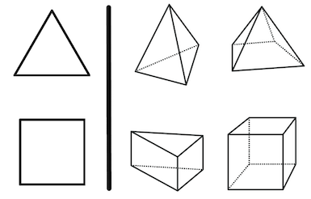
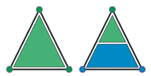
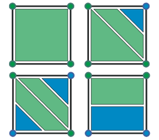

.. ## Copyright (c) 2017-2019, Lawrence Livermore National Security, LLC and
.. ## other Axom Project Developers. See the top-level COPYRIGHT file for details.
.. ##
.. ## SPDX-License-Identifier: (BSD-3-Clause)

=======================
Equi-Z Algorithm
=======================

The Equi-Z algorithm provided here is an implementation of the algorithm described in 
the 2005 paper "Material Interface Reconstruction in VisIt" by J. S. Meredith.

Functionality for this algorithm is provided by ``computeReconstructedInterface()``. 
It takes in references to two meshes: the mesh to be processed and the mesh that 
will contain the results of the material interface reconstruction.

.. raw:: html

    <h3>Key Concepts</h3>

Full details of the algorithm can be found in the original paper, but key concepts 
are explained here.

The input into this algorithm is a volumetric mesh composed of element based volume fractions.
The elements of this input mesh can contain multiple materials. The output of this algorithm
is a new volumetric mesh composed of clean elements (i.e. only one material is present in each element). 
Note that both the input and output meshes are composed of elements that are part of the finite element zoo (described below).
Each element of the mesh is then processed independently. For each pair of materials of the current element, convert the element
centered volume fractions to vertex centered volume fractions, which are found by calculating the average value of the materials 
of the adjacent elements. Then, determine the dominant material at each vertex of the element. The configuration of the dominant
materials is used as an index into a lookup table of clipping cases (described below). Once the clipping case is found, linear interpolation is used
to find the exact points along the edges at which the current element should be split. The element is then decomposed into clean, zoo 
elements.

.. raw:: html

    <h4>Finite Element Zoo</h4>

For two-dimensional meshes, the finite element zoo consists of triangles and quadrilaterals, while for three-dimensional meshes,
the finite element zoo consists of tetrahedrons, pyramids, triangular prisms (wedges), and hexahedrons. This can be seen in the
figure below.

Splitting the mesh into elements contained in the zoo prevents a couple of issues: the first being
interpolation imprinting and the second being the need to split arbitrary polyhedra.

.. raw:: html

    <h4>Clipping Cases</h4>

During the course of the algorithm, it is necessary to map each shape and the material that is dominant at each of its vertices 
to a specific, pre-defined clipping case. For two dimensional shapes, the cases can be seen below.

Note that while this algorithm can handle any number of materials in the input mesh, it considers two materials at a time when splitting
an element.