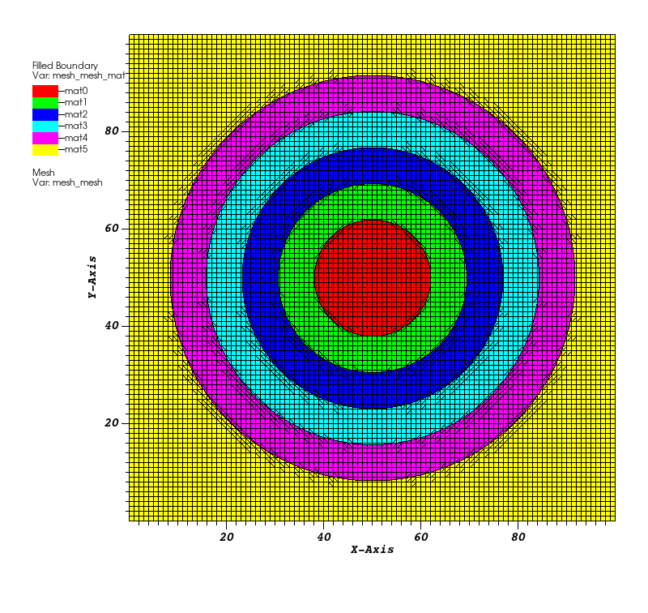

.. ## Copyright (c) 2017-2025, Lawrence Livermore National Security, LLC and
.. ## other Axom Project Developers. See the top-level LICENSE file for details.
.. ##
.. ## SPDX-License-Identifier: (BSD-3-Clause)

******************************************************
MIR Algorithms
******************************************************

The MIR component contains MIR algorithms that will take a Blueprint mesh as input,
perform MIR on it, and output a new Blueprint mesh with the reconstructed output.
A Blueprint mesh is contained in a ``conduit::Node`` and it follows the `Blueprint protocol <https://llnl-conduit.readthedocs.io/en/latest/blueprint_mesh.html>`_,
which means the node contains specific items that describe the mesh coordinates, topology, fields, and materials.

#######
Inputs
#######

MIR algorithms are designed to accept a Conduit node containing various options that can
influence how the algorithm operates. The MIR algorithm copies the options node to the memory
space where it will be used. The only required option is ``matset``, the name of the matset
to operate on. Other options have sensible defaults described in the table below.

+---------------------------------+------------------------------------------------------+
| Option                          | Description                                          |
+=================================+======================================================+
|``coordsetName: name``           | The name of the new coordset in the output mesh. If  |
|                                 | it is not provided, the output coordset will have the|
|                                 | same name as the input coordset.                     |
+---------------------------------+------------------------------------------------------+
|``fields:``                      | The fields node lets the caller provide a list of    |
|                                 | field names that will be processed and added to the  |
|                                 | output mesh. The form is *currentName:newName*. If   |
|                                 | the *fields* node is not given, the algorithm will   |
|                                 | process all input fields. If the fields node is empty|
|                                 | then no fields will be processed.                    |
+---------------------------------+------------------------------------------------------+
| ``matset: name``                | A required string argument that specifies the name   |
|                                 | of the matset that will be operated on.              |
+---------------------------------+------------------------------------------------------+
| ``matsetName: name``            | An optional string argument that specifies the name  |
|                                 | of the matset to create in the output. If the name   |
|                                 | is not given, the output matset will have the same   |
|                                 | name as the input matset.                            |
+---------------------------------+------------------------------------------------------+
| ``originalElementsField: name`` | The name of the field in which to store the original |
|                                 | elements map. The default is "originalElements".     |
+---------------------------------+------------------------------------------------------+
| ``selectedZones: [zone list]``  | An optional argument that provides a list of zone ids|
|                                 | on which to operate. The output mesh will only have  |
|                                 | contributions from zone numbers in this list, if it  |
|                                 | is given.                                            |
+---------------------------------+------------------------------------------------------+
| ``topologyName: name``          | The name of the new topology in the output mesh. If  |
|                                 | it is not provided, the output topology will have the|
|                                 | same name as the input topology.                     |
+---------------------------------+------------------------------------------------------+

###############
EquiZAlgorithm
###############

The `Equi-Z MIR algorithm <https://www.google.com/url?sa=t&source=web&rct=j&opi=89978449&url=https://www.osti.gov/servlets/purl/15014510&ved=2ahUKEwittMui-euIAxUzxOYEHXTWA2kQFnoECBcQAQ&usg=AOvVaw3qbX9qgwCn4qDP0iZ3Sq0J>`_ by J. Meredith 
is a useful visualization-oriented algorithm for MIR. Equi-Z can reconstruct mixed-material
zones that contain many materials per zone. Whereas many MIR algorithms 
produce disjointed element output, Equi-Z creates output that mostly forms continuous
surfaces and shapes. Continuity is achieved by averaging material volume fractions to
the mesh nodes for each material and then performing successive clipping for each
material, using the node-averaged volume fractions to determine where clipping occurs
along each edge. The basic algorithm is lookup-based so shape decomposition for a
clipped-zone can be easily determined. The clipping stage produces numerous zone fragments
that are marked with the appropriate material number and moved into the next material
clipping stage. This concludes when all zones are comprised of only 1 material. From,
there points are made unique and a new output mesh is created.

Axom's implementation of Equi-Z is data parallel and can run on the CPU and the GPU.
First, the zones of interest are identified and they are classified as clean or mixed.
Clean zones consist of a single material and are pulled out early into a new mesh while mixed
zones are processed further. The Equi-Z algorithm reconstructs zones with boundaries along
material interfaces. The clean zones mesh and reconstructed zones mesh are merged to form
a single output mesh. The mesh may consist of multiple Blueprint shape types in an
unstructured "mixed" topology.

Axom's implementation supports 2D/3D zones from structured or unstructured topologies
made of Finite Element Zoo elements *(e.g. triangles, quadrilaterals, tetrahedra, pyramids,
wedges, hexahedra, or topologically-compatible mixtures)*. The MIR logic for Equi-Z is
encapsulated in ``axom::mir::EquizAlgorithm``, which is a class that is templated on view objects.
View objects help provide an interface between the Blueprint data and the MIR algorithm.
At a minimum, an execution space and three views are required to instantiate the
``axom::mir::EquiZAlgorithm`` class. The execution space determines which compute backend will
be used to execute the algorithm. The Blueprint data must exist in a compatible
memory space for the execution space. The views are: *CoordsetView*, *TopologyView*, and
*MaterialView*. The *CoordsetView* template argument lets the algorithm access the mesh's
coordset using concrete data types and supports queries that return points. The
*TopologyView* provides a set of operations that can be performed on meshes, mainly a
method for retrieving individual zones that can be used in device kernels.
The *MaterialView* provides an interface for querying matsets.

Once view types have been created and views have been instantiated, the ``EquiZAlgorithm``
algorithm can be instantiated and used. The ``EquiZAlgorithm`` class provides a single
``execute()`` method that takes the input mesh, an options node, and a node to contain
the output mesh. The output mesh will exist in the same memory space as the input mesh,
which again, must be compatible with the selected execution space. The ``axom::mir::utilities::blueprint::copy()``
function can be used to copy Conduit nodes from one memory space to another.

.. literalinclude:: ../../examples/concentric_circles/runMIR.hpp
   :start-after: _equiz_mir_start
   :end-before: _equiz_mir_end
   :language: C++

The MIR output will contain a new field called, by default, *"originalElements"* that
indicates which original zone number gave rise to the reconstructed zone. This field
makes it possible to map back to the original mesh. The name of the field can be changed
by providing a new name by setting "originalElementsField" in the options.

#####################
Example Application
#####################

The mir_concentric_circles application generates a uniform mesh with square zones, populated
with circular mixed material shells. The application performs MIR on the input mesh and writes
a file containing the reconstructed mesh. All program arguments (listed in the table below)
are optional.

+--------------------+---------------------------------------------------------------+
| Argument           | Description                                                   |
+====================+===============================================================+
| --gridsize number  | The number of zones along an axis. The default is 5.          |
+--------------------+---------------------------------------------------------------+
| --numcircles number| The number of number of circles to use for material creation. |
|                    | The default is 2.                                             |
+--------------------+---------------------------------------------------------------+
| --output filepath  | The file path for output files. The default is "output".      |
+--------------------+---------------------------------------------------------------+
| --policy policy    | Set the execution policy (seq, omp, cuda, hip)                |
+--------------------+---------------------------------------------------------------+
| --caliper mode     | The caliper mode (none, report)                               |
+--------------------+---------------------------------------------------------------+

To run the example program from the Axom build directory, follow these steps:

  ./examples/mir_concentric_circles --gridsize 100 --numcircles 5 --output mir

   Diagram showing MIR output from the *mir_concentric_circles* application.

#####################
Visualization
#####################

The `VisIt software <https://visit-dav.github.io/visit-website/>`_ can be used to
view the Blueprint output from MIR algorithms. Blueprint data is saved in an HDF5
format and the top level file has a ".root" extension. Open the ".root" file in VisIt
to get started and then add a *FilledBoundary* plot of the material defined on the
mesh topology. Plotting the mesh lines will reveal that there is a single material
per zone. If the input mesh is visualized in a similar manner, zones with multiple
materials will contain different colors for each material.
