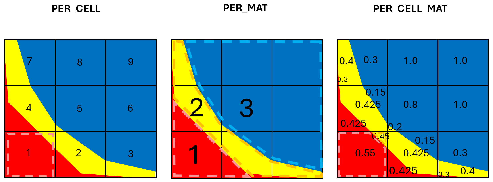
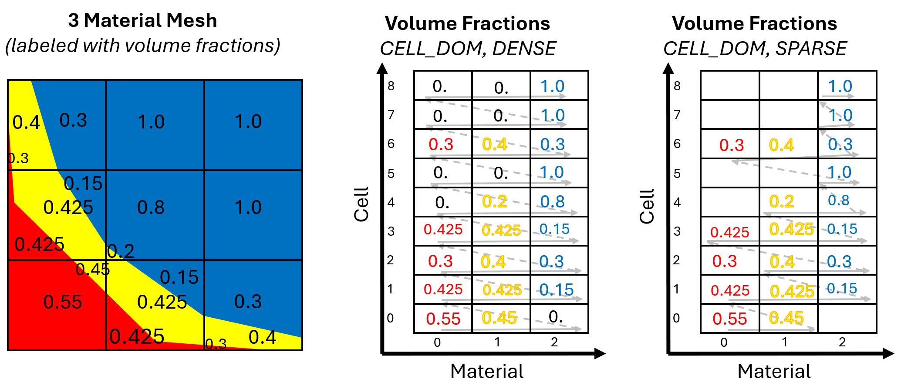

.. ## Copyright (c) 2017-2024, Lawrence Livermore National Security, LLC and
.. ## other Axom Project Developers. See the top-level LICENSE file for details.
.. ##
.. ## SPDX-License-Identifier: (BSD-3-Clause)

******************************************************
Field Concepts
******************************************************

Fields are data that are defined over a mesh, typically with one or more values
per cell. Fields can be scalar, indicating 1-component per cell - or they can
contain multiple components as with vector data (2+ components per cell). This
section talks about important MultiMat field concepts that determine where field
live on the mesh and how field data are organized in memory.

#######################
Field Mapping
#######################

MultiMat is associated with a mesh divided into cells and the mesh has materials
that may further subdivide cells in the mesh. MultiMat includes the concept of
field mapping, which is where on the mesh the field data live. Fields can be
defined over the cells, which is how most simulations think about cell-centered
fields. With MultiMat, fields can also be defined over the materials or over all
of the cells/materials, allowing fields to have data values for each material in
a zone.

   Diagram showing field mapping concept.

+--------------------+----------------------------------------------------------+
| FieldMapping       | Meaning                                                  |
+====================+==========================================================+
| PER_CELL           | The field contains up to ncells*ncomponents values (for  |
|                    | dense storage) and there are ncomponents values per cell.|
|                    | For scalars *ncomponents* is 1 so the field length is    |
|                    | ncells.                                                  |
+--------------------+----------------------------------------------------------+
| PER_MAT            | The field contains nmats*ncomponents values and there    |
|                    | are ncomponents values per material. This mapping allows |
|                    | fields to be defined over the entire material region and |
|                    | any cell that uses the material inherits the per-material|
|                    | field value, allowing for very compact storage of        |
|                    | material-level properties.                               |
+--------------------+----------------------------------------------------------+
| PER_CELL_MAT       | The field contains up to ncells*nmats*ncomponents (for   |
|                    | dense storage). This mapping allows materials within a   |
|                    | cell to have their own unique values, which makes them   |
|                    | useful for tracking data at a sub-cell level.            |
+--------------------+----------------------------------------------------------+

#######################
Data Layout
#######################

Simulation codes contain a variety of algorithms that may have a preference for how
data are arranged in memory to ensure good cache performance. MultiMat supports
fields that may span ncells*nmats data values, though the data ordering can depend
on the order of loops used to access the data. Data are said to be *cell dominant*
(CELL_DOM) if they are stored such that each cell stores all of its material data
to memory before proceeding to the next cell. Data are *material dominant* (MAT_DOM)
if the data for one material's zones is written before proceeding to the next material.
The data layout for multimaterial data can be thought of as 2 nested for-loops where
the outer loop is the dominant loop. For example, if iterating over materials and
then cells, then the data are stored using ``MAT_DOM`` layout.

+--------------------+----------------------------------------------------------+
| DataLayout         | Meaning                                                  |
+====================+==========================================================+
| CELL_DOM           | Data are stored for each zone and then for each material |
|                    | like this *(c=cell, m=material)*:                        |
|                    |                                                          |
|                    | ``{c0m0, c0m1, c0m2, ..., c1m0, c1m1, c1m2, ...}``       |
+--------------------+----------------------------------------------------------+
| MAT_DOM            | Data are stored for each material and then for each cell |
|                    | like this *(c=cell, m=material)*:                        |
|                    |                                                          |
|                    | ``{m0c0, m0c1, m0c2, m0c3, ... , m1c0, m1c1, m1c2, ...}``|
+--------------------+----------------------------------------------------------+

#######################
Sparsity Layout
#######################

Sparsity concerns the shape of the data layout and primarily concerns data with
``PER_CELL_MAT`` mapping where each cell may contain multiple materials. When initializing
the MultiMat object, the Cell-Material Relation indicates how materials are distributed
over the mesh. It is completely acceptable for materials to skip over certain zones,
which makes sense if we think about materials as a way to divide up the mesh into
various regions or parts. There are ncells*nmats pairs of data that could be entered
for MultiMat fields. For ``DENSE`` fields, the field must contain ncells*nmats values,
with values present for cell/material pairs even where the material is not present.
This is an easy way to specify the data but it wastes memory due to the extra values
that do nothing other than keep the shape of the data array.

For large meshes, compressing out unnecessary values can save a lot of memory. MultiMat
lets fields be provided using a ``SPARSE`` layout that does not include any unnecessary
values. Going back to the Cell-Material Relation (CMR) as a matrix of true/false values, one
must only provide field values for ``SPARSE`` data where the CMR contains true values.

+--------------------+----------------------------------------------------------+
| SparsityLayout     | Meaning                                                  |
+====================+==========================================================+
| DENSE              | Data are provided for all ncells*nmats pairs, even if    |
|                    | there is no cell/material that is valid.                 |
+--------------------+----------------------------------------------------------+
| SPARSE             | Data are provided for only the cell/material pairs that  |
|                    | are valid according to the Cell-Material Relation.       |
+--------------------+----------------------------------------------------------+

   Mixed-material volume fraction field with both DENSE and SPARSE representations.

