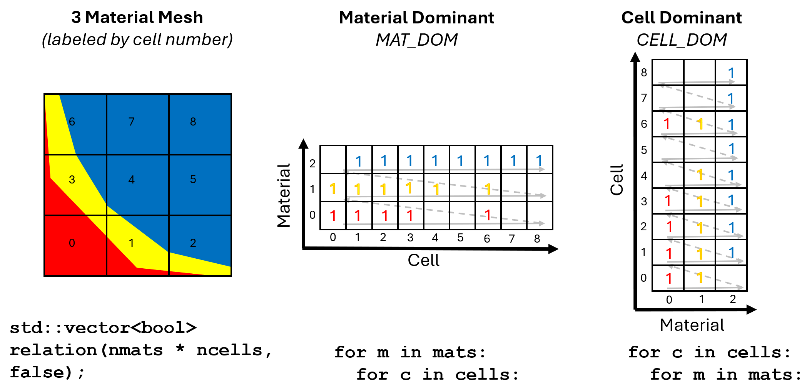
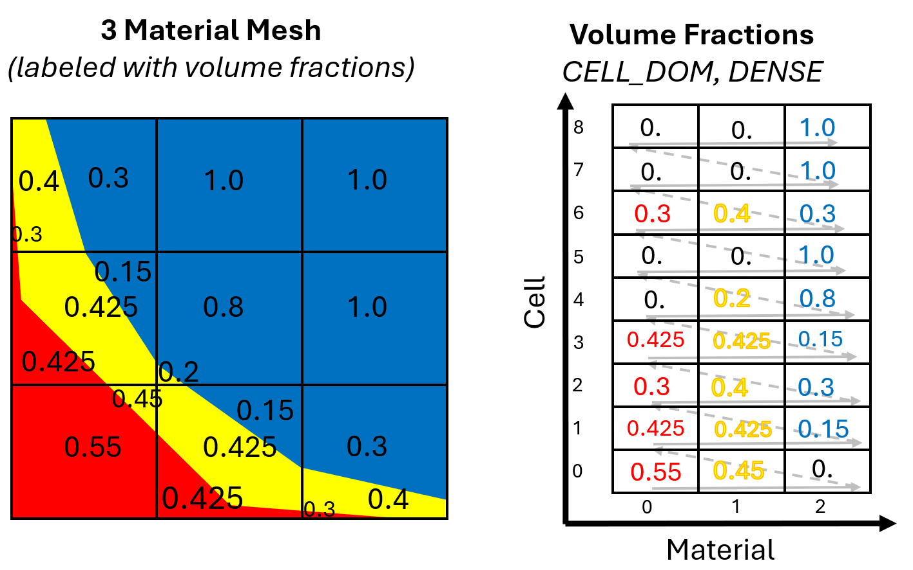

.. ## Copyright (c) 2017-2025, Lawrence Livermore National Security, LLC and
.. ## other Axom Project Developers. See the top-level LICENSE file for details.
.. ##
.. ## SPDX-License-Identifier: (BSD-3-Clause)

******************************************************
Materials
******************************************************

MultiMat defines materials over the cells in a mesh. This section describes how to
use the MultiMat object to define materials.

#######################
Cell Material Relation
#######################

The distribution of materials over the mesh is determined using the **Cell-Material Relation** *(CMR)*.
If a mesh has *N* cells and *M* materials, each cell can have up to *M* possible values.
This means the mesh will hold N*M values if each cell contains all materials.
There are multiple ways to specify the CMR to MultiMat. A static material decomposition
is described here, though the CMR can also be built :doc:`dynamically <multimat_dynamic_mode>`.
The easiest method for defining the CMR is to provide a bool vector containing
true/false values for whether a cell/material combination is valid.

   Diagram showing mixed-material mesh with CELL_DOM and MAT_DOM ways of defining the Cell-Material Relation.

The following code shows how to initialize a MultiMat object with 9 cells and 3 materials
and build the CMR by populating a bool vector that is given to the MultiMat object.
In the following example, the relation is expressed using a **Cell-Dominant**
data layout (``CELL_DOM``). This means that the data will be arranged such that all material
values for cell 0 are given, followed by all of the material values for cell 1, until all
cells have provided their flags. The bool vector contains *true* if a material is present
in a cell and *false* if the material is not present. This CMR vector is essentially
a mask for which cell/material combinations are valid. Data can also be transposed
into a **Material-Dominant** data layout (``MAT_DOM``) in which the materials are
iterated first, followed by cells that use the current material.

.. literalinclude:: ../../examples/basic.cpp
   :start-after: _multimat_materials_cmr_begin
   :end-before: _multimat_materials_cmr_end
   :language: C++

#######################
Volume Fractions
#######################

The CMR determines which materials are present in each cell; volume fractions determine
how much material is in each cell. If a cell contains materials A and B
at 20% and 80%, respectively, then the volume fractions for those materials in the
cell are: *0.2* and *0.8*. Note that the sum of volume fractions in a cell should equal 1
to account for all of the cell, though this is not enforced unless the ``isValid()``
method is called. Volume fractions must be provided for every valid cell/material pair
in the CMR and they must be specified using the same data layout as data in the CMR.

   Diagram showing mixed-material mesh with volume fractions shown in CELL_DOM table.

Volume fractions are stored in MultiMat as a field and fields have an added concept
of sparsity. Fields can provide data for every possible cell/material pair; this is
called a dense field. Dense fields are easy to understand: they have values for
every cell/material pair, even for materials that are not actually present. Fields
can also be sparse, saving memory by eliminating the zeroes where a material does not
exist.

Volume fraction data are provided to MultiMat wrapped in an ``axom::ArrayView`` object,
which provides the default values for the volume fractions. The *ArrayView* is passed
to MultiMat using the ``setVolfracField()`` method. The following example shows how to
pass a dense volume fraction field to MultiMat. Note the zeroes where the material is
not present. After adding volume fractions, the MultiMat object is fully constructed
and it can be used to store field data.

.. literalinclude:: ../../examples/basic.cpp
   :start-after: _multimat_materials_volfracs_begin
   :end-before: _multimat_materials_volfracs_end
   :language: C++

