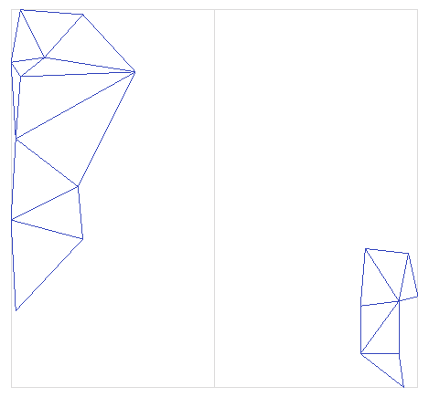
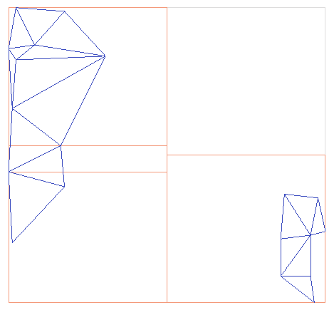

BVHTree
^^^^^^^

The ``BVHTree`` implements a 
`bounding volume hierarchy tree <https://en.wikipedia.org/wiki/Bounding_volume_hierarchy>`_.
This data structure recursively subdivides the region of interest into a "tree" of
subregions, stopping when a subregion contains less than some number of objects
or when the tree reaches a specified height.  Similar to ``UniformGrid``,
subregions are also called "bins".

The ``BVHTree`` is well-suited for particle-mesh or ray-mesh intersection tests.
It is also well-suited to data sets where the contents are unevenly distributed,
since the bins are subdivided based on their contents.  The figure below shows a
2D BVH tree with triangles inserted.

.. figure:: figs/showBVHTree0.png
   :figwidth: 300px
   :alt: Diagram showing triangles in a bounding box

The ``BVHTree::build()`` method recursively divides the bounding box.

.. figure:: figs/showBVHTree3.png
   :figwidth: 300px
   :alt: Diagram showing third division of a BVHTree

The following code example shows how a ``BVHTree`` can be used to accelerate a
point-mesh intersection algorithm.  The key idea in ``BVHTree::find()`` is that
testing for probe intersection with a bin (bounding box) is cheap.  If a bin
intersection test fails (misses), the contents of the bin are cheaply pruned out
of the search.  If the probe does intersect a bin, the next level of bins is
tested for probe intersection.  Without the spatial index, each probe point
must be tested against each triangle.

.. literalinclude:: ../../examples/primal_introduction.cpp
   :start-after: _bvhtree_header_start
   :end-before: _bvhtree_header_end
   :language: C++

.. literalinclude:: ../../examples/primal_introduction.cpp
   :start-after: _bvhtree_start
   :end-before: _bvhtree_end
   :language: C++
