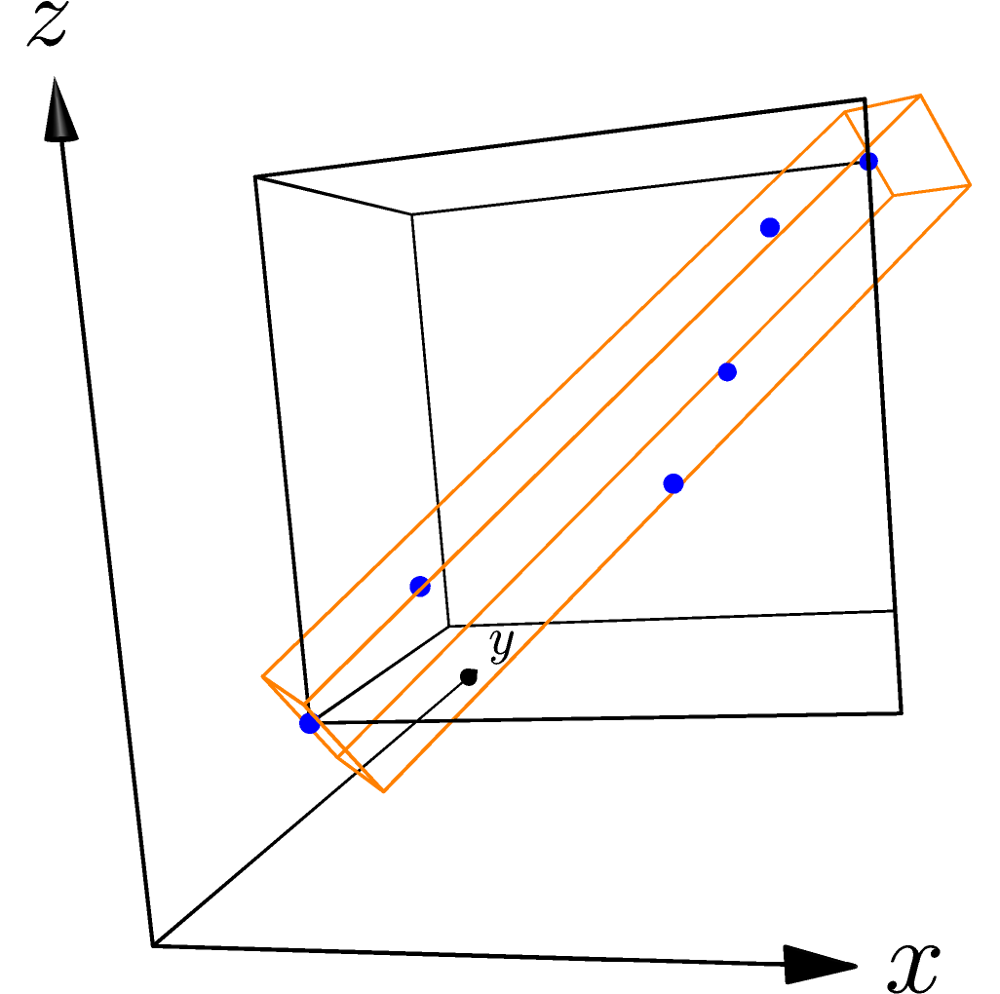

Compute bounding box
^^^^^^^^^^^^^^^^^^^^

Primal's bounding boxes are rectangular right prisms.  That is, they are boxes
where neighboring walls are at right angles.

The BoundingBox class represents an axis-aligned bounding box, which has two
walls perpendicular to the X-axis, two perpendicular to the Y-axis, and two
perpendicular to the Z-axis.  This is sufficient for many computations; range
and intersection operations tend to be fast.

The OrientedBoundingBox class can be oriented in any way with respect to the 
coordinate axes.  This can provide a tighter fit to the bounded data, but 
construction, intersection, and range calculation are more costly.

Here a group of points is used to create both an (axis-aligned) BoundingBox
and an OrientedBoundingBox.  The points are drawn in blue, the BoundingBox in
black, and the OrientedBoundingBox in orange.

.. literalinclude:: ../../examples/primal_introduction.cpp
   :start-after: _bbox_header_start
   :end-before: _bbox_header_end
   :language: C++

.. literalinclude:: ../../examples/primal_introduction.cpp
   :start-after: _bbox_start
   :end-before: _bbox_end
   :language: C++

Primal also provides a ``merge_boxes()`` function to produce a bounding box that
contains two input bounding boxes.  This is available for client codes to use and
also supports the operation of the BVHTree class.

