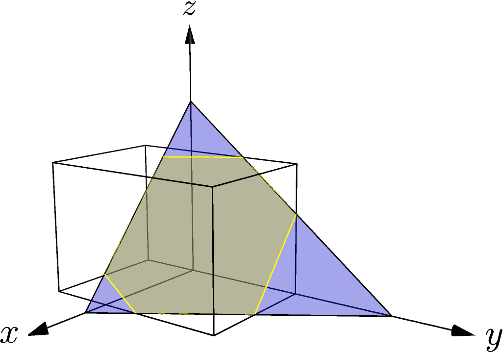

Clip triangle against bounding box
^^^^^^^^^^^^^^^^^^^^^^^^^^^^^^^^^^

The clip operator clips a triangle against a bounding box, returning the
resulting polygon.  The figure shows the triangle in blue and the polygon
resulting from ``clip()`` in grey.

.. literalinclude:: ../../examples/primal_introduction.cpp
   :start-after: _clip_header_start
   :end-before: _clip_header_end
   :language: C++

.. literalinclude:: ../../examples/primal_introduction.cpp
   :start-after: _clip_start
   :end-before: _clip_end
   :language: C++

