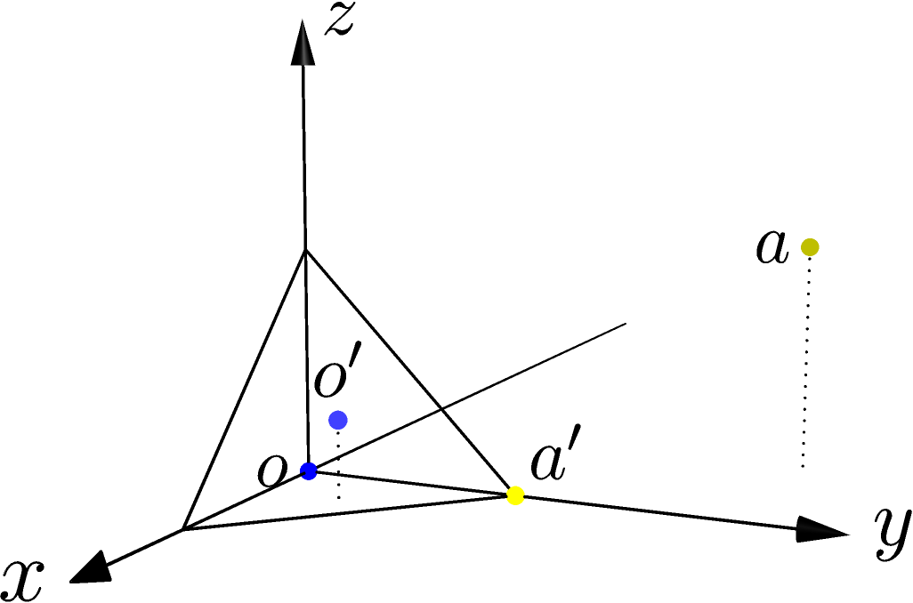

Closest point query
^^^^^^^^^^^^^^^^^^^

The closest point operator finds the point on a triangle that is closest to a
query point.  Query point :math:`o` (shown in dark blue), at the origin, is
closest to point :math:`o'` (light blue), which lies in the triangle's interior.
Query point :math:`a` (olive) is closest to point :math:`a'` (yellow), which
lies on the triangle's edge at a vertex.

.. literalinclude:: ../../examples/primal_introduction.cpp
   :start-after: _closest_point_header_start
   :end-before: _closest_point_header_end
   :language: C++

.. literalinclude:: ../../examples/primal_introduction.cpp
   :start-after: _closest_point_start
   :end-before: _closest_point_end
   :language: C++

As the code example shows, ``closest_point()`` can take a pointer to an ``int``
as an optional third parameter.  If supplied, the function writes a value into
the ``int`` that indicates which of the triangle's vertices or sides contains
the closest point (or the interior).

