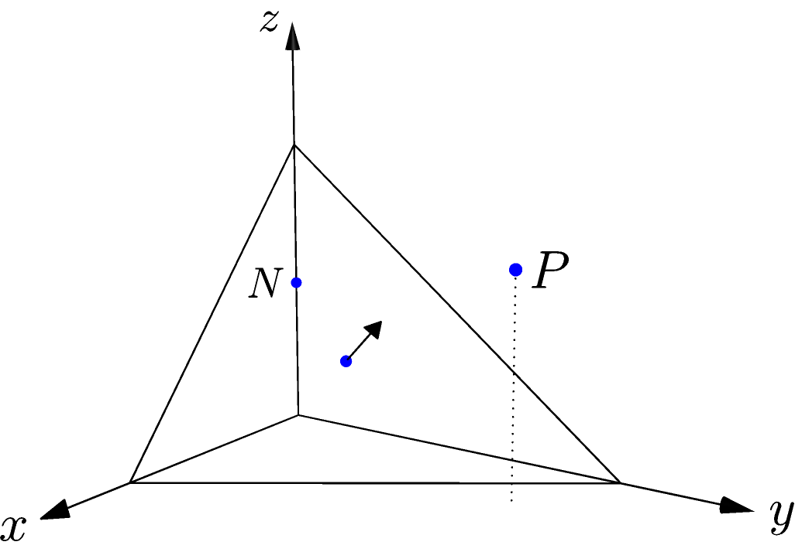

Orientation
^^^^^^^^^^^

Axom contains two overloads of ``orientation()``.  The 3D case tests a point against
a triangle and reports which side it lies on; the 2D case tests a point against a
line segment.  Here is an example of the 3D point-triangle orientation test.

.. literalinclude:: ../../examples/primal_introduction.cpp
   :start-after: _orient_header_start
   :end-before: _orient_header_end
   :language: C++

.. literalinclude:: ../../examples/primal_introduction.cpp
   :start-after: _orient_start
   :end-before: _orient_end
   :language: C++

The triangle is shown with its normal vector pointing out of its centroid.  The
triangle's plane divides space into a positive half-space, pointed into by the
triangle's normal vector, and the opposing negative half-space.  The test point
on the :math:`z` axis, labelled :math:`N`, is on the negative side of the
triangle.  The centroid lies in the triangle, on the boundary between the two
half-spaces.  The remaining test point, labelled :math:`P`, is on the triangle's
positive side.

