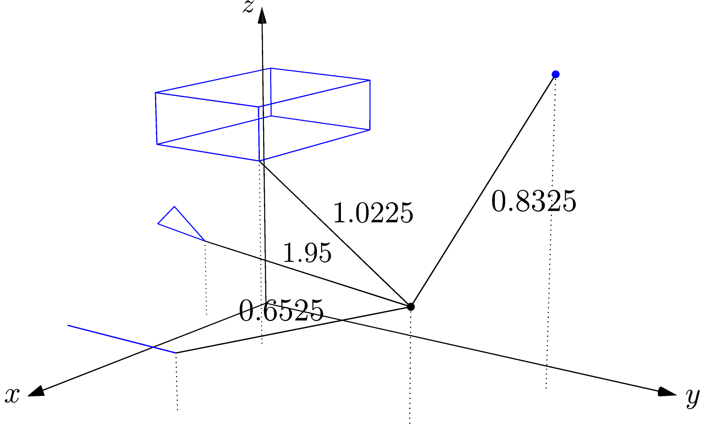

Distance
^^^^^^^^

The various overloads of ``squared_distance()`` calculate the squared 
distance between a query point and several different primitives:

- another point,
- a BoundingBox,
- a Segment,
- a Triangle.

.. literalinclude:: ../../examples/primal_introduction.cpp
   :start-after: _sqdist_header_start
   :end-before: _sqdist_header_end
   :language: C++

.. literalinclude:: ../../examples/primal_introduction.cpp
   :start-after: _sqdist_start
   :end-before: _sqdist_end
   :language: C++

The example shows the squared distance between the query point, shown in black
in the figure, and four geometric primitives.  For clarity, the diagram also shows
the projection of the query point and its closest points to the XY plane.

