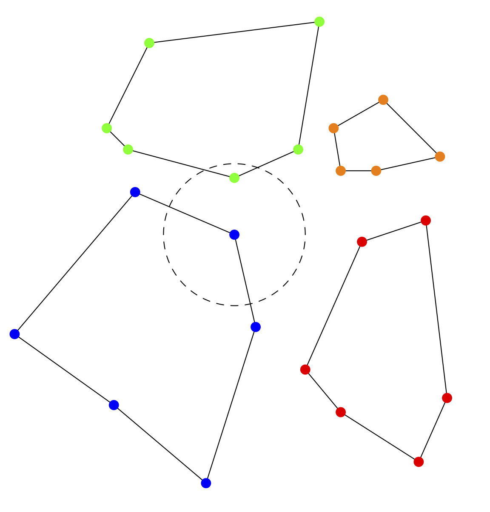

.. ## Copyright (c) 2017-2021, Lawrence Livermore National Security, LLC and
.. ## other Axom Project Developers. See the top-level LICENSE file for details.
.. ##
.. ## SPDX-License-Identifier: (BSD-3-Clause)

.. _all-nearest:

***************************
All nearest neighbors query
***************************

Some applications need to work with the interaction of points that are close
to each other.  For example, in one technique used for additive manufacturing,
the particles in a powder bed are melted using a laser.  Particle behavior
against nearby particles determines droplet formation.  The all-nearest-neighbors
query takes as input a list of point positions and regions and a maximum radius.
For each point, using the L2 norm as the distance measure, the query calculates
the nearest neighbor point not in the same region, as shown in the figure.

   All nearest neighbors query.  Here, points belong to one of four
   regions.  Given a maximum search radius, the query finds
   the closest neighbor to each point in another region.

Here is an example of query usage, from
``<axom>/src/axom/quest/tests/quest_all_nearest_neighbors.cpp``.

First, include the header.

.. literalinclude:: ../../tests/quest_all_nearest_neighbors.cpp
   :start-after: _quest_allnear_include_start
   :end-before: _quest_allnear_include_end
   :language: C++

Query input consists of the points' x, y, and z positions and region IDs,
the point count, and the search radius.

.. literalinclude:: ../../tests/quest_all_nearest_neighbors.cpp
   :start-after: _quest_allnear_input_start
   :end-before: _quest_allnear_input_end
   :language: C++

For each input point, the output arrays give the point's neighbor index and
squared distance from the point to that neighbor.

.. literalinclude:: ../../tests/quest_all_nearest_neighbors.cpp
   :start-after: _quest_allnear_query_start
   :end-before: _quest_allnear_query_end
   :language: C++

