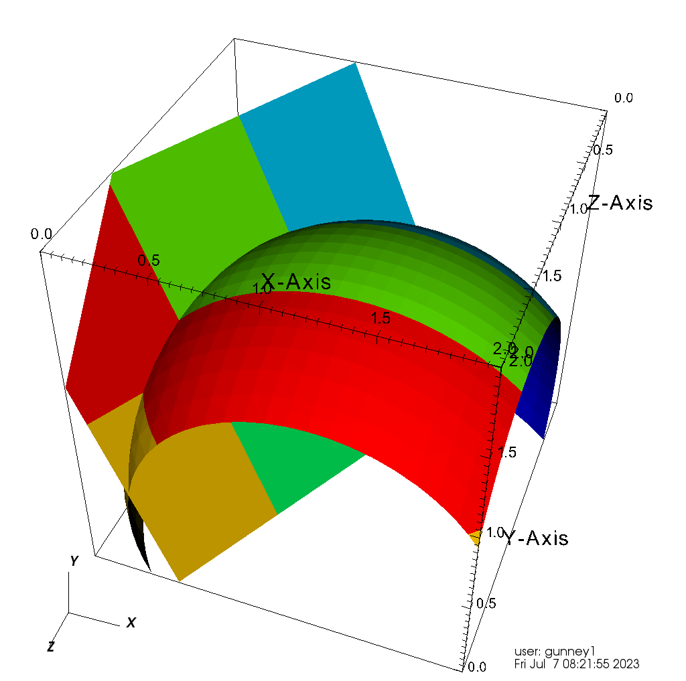

.. ## Copyright (c) 2017-2025, Lawrence Livermore National Security, LLC and
.. ## other Axom Project Developers. See the top-level LICENSE file for details.
.. ##
.. ## SPDX-License-Identifier: (BSD-3-Clause)

.. _isosurface-detection:

********************
Isosurface Detection
********************

Quest can generate isosurface meshes for node-centered scalar fields.
This feature takes a structured mesh with some scalar nodal field and
generates an ``UnstructuredMesh`` at a user-specified isovalue.  The
isosurface mesh contains information on which elements of the field
mesh it crosses.  The output may be useful for material surface
reconstruction and visualization, among other things.

We support 2D and 3D configurations.  The isosurface mesh is a
composed of line segments in 2D and triangles in 3D.

.. Note::

   The current implementation is for the original algorithm:

   Lorensen, William E.; Cline, Harvey E. (1 August 1987).
   "Marching cubes: A high resolution 3D surface construction algorithm".
   *ACM SIGGRAPH Computer Graphics*. 21 (**4**): 163-169

   Other similar or improved algorithms could be added in the future.

.. Note::

   If an input mesh cell contains an isosurface saddle point, the
   isocontour topology is ambiguous.  The algorithm will choose
   the topology arbitrarily but consistently.

   Planar isocontour generated using the field :math:`f(\mathbf{r}) =
   f_0 + \mathbf{r} \cdot \mathbf{n}` and spherical contour generated
   using the field field :math:`g(\mathbf{r}) = |\textbf{r} -
   \textbf{r}_0|`.  Colors denote the domain index in the multi-domain
   cubic mesh.

The algorithm is implemented in the class ``quest::MarchingCubes``.

The inputs are:

#. The mesh containing the scalar field.  This mesh should be in
   Conduit's blueprint format.  See
   https://llnl-conduit.readthedocs.io/en/latest/blueprint_mesh.html
#. The name of the blueprint coordinates data for the input mesh.
#. The name of the scalar field data within the input mesh.
#. The contour value.

The following example shows usage of the ``MarchingCubes`` class.
(A complete example is provided in
``src/axom/quest/examples/quest_marching_cubes_example.cpp``.)

Relevant header files:

.. sourcecode:: C++

   #include "conduit_relay_io_blueprint.hpp"
   #include "axom/quest/MarchingCubes.hpp"
   #include "axom/mint/mesh/UnstructuredMesh.hpp"

Set up the user's blueprint mesh and the ``MarchingCubes`` object:

The blueprint mesh must be a structured mesh in multi-domain format.
A domain is a part of a global mesh that has been subdivided for
reasons including parallel partitioning, geometric constraints and
size constraints.  Any number of domains is allowed, including zero.
(For single-domain format, see the similar
``MarchingCubesSingleDomain`` class in the ``axom::quest`` namespace.)

Blueprint convention allows for named coordinate sets and scalar
fields.  Here, we tell the ``MarchingCubes`` constructor that the
topology is "mesh", and the name of the nodal scalar
field is "scalarFieldName".

The constructor's ``quest::MarchingCubesRuntimePolicy::seq`` argument
tells ``mc`` to run sequentially on the host.  ``MarchingCubes``
currently also supports OpenMP and GPU device executions using CUDA
and HIP.

.. sourcecode:: C++

   conduit::Node blueprintMesh = blueprint_mesh_from_user();
   quest::MarchingCubes mc(quest::MarchingCubesRuntimePolicy::seq,
                           blueprintMesh,
                           "mesh",
                           "scalarFieldName");

Run the algorithm:

.. sourcecode:: C++

   double contourValue = 0.5;
   mc.computeIsocontour(contourValue);

Place the isocontour in an output ``mint::UnstructuredMesh`` object:

``MarchingCubes`` generates the isocontour mesh in an internal format.
Use ``populateContourMesh`` to put it in a ``mint::UnstructuredMesh``
object.  In the future, we will support outputs in blueprint format.

``populateContourMesh`` provides two scalar fields for the generated
mesh:

#. the ID of the cell from the input mesh that generated the
   isocontour cell.
#. the ID of the domain from the input mesh that generated the
   isocontour cell.

The names of these fields are user-specified.  Use empty strings if
you don't need these fields.  This example puts cell IDs in
"cellIds" and domain IDs in "domainIds".

.. sourcecode:: C++

   mint::UnstructuredMesh<axom::mint::SINGLE_SHAPE> contourMesh;
   mc.populateContourMesh(contourMesh, "cellIds", "domainIds");

After putting the isosurface in the ``UnstructuredMesh`` object,
the ``MarchingCubes`` object is no longer needed.

MPI-parallel runs:

For MPI-parallel runs, the input mesh may have local and remote
domains.  The algorithm is local in that no data communication is
required to run.  The output isosurface mesh uses node and cell
numbers that are locally unique.  Users requiring these numbers to be
globally unique should renumber them.
