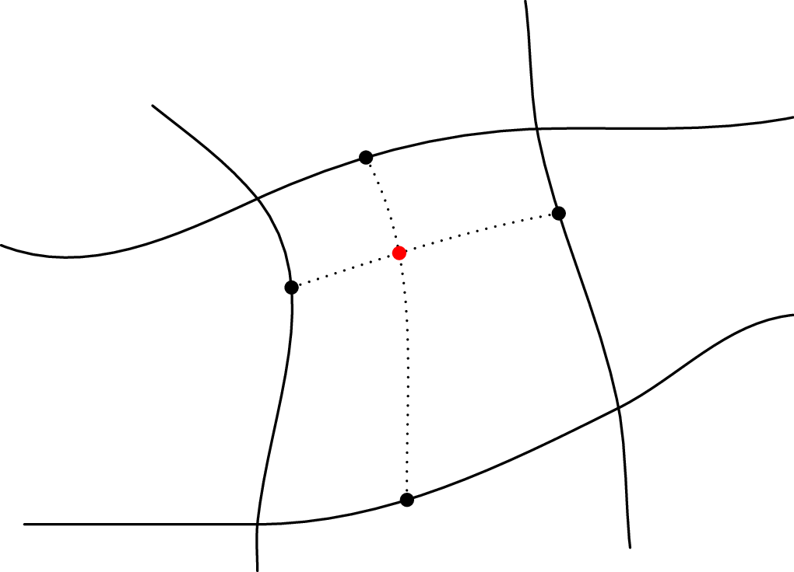

.. ## Copyright (c) 2017-2021, Lawrence Livermore National Security, LLC and
.. ## other Axom Project Developers. See the top-level LICENSE file for details.
.. ##
.. ## SPDX-License-Identifier: (BSD-3-Clause)

.. _point-in-cell:

*******************
Point-in-cell query
*******************

The point-in-cell query is particularly useful with high-order meshes.
It takes a 2D quad or 3D hex mesh and locates a query point in that mesh,
reporting both the cell containing the point and the isoparametric coordinates
of the query point within the cell.

.. Note::
   If a query point lies on the boundary in more than one cell, the
   point-in-cell query will return the cell with the lowest index.

   If the point lies outside of any cell, the query returns the special
   value ``quest::PointInCellTraits<mesh_tag>::NO_CELL`` or using the
   MeshTraits typedef, ``MeshTraits::NO_CELL``.

   Point-in-cell query, identifying the cell that contains a physical point and
   finding the point's isoparametric coordinates within the cell.

The point-in-cell query is currently implemented using MFEM, so to use this query
Axom must be compiled with MFEM as a dependency.  The following example
(from ``<axom>/src/tests/quest_point_in_cell_mfem.cpp``) shows
the use of the query, beginning with inclusion of required header files.

.. literalinclude:: ../../tests/quest_point_in_cell_mfem.cpp
   :start-after: _quest_pic_include_start
   :end-before: _quest_pic_include_end
   :language: C++

We use typedefs for the sake of brevity.  The class is templated on
a struct (provided by Quest, referred to as ``mesh_tag``) that is used to 
select MFEM as the backend implementation for
point location.  To implement a new backend, a developer must declare a new
(empty) struct and provide a specialization of the ``PointInCellTraits``
and ``PointInCellMeshWrapper`` templated on the new struct that fulfill the
interface documented for those classes.

.. literalinclude:: ../../tests/quest_point_in_cell_mfem.cpp
   :start-after: _quest_pic_typedef_start
   :end-before: _quest_pic_typedef_end
   :language: C++

Instantiate the object using an MFEM mesh and a spatial index 25 bins on a side.

.. literalinclude:: ../../tests/quest_point_in_cell_mfem.cpp
   :start-after: _quest_pic_init_start
   :end-before: _quest_pic_init_end
   :language: C++

Test a query point.  Here ``idx`` receives the ID of the cell that contains
``queryPoint`` and ``isoPar`` is a ``primal::Point`` that receives the
isoparametric coordinates of ``queryPoint`` within cell ``idx``.

.. literalinclude:: ../../tests/quest_point_in_cell_mfem.cpp
   :start-after: _quest_pic_locate_start
   :end-before: _quest_pic_locate_end
   :language: C++

From cell ID and isoparametric coordinates, reconstruct the input physical
coordinates.

.. literalinclude:: ../../tests/quest_point_in_cell_mfem.cpp
   :start-after: _quest_pic_reconstruct_start
   :end-before: _quest_pic_reconstruct_end
   :language: C++

The destructor of the index object cleans up resources used
(in this case, when the variable ``spatialIndex`` goes out of scope).

