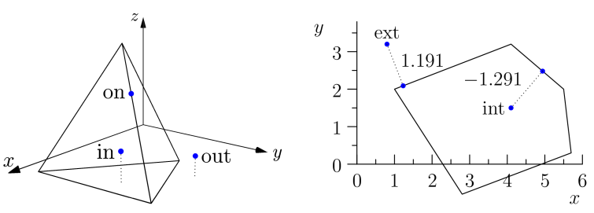

.. ## Copyright (c) 2017-2021, Lawrence Livermore National Security, LLC and
.. ## other Axom Project Developers. See the top-level LICENSE file for details.
.. ##
.. ## SPDX-License-Identifier: (BSD-3-Clause)

.. _surface-query-c:

*********************************
Surface mesh point queries: C API
*********************************

Quest provides the in/out and distance field queries to test a point against
a surface mesh.  These queries take a mesh composed of triangles in 3D 
and a query point.  The in/out query tests whether the point is contained within
the surface mesh.  The distance query calculates the signed distance from
the query point to the mesh.

   Types of point-vs-surface-mesh queries provided by Quest.     
   **Left:** In/out query, characterizing points as inside or outside the mesh.  
   Points that lie on the boundary might or might not be categorized as 
   inside the mesh.
   **Right:** Distance query, calculating the signed distance from each
   query point to its closest point on the mesh.  A negative result indicates an
   interior query point.  

The following examples show Quest's C interface to these queries.  The general
pattern is to set some query parameters, then pass a ``mint::Mesh *`` or file 
name string to an initialization function, call an ``evaluate`` function 
for each query point, then clean up with a ``finalize`` function.

In/out C API
------------

The in/out query operates on a 3D surface mesh, that is, triangles forming a
watertight surface enclosing a 3D volume. The in/out API utilizes integer-valued
return codes with values ``quest::QUEST_INOUT_SUCCESS`` and 
``quest::QUEST_INOUT_FAILED`` to indicate the success of each operation. 
These examples are excerpted from ``<axom>/src/axom/quest/examples/quest_inout_interface.cpp``.

To get started, we first include some header files.

.. literalinclude:: ../../examples/quest_inout_interface.cpp
   :start-after: _quest_inout_interface_include_start
   :end-before: _quest_inout_interface_include_end
   :language: C++

Before initializing the query, we can set some parameters, for example,
to control the logging verbosity and to set a threshold for welding vertices
of the triangle mesh while generating the spatial index.

.. literalinclude:: ../../examples/quest_inout_interface.cpp
   :start-after: _quest_inout_interface_parameters_start
   :end-before: _quest_inout_interface_parameters_end
   :language: C++

By default, the verbosity is set to ``false`` and the welding threshold is 
set to ``1E-9``.

We are now ready to initialize the query. 

.. literalinclude:: ../../examples/quest_inout_interface.cpp
   :start-after: _quest_inout_interface_init_start
   :end-before: _quest_inout_interface_init_end
   :language: C++

The variable ``fileName`` is a ``std::string`` that indicates a triangle 
mesh file. Another overload of ``quest::inout_init()`` lets a user code pass 
a reference to a ``mint::Mesh*`` to query meshes that were previously read in 
or built up. If initialization succeeded (returned 
``quest::QUEST_INOUT_SUCCESS``), the code can

- Query the mesh bounds with ``quest::inout_mesh_min_bounds(double[3])`` and 
  ``quest::inout_mesh_max_bounds(double[3])``.
- Find mesh center of mass with ``quest::inout_mesh_center_of_mass(double[3])``.
- Test if a query point is inside the mesh surface.  In this example ``pt``
  is a ``double[3]`` and ``numInside`` is a running total.

.. literalinclude:: ../../examples/quest_inout_interface.cpp
   :start-after: _quest_inout_interface_test_start
   :end-before: _quest_inout_interface_test_end
   :language: C++

Once we are done, we clean up with the following command:

.. literalinclude:: ../../examples/quest_inout_interface.cpp
   :start-after: _quest_inout_interface_finalize_start
   :end-before: _quest_inout_interface_finalize_end
   :language: C++

Signed Distance query C API
---------------------------

Excerpted from ``<axom>/src/axom/quest/examples/quest_signed_distance_interface.cpp``.

Quest header:

.. literalinclude:: ../../examples/quest_signed_distance_interface.cpp
   :start-after: _quest_distance_interface_include_start
   :end-before: _quest_distance_interface_include_end
   :language: C++

Before initialization, a code can set some parameters for the distance query.

- Passing ``true`` to ``quest::signed_distance_set_closed_surface(bool)``
  lets the user read in a non-closed "terrain mesh" that divides
  its bounding box into "above" (positive distance to the surface mesh)
  and "below" (negative distance).
- ``quest::signed_distance_set_max_levels()`` and
  ``quest::signed_distance_set_max_occupancy()`` control options for the
  BVH tree spatial index used to accelerate signed distance queries.
- If the SLIC logging environment is in use, passing ``true`` to
  ``quest::signed_distance_set_verbose()`` will turn on verbose logging.
- Use of MPI-3 shared memory can be enabled by passing ``true`` to
  ``quest::signed_distance_use_shared_memory()``.

The distance query must be initialized before use.  In this example,
``Arguments`` is a POD struct containing parameters to the executable.
As with the in/out query, a user code may pass either a file name or a
reference to a ``mint::Mesh *`` to ``quest::signed_distance_init()``.

.. literalinclude:: ../../examples/quest_signed_distance_interface.cpp
   :start-after: _quest_distance_interface_init_start
   :end-before: _quest_distance_interface_init_end
   :language: C++

Once the query is initialized, the user code may retrieve mesh bounds 
with ``quest::signed_distance_get_mesh_bounds(double* lo, double* hi)``.
Test query points against the mesh with ``quest::signed_distance_evaluate()``.
Here, ``pt`` is a ``double[3]``, ``phi`` is a ``double`` array, and ``inode``
is an integer.

.. literalinclude:: ../../examples/quest_signed_distance_interface.cpp
   :start-after: _quest_distance_interface_test_start
   :end-before: _quest_distance_interface_test_end
   :language: C++

Finally, clean up.

.. literalinclude:: ../../examples/quest_signed_distance_interface.cpp
   :start-after: _quest_distance_interface_finalize_start
   :end-before: _quest_distance_interface_finalize_end
   :language: C++
