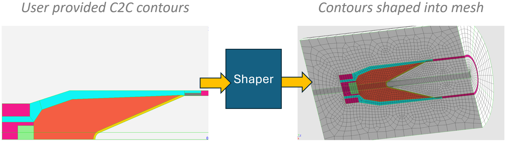
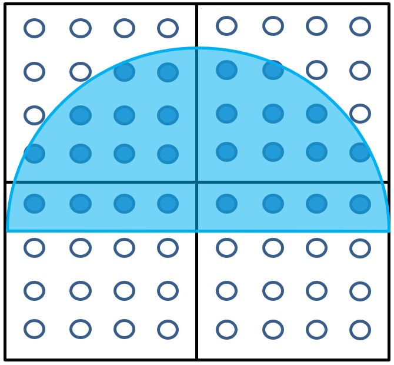
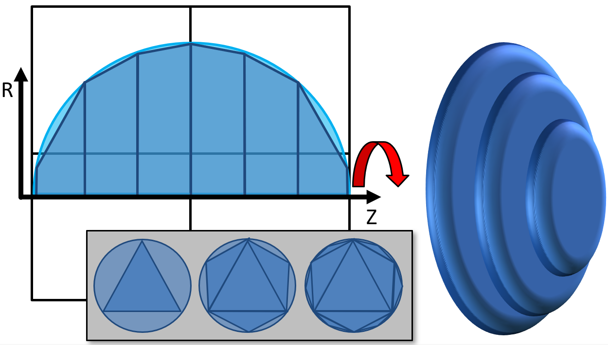

.. ## Copyright (c) 2017-2024, Lawrence Livermore National Security, LLC and
.. ## other Axom Project Developers. See the top-level LICENSE file for details.
.. ##
.. ## SPDX-License-Identifier: (BSD-3-Clause)

.. _shaping-overview:

Shaping Overview
================

Shaping is the process of overlaying additional detail into a mesh by converting
shape geometry into materials described as volume fractions within each mesh zone.
Shaping is used when it is not feasible or practical to directly build features
into the mesh.

   Shaping permits details to be added into meshes.

Axom\'s Klee component describes the models used for shaping. Klee shapes include
a material name, a file path that contains the shape geometry, replacement rules,
and transforms that can be applied to the shape geometry. Axom\'s Quest component
contains shaping infrastructure that takes the shapes from Klee and generates the
volume fractions for the shapes on a target mesh.

.. _shaping-pipeline:

Shaping Pipeline
=================

Shaping involves creating a target mesh and data collection, reading a shape set,
creating a shaper, and then iterating over the shapes to pass each shape into the
shaper. The shaper is responsible for determining overlap between the shape and
the target mesh and producing grid functions that contain that overlap, or volume
fraction.

First, we include relevant Axom headers:

.. code-block:: c++

  #include <axom/klee.hpp>
  #include <axom/quest.hpp>
  #include <axom/sidre.hpp>
  #include <axom/slic.hpp>

  using quest = axom::quest;
  using klee = axom::klee;
  using slic = axom::slic;
  using sidre = axom::sidre;

Axom shaping classes operate on MFEM meshes and use grid functions to represent the
volume fraction fields that encode each shaped-in material. MFEM meshes can be loaded
or constructed in memory.

 * More information on MFEM is covered at the `MFEM Examples page <https://mfem.org/features/#extensive-examples>`_.

The MFEM mesh also needs an associated data collection, *(shapingDC)*, to contain the
grid functions. Axom provides *MFEMSidreDataCollection*, a derived class of MFEM's
DataCollection class that can interoperate with Axom\'s Sidre component.

.. literalinclude:: ../../examples/shaping_driver.cpp
   :start-after: _load_mesh_start
   :end-before: _load_mesh_end
   :language: C++

We create the desired shaper *(SamplingShaper shown here)* and set its parameters.
Note that some parameters are common to each shaper type while others are specific to
sampling or intersection shaping classes.

.. code-block:: yaml

  auto shaper = new quest::SamplingShaper;
  shaper->setSamplesPerKnotSpan(25);
  shaper->setVerbosity(true);

The shaper will operate on shapes, which can be obtained by reading a Klee shape set.

.. code-block:: c++

  auto shapeSet = klee::readShapeSet("/path/to/klee/file");

The shaper can **optionally** be pre-initialized with volume fractions from the
calling code. This step can be skipped if the volume fractions are to be produced
solely using shapes from Klee. Volume fraction field grid functions have a *"vol_frac_"* prefix,
followed by the name of the material. Grid functions are registered with the
*shapingDC* data collection and the shaper's *importInitialVolumeFractions()*
method aids in importing the initial volume fractions onto the target mesh.

.. literalinclude:: ../../examples/shaping_driver.cpp
   :start-after: import_volume_fractions_start
   :end-before: import_volume_fractions_end
   :language: C++

After all shaping input data have been read, the actual *shaping pipeline* can begin. This is
where each shape is processed within the shaper and this procedure applies to both sampling
and intersection shaping. The *loadShape()* method is called to
make the shape be loaded from its geometry file. The *prepareShapeQuery()* method builds
internal data structures that aid in shaping. The *runShapeQuery()* method builds the
query mesh and intersects it with the target mesh, creating the volume fractinons for
the shape. The *applyReplacementRules()* method incorporates the shape's volume fractions
into the existing volume fraction grid functions, subject to the replacement rules defined
for the shape. Finally, the *finalizeShapeQuery()* method performs internal cleanup in the
shaper so it is ready to process the next shape.

.. literalinclude:: ../../examples/shaping_driver.cpp
   :start-after: _shaping_pipeline_begin
   :end-before: _shaping_pipeline_end
   :language: C++

.. _sampling-shaper:

Sampling Shaper
---------------

Quest provides a *SamplingShaper* class that takes input shapes and turns them into volume fraction
grid functions on the target mesh using sampling-based in/out tests. The SamplingShaper works by
iterating over each zone in the target mesh and at various points within that zone *(typically
quadrature points)*, determining whether that point is inside or outside of a shape. These in/out
test results are used to determine the volume overlap of the shape and the zone.

* RZ contour shapes
* Shapes containing geometry from STL, ProE files
* 2D/3D target meshes
* Can output high order volume fraction grid functions
* Executes on the CPU

   Sampling shaper tests whether points in a zone are in/out for a shape.

Accuracy
^^^^^^^^

The SamplingShaper relies on a winding number-based in/out test to compare a point against
a shape. Ultimately, each shape is descretized into a number of smaller line segments so the algorithm
can walk around the edges to determine the in/out value. For highly-curved shape edges, more 
accuracy can be achieved by subdividing edges into more line segments.
The *setSamplesPerKnotSpan()* method sets the number of sample points within each spline
knot span (smaller intervals that make up the curved edge)and determines how many line segments are produced.
Additionally, the number of sample points
taken within the zone influences the accuracy of the result. The quadrature order determines the
number of samples within a zone. The volume fraction order determines the order
of the output volume fraction field. The shaper will convert the sampled points at the quadrature order
to the volume fraction order when making the volume fraction grid functions.

.. code-block:: c++

  shaper->setSamplesPerKnotSpan(25);
  shaper->setQuadratureOrder(5);
  shaper->setVolumeFractionOrder(2);

Point Projection
^^^^^^^^^^^^^^^^

The SamplingShaper can use a point projection lambda function during in/out tests to transform the
sampling point. One use case for this is to transform a 3D point from the target mesh back into a 2D
point, allowing for revolved shaping using 2D shapes. The *setPointProjector()*
function sets a point transformation function for the shaper.

.. literalinclude:: ../../examples/shaping_driver.cpp
   :start-after: _point_projection_begin
   :end-before: _point_projection_end
   :language: C++

.. _intersection-shaper:

Intersection Shaper
--------------------

The IntersectionShaper takes a set of 2-dimensional RZ contours and revolves them into 3D to do actual
geometric intersections of the revolved geometry with the target mesh zones. Contour shapes are linearized
into line segments and then revolved into truncated cones, which are approximated using a number of
octahedra. The number of octahedra is determined by a level parameter that indicates how many times the
shape has been refined to produce octahedra, each time more accurately covering volume of the truncated
cone. The shaper intersects each octahedron with the zones of the target mesh to determine the volume
fraction overlap.

* Revolves RZ contour shapes
* 3D target meshes
* Executes on CPU and GPU

   Intersection shaper creates revolved geometry for a shape and determines volume intersection with target mesh zones.

Accuracy
^^^^^^^^^

The IntersectionShaper works by default in the same manner as the SamplingShaper in how it discretizes
shapes into line segments. However, the IntersectionShaper can also set a percent error value that causes
the algorithm to re-refine the shape into line segments dynamically or increase the level of cone refinement until
the percentage of volume difference converges to less than a supplied error tolerance.

.. code-block:: c++

    shaper->setPercentError(0.02);
    shaper->setRefinementType(quest::Shaper::RefinementDynamic);

