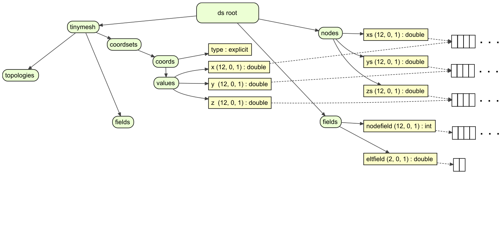

.. ## Copyright (c) 2017-2021, Lawrence Livermore National Security, LLC and
.. ## other Axom Project Developers. See the top-level LICENSE file for details.
.. ##
.. ## SPDX-License-Identifier: (BSD-3-Clause)

.. _sidre-conduit:

******************************************************
Sidre Interaction with Conduit
******************************************************

Internally, Sidre uses the in-memory data description capabilities of 
`Conduit <https://github.com/LLNL/conduit>`_.  Sidre also leverages Conduit
to facilitate data exchange, demonstrated here as applied to visualization.
The following discussion gives a basic overview of Sidre's capabilities
when combined with Conduit.  Please see the reference documentation for 
more details.

Mesh Blueprint
--------------

The `Mesh Blueprint <http://llnl-conduit.readthedocs.io/en/latest/blueprint_mesh.html>`_
is a data exchange protocol supported by Conduit, consisting of a
properly-structured Datastore saved as an HDF5 or JSON file and a Conduit index
file.  The Blueprint can accomodate structured or unstructured meshes, with
node- or element-centered fields.  The following example shows how to create a
Blueprint-conforming Datastore containing two unstructured adjacent hexahedrons
with one node-centered field and one element-centered field.  In the diagram,
nodes are labeled in black, the node-centered field values are in blue, and
the element-centered field values are in green.

.. image:: figs/tiny_mesh.png
   :width: 300px

A simulation organizes its Sidre data as the code design dictates.
Here is a simple example.

.. image:: figs/ds.png
   :width: 650px

Here is the code to create that Dataset ``ds``.

.. literalinclude:: ../../examples/sidre_createdatastore.cpp
   :start-after: _tiny_create_start
   :end-before: _tiny_create_end
   :language: C++

To use the Mesh Blueprint, make a new Group ``tinymesh`` conforming to the protocol.
The structure of the conforming Group is shown below (summarizing
the `Mesh Blueprint <http://llnl-conduit.readthedocs.io/en/latest/blueprint_mesh.html>`_
documentation).

First build top-level groups required by the Blueprint.

.. image:: figs/cds.png
   :width: 650px

.. literalinclude:: ../../examples/sidre_createdatastore.cpp
   :start-after: _blueprint_restructure_toplevel_start
   :end-before: _blueprint_restructure_toplevel_end
   :language: C++

Add the node coordinates.  The Views under ``tinymesh`` will point to the
same Buffers that were created for the Views under ``nodes``
so that ``tinymesh`` can use the data without any new allocation or copying.

.. literalinclude:: ../../examples/sidre_createdatastore.cpp
   :start-after: _blueprint_restructure_coords_start
   :end-before: _blueprint_restructure_coords_end
   :language: C++

Arrange the nodes into elements.  Each simulation has its own knowledge of
topology.  This tiny example didn't previously encode topology,
so we must explicitly specify it.

.. image:: figs/cdstopo.png
   :width: 650px

.. literalinclude:: ../../examples/sidre_createdatastore.cpp
   :start-after: _blueprint_restructure_topo_start
   :end-before: _blueprint_restructure_topo_end
   :language: C++

Link the fields into ``tinymesh``.  As with the node positions, the Views
point to the existing Buffers containing the field data.

.. image:: figs/cdsfields.png
   :width: 650px

.. literalinclude:: ../../examples/sidre_createdatastore.cpp
   :start-after: _blueprint_restructure_field_start
   :end-before: _blueprint_restructure_field_end
   :language: C++

Conduit includes a ``verify`` method to test if the structure
of the ``tinymesh`` conforms to the Mesh Blueprint.  This is valuable for writing and 
debugging data adapters.
Once the Datastore is properly structured, save it, then use Conduit to save the 
index file (ending with `.root`).  This toy data set is small enough that we can
choose to save it as JSON.

.. literalinclude:: ../../examples/sidre_createdatastore.cpp
   :start-after: _blueprint_restructure_save_start
   :end-before: _blueprint_restructure_save_end
   :language: C++

The code listed above produces the files `tinymesh.json` and `tinymesh.root`.
Any code that uses Mesh Blueprint can open and use this pair of files.

The DataStore also contains a method that can automatically generate the
Blueprint index within a Sidre Group rather than calling directly into
Conduit.  Set up a mesh similarly to the example above.

.. literalinclude:: ../../examples/sidre_createdatastore.cpp
   :start-after: _blueprint_generate_toplevel_start
   :end-before: _blueprint_generate_toplevel_end
   :language: C++

Then use ``DataStore::generateBlueprintIndex`` to generate the index within
a Group held by the DataStore.  Then additional data needed in the root file
can be added and saved using Sidre I/O calls.

.. literalinclude:: ../../examples/sidre_createdatastore.cpp
   :start-after: _blueprint_generate_save_start
   :end-before: _blueprint_generate_save_end
   :language: C++

Additionally, the Sidre Parallel I/O (SPIO) class ``IOManager`` provides a
method that both generates a Blueprint index and adds it to a root file.
Using the same mesh data from the last example, first write out all of the
parallel data using ``IOManager::write``.  This will output to files all of
the data for all domains, and will also create a basic root file.  Then
``IOManager::writeBlueprintIndexToRootFile`` can be used to generate the
Blueprint index and add it to the root file.  This is currently only
implemented to work with the ``sidre_hdf5`` I/O protocol.

.. literalinclude:: ../../examples/sidre_createdatastore.cpp
   :start-after: _blueprint_generate_spio_start
   :end-before: _blueprint_generate_spio_end
   :language: C++

Data Visualization
------------------

The `VisIt <http://visitusers.org/>`_ tool can read in a Blueprint, interpret
the index file, and sensibly display the data contained in the data file.
Starting from version 2.13.1, VisIt can open a `.root` file just like any other
data file.  VisIt produced the following image from the Mesh Blueprint file saved above.

.. image:: figs/tiny_mesh_rendered.png
   :width: 600px

Conduit is also a foundational building block for the 
`Ascent <http://ascent.readthedocs.io/>`_ project, which provides a powerful
data analytics and visualization facility (without copying memory) to 
distributed-memory simulation codes.
