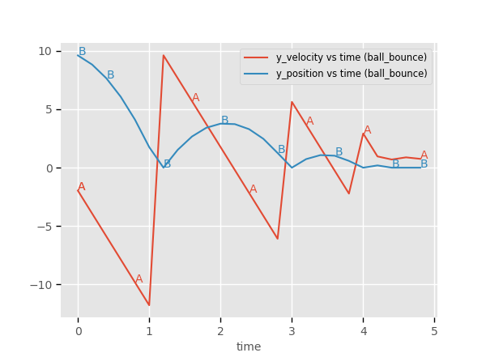

.. ## Copyright (c) 2017-2025, Lawrence Livermore National Security, LLC and
.. ## other Axom Project Developers. See the top-level LICENSE file for details.
.. ##
.. ## SPDX-License-Identifier: (BSD-3-Clause)

.. _curvesets-label:

==========
Curve Sets
==========

Sina ``CurveSet`` objects act as a way to group related independent and dependent
``Curve`` objects. Each ``Curve`` is a 1-dimensional list of numbers along with
optional units and tags.

A common example of a ``CurveSet`` could be time series data. Here the independent
curve would be time and the dependent curve(s) would be the data you're measuring
over time.

We will demonstrate the creation of a ``CurveSet`` using a simple experiment that
measures the 2D position and velocity of a ball while it bounces. In the below script
We will create one function to generate the data for the ball bounce experiment and
another function to assemble the ``CurveSet`` object and add it to our ``Record``:

.. literalinclude:: ../../examples/sina_curve_set.cpp
   :language: cpp

Once this code is compiled and executed a json file will be created. Here, we'll
use `PyDV <https://lc.llnl.gov/weave/pydv/html/index.html>`_ to ingest the Sina json
file in order to view the position and velocity of the ball along the y-axis over
time.

