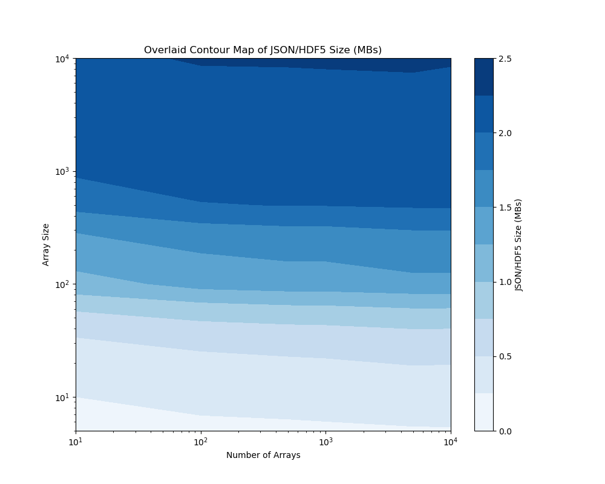
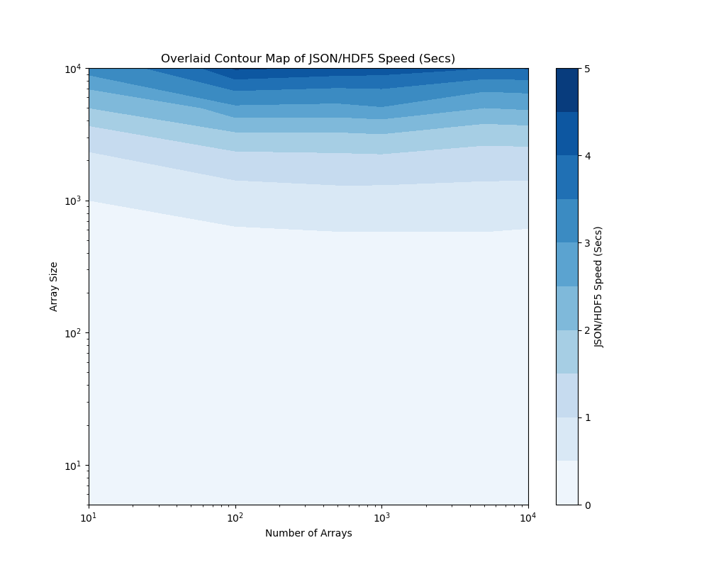

.. ## Copyright (c) 2017-2025, Lawrence Livermore National Security, LLC and
.. ## other Axom Project Developers. See the top-level LICENSE file for details.
.. ##
.. ## SPDX-License-Identifier: (BSD-3-Clause)

.. _curvesets-label:

==========
HDF5 and JSON
==========

Sina's C++ and Python Code supports loading both JSON and HDF5 files as Documents,
and saving Documents to either file type.

Both options offer differing strengths and weaknesses when compared to each other,
the following data on the size and speed has been compiled to give a better idea
of which file type fits your requirements.

==========
Why You Should Use JSON
==========

* JSON is more universally parsable
* JSON code is human readable allowing you more, easier flexibility with searching
for relevent data.  This is most applicable with smaller files since large amounts
of data or curve sets quickly become more efficient to navigate digitally
* JSON outperforms HDF5 in speed and size efficiency when dealing with non-curve set data 
and outperforms at smaller curve set sizes (just before :math:`10^2` Curve Sets for Size and
around :math:`10^3.25` for Speed)

==========
Why You Should Use HDF5
==========

* HDF5 offers better size and speed efficiency when dealing with larger files/curve sets 
and only outperforms more dramatically as size increases
* Hierarchical structure leads to being 2.5x more size efficient and 5x faster at our largest
tested files

==========
Images
==========

JSON vs HDF5 Size
--------

JSON vs HDF5 Speed
--------

