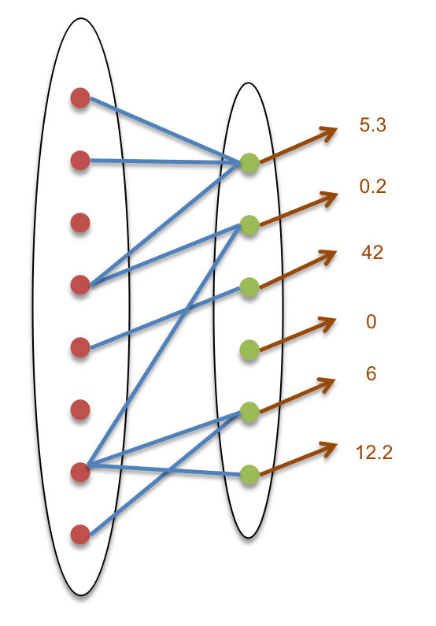

******************************************************
Core concepts
******************************************************

Describe Slam concepts, what they mean, how they are used, etc.

   A **relation** (blue lines) between two **sets** (ovals with red and green dots, as elements)
   and a **map** of scalar values (brown) on the second set.

Set
---
* Taxonomy of set types (OrderedSet, IndirectionSet, Subset, static vs. dynamic)
* Simple API (including semantics of operator[] and iterators )
* Example to show how we iterate through a set

Relation
--------
* Relational operator (from element of Set A to set of elements in Set B)
* Taxonomy:
    * Cardinality: Fixed vs Variable number of elements per relation
    * Mutability: Static vs. Dynamic relation
    * Storage: Implicit vs. Explicit (e.g. product set)
* Simple API (including semantics of operator[] )

Map
---

* Data associated with all members of a set
* Simple API (including semantics of operator[] )
