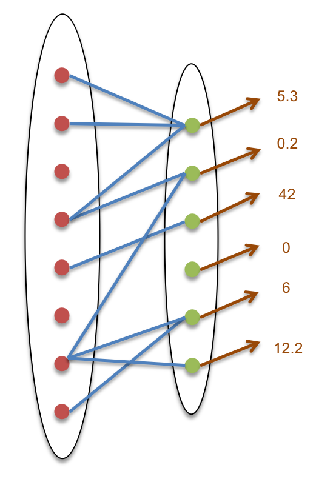

.. ## Copyright (c) Lawrence Livermore National Security, LLC and other
.. ## Axom Project Contributors. See top-level LICENSE and COPYRIGHT
.. ## files for dates and other details.
.. ##
.. ## SPDX-License-Identifier: (BSD-3-Clause)

.. _srm-label:

=============
Core concepts
=============

This section describes Slam's concepts: what they mean and how they are used.

   A **relation** (blue lines) between two **sets** (ovals with red and green dots, as elements)
   and a **map** of scalar values (brown) on the second set.

.. _set-concept-label:

Set
===

Sets model mesh entities such as vertices, zones, materials or refinement levels.
Ordered sets associate each entity with a position so Slam code can iterate
and index efficiently.

Use ``RangeSet`` for contiguous ranges. Use ``ArraySet`` or ``ArrayViewSet``
when set elements are stored in Axom buffers.

``ProductSet`` represents every pair of positions in its first and second sets.
Its flat position type must be signed integral and able to represent both sets'
position types. Construction checks that their sizes are nonnegative and that
their product fits the flat position type. Either set may be empty. The virtual
interface also checks that its materialized row fits an ``axom::Array`` size;
the concrete interface represents rows implicitly. Referenced sets must outlive
the product and retain their sizes while it is used for indexing or iteration.

.. _relation-concept-label:

Relation
========

A relation connects elements from a `from-set` to those of a `to-set`
and can be used to encode mesh incidence and adjacency relations, such 
as those from cells to vertices, from vertices to cells, from zones to materials
or from elements to neighboring elements.

Slam classifies relations along a few independent axes:

* cardinality: constant per from-set entity or variable per from-set entity
* mutability: static after construction or dynamically editable
* storage: implicit, such as a product set, or explicit, such as index buffers

Use ``ConstantRelation`` / ``ConstantRelationView`` for static fixed-cardinality
relations and ``VariableRelation`` / ``VariableRelationView`` for static
variable-cardinality relations. Use ``DynamicConstantRelation`` or
``DynamicVariableRelation`` when the connectivity needs to be edited.

.. _map-concept-label:

Map
===

Maps attach values to the members of a set. In mesh terms, a map is the Slam
abstraction for scalar, vector or tensor data associated with vertices, cells,
materials or other entity sets.

A ``Map`` stores its values in an ``axom::Array`` by default, allocating and freeing
that buffer as part of the map's lifetime. To point a map at a buffer whose lifetime is
managed elsewhere, e.g. storage owned by an application, or data to be captured in a device kernel,
construct it with an ``axom::ArrayView`` indirection instead.
``BivariateMap`` attaches values to a bivariate set, such as a product set or relation set,
with the same choice of storage.

See :ref:`aliases-label` for how the map storage default interacts with
those of other Slam containers, and for the relation aliases.

Sizes and component shapes
--------------------------

A bound map has a positive number of components per set element, even when
the set is empty. Every dimension of a tensor component shape must be positive.
Built-in stride constructors and ``make_map`` helpers check component counts
and shape products. Maps check storage sizes before allocating or resizing
storage. Custom stride policies must obey the same contract. The scalar count must
fit both the map's position type and ``axom::IndexType``. A supplied
``ArrayView`` must have exactly that many entries; these checks are active in
Debug and Release builds. For raw-pointer helpers, the caller remains responsible
for providing sufficient storage.

These are map requirements, not restrictions on every stride policy. Ordered
sets may use a negative stride to traverse a range in reverse.

The referenced set's size must remain consistent with the map's value buffer.
Do not mutate an inherited stride policy or component shape after construction;
construct or assign a map with the desired shape instead. ``isValid()`` safely
rejects invalid component counts or storage sizes, but it does not repair them.

BivariateMap reads component count and shape from its inner Map, including after
assignment through ``getMap()``. Its outer stride-policy base remains for source
and layout compatibility. Changing that base does not configure the map.
``isValid()`` also checks that the inner Map's entry count agrees with the
bivariate set. Iterators are invalidated after replacing storage or changing shape.

Value constness follows the backing storage. A const owning map returns const
references. A const map backed by ``ArrayView<T>`` still returns ``T&``; one
backed by ``ArrayView<const T>`` returns ``const T&``. Direct access, scalar
iterator access, and submaps preserve these same reference types.

Set positions and elements
--------------------------

The set whose elements receive values is the map's mathematical *domain*.
For ``Map``, this is the set returned by ``set()``. For ``BivariateMap``, it is
the bivariate set, whose elements are pairs of positions in its first and
second sets.

Map access uses positions. If a set contains elements ``{10, 20, 30, 40}``,
``map(1)`` accesses the value associated with element ``20``. ``map.index(1)``
returns that element. With several components per element, ``map(1, c)``
accesses component ``c`` of the same entry. ``map[1 * map.numComp() + c]``
accesses that component by its flat storage position.

``BivariateMap::index(flatPosition)`` returns the coordinate pair stored at
that flat position in the bivariate set. Its existing two-argument overload,
``index(firstPosition, secondPosition)``, searches for the position within
the selected row.

Submaps
-------

A ``SubMap`` selects entries from a parent map and accesses their values in
the parent. It stores the parent pointer and a set of selected parent positions.
Its component count and shape come from the parent.

``submap.set()`` returns those selected positions. ``submap.index(i)`` follows
the selection to the set element associated with the value. Suppose the parent
set contains ``{10, 20, 30, 40}`` and the submap selects positions ``{3, 1}``:

.. list-table:: Positions and elements in a submap
   :header-rows: 1

   * - Submap position ``i``
     - Parent position ``submap.set()->at(i)``
     - Selected element ``submap.index(i)``
   * - 0
     - 3
     - 40
   * - 1
     - 1
     - 20

A nested submap selecting position ``1`` of this submap therefore accesses
the parent's value for element ``20``. Each level uses the same rule:

.. code-block:: cpp

   submap.index(i) == parent.index(submap.set()->at(i))

For a submap of a bivariate map, the result is a coordinate pair. This rule
holds at every nesting depth.

A const submap preserves the parent's value access. A submap of a mutable
owning map permits writes even through a const submap wrapper. A submap of a
const owning map returns const references. View-backed parents retain their
own const behavior.

The parent map and any buffers referenced by the selected-position set must
outlive the submap and its iterators. SubMap copies the selected-position set
itself, so a temporary range of positions is safe. If the parent is reassigned,
the selected positions must still be valid. Recreate iterators after changing
the parent's storage or component shape.

C++ concept contracts
=====================

``Concepts.hpp`` defines the operations generic code can use.
The public concepts do not require SLAM policy classes, storage aliases,
or concrete iterator types. Object classification ignores top-level const
and reference qualification. Element and mapped-value constness still matters.

.. list-table:: Public object contracts
   :header-rows: 1
   :widths: 25 75

   * - Concept
     - Required operations and meaning
   * - ``SetLike<S>``
     - Signed integral ``PositionType``, ``ElementType``, and const ``size()``,
       ``empty()``, and ``at(position)``. A set element may be a coordinate pair.
   * - ``IterableSetLike<S>``
     - ``SetLike`` plus const ``begin()`` and ``end()``. Traversal supports
       dereference, increment, and comparison with the end, and visits elements
       in positional order. Iterator aliases and standard-range conformance
       are not required.
   * - ``BivariateSetLike<S>``
     - ``SetLike`` with first and second sets that also model ``SetLike``.
       Coordinate members have their respective sets' position types.
       ``getFirstSet()`` and ``getSecondSet()`` return those sets, and
       ``getElements(first)`` returns a sized, iterable row of second-set
       positions.
   * - ``RelationLike<R>``
     - From and to sets that model ``SetLike``, returned by ``fromSet()`` and
       ``toSet()``. ``relation[from]`` returns a sized, iterable row of to-set
       positions. Neither set is restricted to scalar elements.
   * - ``MapLike<M>``
     - Signed integral ``PositionType``, scalar ``DataType``, ``size()``,
       ``numComp()``, ``index(position)``, and mutable and const
       ``flatValue(position, component)``. Value access returns lvalue
       references to ``DataType``, possibly adding constness.
   * - ``MapOver<M, S>``
     - ``MapLike`` with an explicit whole-set binding to exactly ``S``.
       ``MappedSetType`` names ``S``, ``set()`` returns a pointer to const ``S``,
       and the map and set use the same position type.
   * - ``Validatable<T>``
     - Const ``isValid(false)`` returns a Boolean result. This is an optional
       capability, independent of the object concepts above.

A concept checks expressions and types, rather than runtime consistency. 
A set's ``size()`` must be nonnegative and agree with ``empty()``.
Access requires valid positions. Dynamic containers can retain invalid entries
within their extent and their validity API determines which positions may be accessed.

Bivariate coordinates must identify valid positions in both component sets.
Concatenating the rows in first-set order must agree with ``at(flatPosition)``;
the flat cardinality equals the sum of the row sizes. Relation rows must contain
valid to-set positions. A row's reported size must agree with its traversal.
Search methods and flat-position projections are optional conveniences,
not requirements of these public concepts.

Map access and set binding
--------------------------

``flatValue(entry, component)`` uses a local scalar-component offset in ``[0, numComp())``,
even for tensor maps. For a shape ``{2, 3}``, ``flatValue(entry, 5)`` and
``value(entry, 1, 2)`` access the same scalar.
Here, "flat" describes the entry position in a bivariate map rather than
the global component-storage position used by ``operator[]``.

``MapLike`` requires no materialized domain object. ``index(entry)`` identifies
the element receiving the values, and the component count is positive for a
bound map. A default, unbound SubMap may be empty with zero components.
Writable access is a separate requirement for algorithms that modify values.
A const owning map is read-only, while a const view can retain mutable access
to its backing storage.

``Map``, ``DynamicMap``, and ``BivariateMap`` expose ``MappedSetType`` beside
their existing aliases. It names the set returned by ``set()``. This type-only
alias distinguishes BivariateMap's mapped bivariate set from its internal flat
``SetType`` without changing either object representation or set access.
For a valid bound ``MapOver<M, S>``, ``size() == set()->size()`` and
``index(i)`` identifies the same element as ``set()->at(i)``.

SubMap models ``MapLike`` but not ``MapOver``. Its ``set()`` selects positions
in its parent; those positions are not the mapped elements returned by
``index()``. There is no projected-set adapter or second parent binding.
Generic algorithms that only read or write mapped values should require ``MapLike``.
Require ``MapOver`` when the algorithm needs the whole-set binding.

Implementation and deployment requirements
------------------------------------------

Existing owners and adapters may consume more operations than the public
semantic contracts. BivariateMap uses search and conversion of flat row positions
to its concrete RangeSet. It derives the row type from ``getElements()`` and
iterator coordinates from ``at()``. It does not require a set iterator or
``SubsetType`` alias. RelationSet consumes a relation's flat storage. Their
checks live in ``detail`` and are not additional requirements on every
bivariate set or relation.

RelationSet derives rows from const ``relation[from]``. It searches the row's
flat storage using ``offset(from)`` and the row's size, and projects flat
positions through ``firstIndex(flat)`` and ``relationData()[flat]``. These
operations must agree with row traversal. No row subscript, row offset, or
``RelationSubset`` alias is required. A concrete RelationSet returns the source
row directly. A virtual RelationSet requires conversion to the fixed row type
of BivariateSet. If that conversion is unavailable, the concrete adapter's
``VirtualSet`` and ``OtherSet`` aliases are ``void``.

SubMap construction requires scalar access, size, component count, shape, and
element lookup from its parent. Range traversal adds a separate check for a
parent iterator that can be constructed at a selected position, dereferenced,
copied, and queried for its original flat position. A parent ``set_end()`` is
not required. The copied index set supplies positional access; it does not
need its own iteration or subscript API. Shaped component access is checked
only when requested.

Size, stride, offset, subset, ordered-set indirection, and map-storage policy protocols
remain separate extension contracts. Their owner-specific combinations do not
enter the public object concepts. See :ref:`policy-contracts-label` for the
operations each owner uses.

``PositionLike`` currently means a signed integral type. Tagged positions need
a design that distinguishes positions, extents, and differences before they
can support SLAM's arithmetic. There is no opt-in that bypasses that requirement.

``TriviallyCopyableRepresentation`` checks only the C++ representation.
It does not certify device-callable operations, device-accessible allocations,
or the lifetime of referenced objects. In particular, a trivially copyable
SubMap can retain a pointer to a host-only parent. Device view conversion must
establish its own contract.

