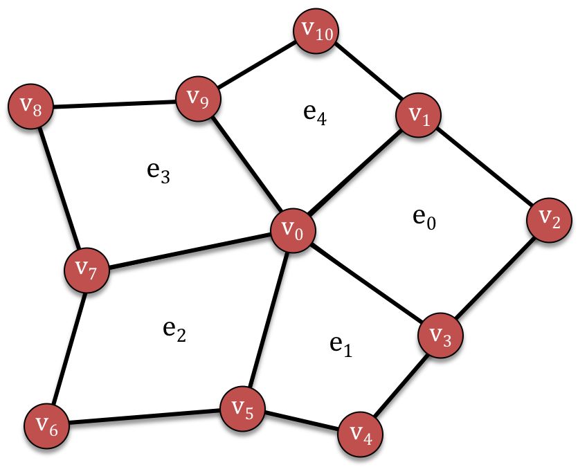

.. ## Copyright (c) 2017-2021, Lawrence Livermore National Security, LLC and
.. ## other Axom Project Developers. See the top-level LICENSE file for details.
.. ##
.. ## SPDX-License-Identifier: (BSD-3-Clause)

=======================
An introductory example
=======================

This file contains an introductory example to define and traverse a simple quadrilateral
mesh. The code for this example can be found in
``axom/src/axom/slam/examples/UserDocs.cpp``.

   An unstructured mesh with eleven vertices (red circles) and five elements
   (quadrilaterals bounded by black lines)

We first import the unified Slam header, which includes all necessary files for working
with slam:

.. literalinclude:: ../../examples/UserDocs.cpp
   :start-after: _quadmesh_example_import_header_start
   :end-before:  _quadmesh_example_import_header_end
   :language: C++

.. note:: All code in slam is in the ``axom::slam`` namespace.
   For convenience, we add the following namespace declaration to our example to allow us
   to directly use the ``slam`` namespace:

   .. literalinclude:: ../../examples/UserDocs.cpp
     :start-after: _quadmesh_example_slam_namespace_start
     :end-before:  _quadmesh_example_slam_namespace_end
     :language: C++

Type aliases and variables
==========================

We begin by defining some type aliases for the Sets, Relations and Maps in our mesh.
These type aliases would typically be found in a configuration file or in class header
files.

We use the following types throughout this example:

.. literalinclude:: ../../examples/UserDocs.cpp
   :start-after: _quadmesh_example_common_typedefs_start
   :end-before:  _quadmesh_example_common_typedefs_end
   :language: C++

Sets
----

Our mesh is defined in terms of two sets: Vertices and Elements, whose entities are
referenced by integer-valued indices. Since both sets use a contiguous range of indices
starting from 0, we use ``slam::PositionSet`` to represent them.

We define the following type aliases:

.. literalinclude:: ../../examples/UserDocs.cpp
   :start-after: _quadmesh_example_set_typedefs_start
   :end-before:  _quadmesh_example_set_typedefs_end
   :language: C++

and declare them as:

.. literalinclude:: ../../examples/UserDocs.cpp
   :start-after:  _quadmesh_example_set_variables_start
   :end-before:   _quadmesh_example_set_variables_end
   :language: C++

For other available set types, see :ref:`set-concept-label`.

Relations
---------

We also have relations describing the incidences between the mesh vertices and elements.

The element-to-vertex *boundary* relation encodes the indices of the vertices in the
boundary of each element. Since this is a quad mesh and there are always four vertices in
the boundary of a quadrilateral, we use a ``ConstantCardinality`` policy with a
``CompileTimeStride`` set to 4 for this ``StaticRelation``.

.. literalinclude:: ../../examples/UserDocs.cpp
   :start-after: _quadmesh_example_bdry_relation_typedefs_start
   :end-before:  _quadmesh_example_bdry_relation_typedefs_end
   :language: C++

The vertex-to-element *coboundary* relation encodes the indices of all elements incident
in each of the vertices. Since the cardinality of this relation changes for different
vertices, we use a ``VariableCardinality`` policy for this ``StaticRelation``.

.. literalinclude:: ../../examples/UserDocs.cpp
   :start-after: _quadmesh_example_cobdry_relation_typedefs_start
   :end-before:  _quadmesh_example_cobdry_relation_typedefs_end
   :language: C++

We declare them as:

.. literalinclude:: ../../examples/UserDocs.cpp
   :start-after: _quadmesh_example_relation_variables_start
   :end-before:  _quadmesh_example_relation_variables_end
   :language: C++

For other available set types, see :ref:`relation-concept-label`.

Maps
----

Finally, we have some maps that attach data to our sets.

The following defines a type alias for the positions of the mesh vertices.
It is templated on a point type (``Point2``) that handles simple operations on 2D points.

.. literalinclude:: ../../examples/UserDocs.cpp
   :start-after: _quadmesh_example_maps_typedefs_start
   :end-before:  _quadmesh_example_maps_typedefs_end
   :language: C++

It is declared as:

.. literalinclude:: ../../examples/UserDocs.cpp
   :start-after: _quadmesh_example_map_variables_start
   :end-before:  _quadmesh_example_map_variables_end
   :language: C++

Constructing the mesh
=====================

This example uses a very simple fixed mesh, which is assumed to not change after it has
been initialized.

Sets
----

The sets are created using a constructor that takes the number of elements.

.. literalinclude:: ../../examples/UserDocs.cpp
   :start-after: _quadmesh_example_construct_sets_start
   :end-before:  _quadmesh_example_construct_sets_end
   :language: C++

The values of the vertex indices range from ``0`` to ``verts.size()-1`` (and similarly
for ``elems``).

.. note:: All sets, relations and maps in Slam have internal validity checks using
   the ``isValid()`` function:

   .. literalinclude:: ../../examples/UserDocs.cpp
      :start-after: _quadmesh_example_set_isvalid_start
      :end-before:  _quadmesh_example_set_isvalid_end
      :language: C++

Relations
---------

The relations are constructed by binding their associated sets and arrays of data to the
relation instance. In this example, we use an internal helper class ``RelationBuilder``.

We construct the boundary relation by attaching its two sets (``elems`` for its
``fromSet`` and ``verts`` for its ``toSet``) and an array of indices for the relation's
data.

.. literalinclude:: ../../examples/UserDocs.cpp
   :start-after: _quadmesh_example_construct_bdry_relation_start
   :end-before:  _quadmesh_example_construct_bdry_relation_end
   :language: C++

The Coboundary relation requires an additional array of offsets (``begins``) to indicate
the starting index in the relation for each vertex:

.. literalinclude:: ../../examples/UserDocs.cpp
   :start-after: _quadmesh_example_construct_cobdry_relation_start
   :end-before:  _quadmesh_example_construct_cobdry_relation_end
   :language: C++

Since these are static relations, we used data that was constructed elsewhere.
Note that these relations are lightweight wrappers over the underlying data -- no data is
copied. To iteratively build the relations, we would use the ``DynamicConstantRelation``
and ``DynamicVariableRelation`` classes.

See :ref:`setup-label` for more details about Slam's ``Builder`` classes for sets,
relations and maps.

Maps
----

We define the positions of the mesh vertices as a ``Map`` on the ``verts`` set.
For this example, we set the first vertex to lie at the origin, and the remaining
vertices line within an annulus around the unit circle.

.. literalinclude:: ../../examples/UserDocs.cpp
   :start-after: _quadmesh_example_vert_positions_start
   :end-before:  _quadmesh_example_vert_positions_end
   :language: C++

Traversing the mesh
===================

Now that we've constructed the mesh, we can start traversing the mesh connectivity
and attaching more fields.

Computing a derived field
-------------------------

Our first traversal loops through the vertices and computes a derived field on the
position map. For each vertex, we compute its distance to the origin.

.. literalinclude:: ../../examples/UserDocs.cpp
   :start-after: _quadmesh_example_vert_distances_start
   :end-before:  _quadmesh_example_vert_distances_end
   :language: C++

Computing element centroids
---------------------------

Our next example uses element-to-vertex boundary relation to compute the
*centroids* of each element as the average of its vertex positions.

.. literalinclude:: ../../examples/UserDocs.cpp
   :start-after: _quadmesh_example_elem_centroids_start
   :end-before:  _quadmesh_example_elem_centroids_end
   :language: C++

Perhaps the most interesting line here is when we call the relation's subscript
operator (``bdry[eID]``).  This function takes an element index
(``eID``) and returns the *set* of vertices that are incident in this element.
As such, we can use all functions in the Set API on this return type, e.g. ``size()``
and the subscript operator.

Outputting mesh to disk
-----------------------

As a final example, we highlight several different ways to iterate through the
mesh's Sets, Relations and Maps as we output the mesh to disk (in the ``vtk`` format).

This is a longer example, but the callouts
(left-aligned comments of the form  ``// <-- message`` ) point to
different iteration patterns.

.. literalinclude:: ../../examples/UserDocs.cpp
   :start-after: _quadmesh_example_output_vtk_start
   :end-before:  _quadmesh_example_output_vtk_end
   :language: C++
