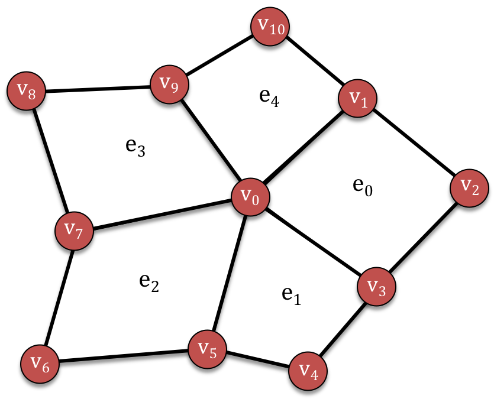

.. ## Copyright (c) Lawrence Livermore National Security, LLC and other
.. ## Axom Project Contributors. See top-level LICENSE and COPYRIGHT
.. ## files for dates and other details.
.. ##
.. ## SPDX-License-Identifier: (BSD-3-Clause)

=======================
An introductory example
=======================

This example builds a quadrilateral mesh, follows its cell-to-vertex
connections and computes fields on its vertices and cells. The complete
source is ``src/axom/slam/examples/UserDocs.cpp``.

   An unstructured mesh with eleven vertices, shown as red circles,
   and five quadrilateral elements bounded by black lines.

.. note:: Slam's types are in the ``axom::slam`` namespace.
   This namespace alias shortens their names in the example:

   .. literalinclude:: ../../examples/UserDocs.cpp
     :start-after: _quadmesh_example_slam_namespace_start
     :end-before:  _quadmesh_example_slam_namespace_end
     :language: C++

   Our examples include all of Slam's header files using the unified header:

   .. literalinclude:: ../../examples/UserDocs.cpp
      :start-after: _quadmesh_example_import_header_start
      :end-before:  _quadmesh_example_import_header_end
      :language: C++

Type aliases and variables
==========================

Since Slam is highly configurable, we typically start by defining aliases 
for the mesh's set, relation and map types in the mesh class or a configuration header.
We use the common :ref:`aliases <aliases-label>` to choose cardinality and
storage policies, then give those types names that describe their mesh roles.

The connectivity buffers hold positions in the vertex and element sets.
This example stores them in ``axom::Array``:

.. literalinclude:: ../../examples/UserDocs.cpp
   :start-after: _quadmesh_example_common_typedefs_start
   :end-before:  _quadmesh_example_common_typedefs_end
   :language: C++

Sets
----

Our example mesh has two sets, vertices and elements. Both use a contiguous range of
integer identifiers starting at zero, so ``slam::PositionSet`` represents
them without an element buffer.

We define the following type aliases:

.. literalinclude:: ../../examples/UserDocs.cpp
   :start-after: _quadmesh_example_set_typedefs_start
   :end-before:  _quadmesh_example_set_typedefs_end
   :language: C++

The mesh stores an instance of each set:

.. literalinclude:: ../../examples/UserDocs.cpp
   :start-after:  _quadmesh_example_set_variables_start
   :end-before:   _quadmesh_example_set_variables_end
   :language: C++

For other available set types, see :ref:`set-concept-label`.

Relations
---------

Two relations describe the connections between vertices and elements.

The element-to-vertex *boundary* relation records the vertices associated with
each element. Every quadrilateral has four vertices, so its cardinality is
a compile-time constant. ``slam::ConstantRelation`` selects a ``StaticRelation``
with that cardinality and a binding to an external ``axom::Array``:

.. literalinclude:: ../../examples/UserDocs.cpp
   :start-after: _quadmesh_example_bdry_relation_typedefs_start
   :end-before:  _quadmesh_example_bdry_relation_typedefs_end
   :language: C++

The vertex-to-element *coboundary* relation records the collection of elements
incident in each vertex. Some vertices touch one element, others two, and the
center vertex touches all five. ``slam::VariableRelation`` allows these
cardinalities to differ and binds the connectivity through external ``axom::Array`` buffers:

.. literalinclude:: ../../examples/UserDocs.cpp
   :start-after: _quadmesh_example_cobdry_relation_typedefs_start
   :end-before:  _quadmesh_example_cobdry_relation_typedefs_end
   :language: C++

.. note:: ``ConstantRelationView`` and ``VariableRelationView``
   store ``axom::ArrayView`` values rather than pointers to external
   ``axom::Array`` objects. Both forms borrow their buffers and their sets.
   When a configuration is not covered by an alias, use the ``StaticRelation`` policies directly.
   See :ref:`aliases-label`.

The mesh stores both relations:

.. literalinclude:: ../../examples/UserDocs.cpp
   :start-after: _quadmesh_example_relation_variables_start
   :end-before:  _quadmesh_example_relation_variables_end
   :language: C++

For other relation types, see :ref:`relation-concept-label`.

Maps
----

The vertex coordinates form a map on the vertex set. Each entry holds a
``Point2``, the example's two-dimensional point type.

.. literalinclude:: ../../examples/UserDocs.cpp
   :start-after: _quadmesh_example_maps_typedefs_start
   :end-before:  _quadmesh_example_maps_typedefs_end
   :language: C++

The map allocates and frees its own ``axom::Array`` of values. To borrow a
buffer managed elsewhere, use ``policies::ArrayViewIndirection``.

The mesh stores the coordinate map:

.. literalinclude:: ../../examples/UserDocs.cpp
   :start-after: _quadmesh_example_map_variables_start
   :end-before:  _quadmesh_example_map_variables_end
   :language: C++

Constructing the mesh
=====================

The topology is fixed after initialization. Construct the sets first, then
bind the relations and maps to them.

Sets
----

The sets are created using a constructor that takes the number of elements.

.. literalinclude:: ../../examples/UserDocs.cpp
   :start-after: _quadmesh_example_construct_sets_start
   :end-before:  _quadmesh_example_construct_sets_end
   :language: C++

Vertex identifiers range from ``0`` to ``verts.size()-1``. Element identifiers
follow the same rule. For these ``PositionSet`` types, an identifier equals
its position in the set.

.. note:: The built-in types used here provide ``isValid()`` checks:

   .. literalinclude:: ../../examples/UserDocs.cpp
      :start-after: _quadmesh_example_set_isvalid_start
      :end-before:  _quadmesh_example_set_isvalid_end
      :language: C++

   Validation is a separate capability in Slam's C++ concepts. A custom type
   can model a set, relation or map without providing ``isValid()``.

Relations
---------

Construct the relations by binding their sets and connectivity buffers.
The ``slam::make_*_relation`` helpers deduce the relation type from these arguments.

For the boundary relation, ``elems`` is the "from-set" and ``verts`` is the "to-set".
The connectivity array contains vertex positions:

.. literalinclude:: ../../examples/UserDocs.cpp
   :start-after: _quadmesh_example_construct_bdry_relation_start
   :end-before:  _quadmesh_example_construct_bdry_relation_end
   :language: C++

The coboundary relation also needs a begin-offset buffer. It contains one
offset per vertex plus a final offset equal to the total number of entries.
The offsets start at zero and never decrease. Adjacent offsets delimit one
vertex's related entries, so equal offsets mean that vertex has no related entries:

.. literalinclude:: ../../examples/UserDocs.cpp
   :start-after: _quadmesh_example_construct_cobdry_relation_start
   :end-before:  _quadmesh_example_construct_cobdry_relation_end
   :language: C++

The example's begin offsets are ``{0, 5, 7, 8, 10, 11, 13, 14, 16, 17, 19, 20}``.
The first vertex has five related entries, and the final offset records twenty
connections in total.

These static relations borrow their sets and array objects. Both must outlive
the relations, and construction does not copy the connectivity data. To build
connectivity incrementally, use ``DynamicConstantRelation`` or
``DynamicVariableRelation``.

See :ref:`setup-label` for construction helpers and builders.

Maps
----

Next. we construct the coordinate map on ``verts``. 
We start by placing the first vertex at the origin and the remaining vertices
in an annulus around the unit circle.

.. literalinclude:: ../../examples/UserDocs.cpp
   :start-after: _quadmesh_example_vert_positions_start
   :end-before:  _quadmesh_example_vert_positions_end
   :language: C++

Traversing the mesh
===================

With the connectivity and coordinates in place, we can compute fields from them.

Computing a derived field
-------------------------

The first traversal computes each vertex's distance from the origin and
stores it in a new map:

.. literalinclude:: ../../examples/UserDocs.cpp
   :start-after: _quadmesh_example_vert_distances_start
   :end-before:  _quadmesh_example_vert_distances_end
   :language: C++

Computing element centers
-------------------------

Next, follow the element-to-vertex relation and average each element's vertex
coordinates. The example names this map ``centroid``. Its values are vertex
averages, not area-weighted geometric centroids of general quadrilaterals.

.. literalinclude:: ../../examples/UserDocs.cpp
   :start-after: _quadmesh_example_elem_centroids_start
   :end-before:  _quadmesh_example_elem_centroids_end
   :language: C++

``bdry[eID]`` returns the subset of vertex positions for element ``eID``.
This subset supports ``size()``, subscripting and iteration. Each vertex position
then indexes the coordinate map. The traversal needs no knowledge of how the
relation stores its connectivity.

Writing the mesh to disk
------------------------

Finally, write the mesh to a VTK file. 
The following snippet uses Slam's iterator API to traverse
the sets, subsets and maps, calling these out using  ``// <--`` comments:

.. literalinclude:: ../../examples/UserDocs.cpp
   :start-after: _quadmesh_example_output_vtk_start
   :end-before:  _quadmesh_example_output_vtk_end
   :language: C++
