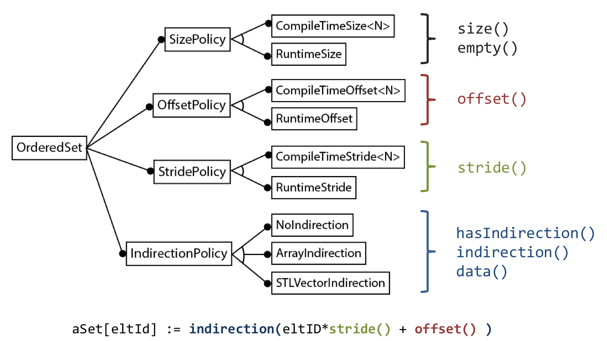

.. ## Copyright (c) 2017-2021, Lawrence Livermore National Security, LLC and
.. ## other Axom Project Developers. See the top-level LICENSE file for details.
.. ##
.. ## SPDX-License-Identifier: (BSD-3-Clause)

======================
Implementation details
======================

.. _policy-label:

Policy-based design
===================

Handling the combinatorial explosion of features; avoid paying for what we don't need

* SizePolicy, StridePolicy, OffsetPolicy (compile time vs. runtime)
* IndirectionPolicy (none, C-array, std::vector, custom, e.g. mfem::Array)
* SubsettingPolicy (none, virtual parent, concrete parent)
* OwnershipPolicy (local, sidre, other repository)

Feature diagram of OrderedSet policies (subset).

The figure shows how certain these policies interact with the subscript operator.

.. _setup-label:

Simplifying mesh setup
======================

* Builder classes
    * Chained initialization using named-parameter idiom
* Generator classes to simplify types
