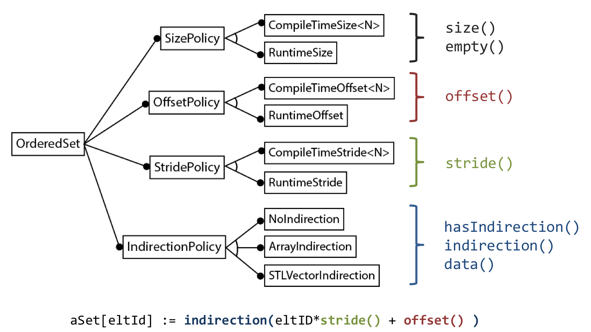

.. ## Copyright (c) Lawrence Livermore National Security, LLC and other
.. ## Axom Project Contributors. See top-level LICENSE and COPYRIGHT
.. ## files for dates and other details.
.. ##
.. ## SPDX-License-Identifier: (BSD-3-Clause)

======================
Implementation details
======================

.. _policy-label:

Policy-based design
===================

Slam uses policy-based design to combine the storage and indexing behavior a
type needs without paying for features it does not use.

Slam defines several aliases for commonly used configurations (see :doc:`aliases`), 
and its types are extensible to custom storage, legacy storage 
and less common combinations that the alias layer does not intentionally name.

Policies include:

* SizePolicy, StridePolicy, OffsetPolicy (compile time vs. runtime)
* IndirectionPolicy, which chooses how set elements, relation indices and map
  values are reached through backing storage:

  * ``NoIndirection`` for implicit ``element == position`` storage
  * ``ArrayIndirection``, backed by an ``axom::Array``. Maps own their array;
    ordered sets and static relations bind an array managed elsewhere.
  * ``ArrayViewIndirection``, backed by an ``axom::ArrayView`` of a buffer managed elsewhere.
    Device use also requires device-callable operations and accessible backing storage.
  * ``CArrayIndirection`` and ``STLVectorIndirection`` for interoperation 
    with raw-pointer and ``std::vector`` storage
  * custom policies, e.g. ``mfem::Array`` adapters
* SubsettingPolicy (none, virtual parent, concrete parent)
* OwnershipPolicy (local, sidre, other repository)

``Map`` and ``BivariateMap`` default to ``ArrayIndirection``.

The following feature diagram of ``slam::OrderedSet`` policies shows how these policies
interact with the subscript operator:

.. _policy-contracts-label:

Policy extension contracts
==========================

Policy concepts describe operations, not membership in SLAM's built-in policy
families. Custom policies do not need to inherit ``ValuePolicy`` or provide
``TagType``, ``IntType``, or device-accessibility flags.

``SizePolicy``, ``StridePolicy``, ``OffsetPolicy``, and ``SubsetPolicy`` describe
const queries and ignore top-level cv/ref qualification. The owner-specific
checks use the exact template argument. A policy inherited by an owner must
be an unqualified, non-final, non-abstract class. A final Map storage descriptor
is permitted because Map neither inherits nor stores a descriptor object.

Ordered sets
------------

OrderedSet constructs its scalar policies from position values, copies them
into the set, and defaults and assigns them in its builder. Its iterators also
copy the policies. Each scalar policy supplies ``DEFAULT_VALUE`` of exactly
the set's position type.

.. list-table:: Operations consumed by ordered-set policies
   :header-rows: 1
   :widths: 20 80

   * - Policy
     - Const operations
   * - Size
     - ``size()``, ``empty()``, ``isValid(verbose)``
   * - Offset
     - ``offset()``, ``isValid(verbose)``
   * - Stride
     - ``stride()``, ``isValid(verbose)``
   * - Indirection
     - ``indirection(pos)``, ``isValid(size, offset, stride, verbose)``
   * - Subset
     - ``isSubset()``, ``parentSet()``, ``isValid(begin, end, verbose)``

Size, offset, and stride queries return the set's position type. A scalar
ordered-set stride does not need map shape metadata. DynamicSet additionally
requires mutable ``size()`` to return a position reference, since insertion
and reset update the stored size.

``OrderedSetIndirectionPolicyFor<I, P, E>`` checks default construction, copying,
binding from ``I::IndirectionPtrType``, and mutable and const indirection.
``IndirectionResult`` and ``ConstIndirectionResult`` name the results. Results
may be element values or references and may add constness, but cannot discard
the qualification of ``E``. Sized binding is available only when the policy
also constructs from the pointer type and a buffer size. The policy is
responsible for checking whatever bounds information its storage provides.

``SubsetPolicy`` checks ``ParentSetType`` and the parent queries. OrderedSet
also requires default construction, copying, and construction from a parent
pointer. Its validation checks ``isValid(begin, end, verbose)`` with the actual
const iterator type. This check occurs after those iterators are complete.
The parent and any bound indirection storage must outlive the set and its
iterators. Relation policies can require additional operations, such as flat
buffer access; ordered-set indirection alone does not promise those operations.

Maps
----

A map stride policy supplies ``IndexType``, ``ShapeType``, a positive compile-time
``NumDims``, ``DefaultSize()``, and construction from a shape. Const ``stride()``
returns the scalar component count and ``shape()`` returns the shape. A
one-dimensional shape converts to ``IndexType``. A multidimensional shape
supports subscripting, and ``strides()`` returns its per-dimension strides.
Map does not need the built-in shape container, shape iterators, a default
stride constructor, or a policy ``isValid()`` method. Custom policies must
provide positive dimensions, a representable product equal to ``stride()``,
and row-major per-dimension strides. Map checks the scalar storage size;
the policy must perform its own shape arithmetic safely.

``MapIndirectionPolicyFor<I, P, D>`` describes static buffer access.
``IndirectionBufferType`` names a buffer with const ``size()`` and ``empty()``.
The size is integral. ``IsMutableBuffer`` is a compile-time flag; if true, the
buffer must support ``resize(size)``. Both whole-buffer and position-taking
``getIndirection(buffer, ...)`` and ``getConstIndirection(buffer, ...)`` return
the pointer types named by ``ResultPtr`` and ``ConstResultPtr``.

Those pointers must refer to the scalar types named by ``IndirectionResult``
and ``ConstIndirectionResult``. Both results are stable lvalue references,
possibly adding constness to ``D``. A view may have shallow constness.
The buffer itself does not need subscripting, and the descriptor does not
need an instance ``indirection()`` operation or set-binding aliases.

Allocation is separate. ``AllocatingMapIndirectionPolicyFor`` adds
``create(size, value, allocatorId)`` returning the buffer type. Maps can instead
accept a supplied buffer. Write operations are available only when their
reference types support the assignments. An owning buffer manages its
allocation; a non-owning buffer requires its referenced storage to outlive the
map and every view or iterator using it.

None of these checks establishes device accessibility. Device conversion must
also establish callable operations, accessible allocations, and valid object
lifetimes.

.. _setup-label:

Simplifying mesh setup
======================

* Builder classes
    * Chained initialization using named-parameter idiom
* Generator classes to simplify types
