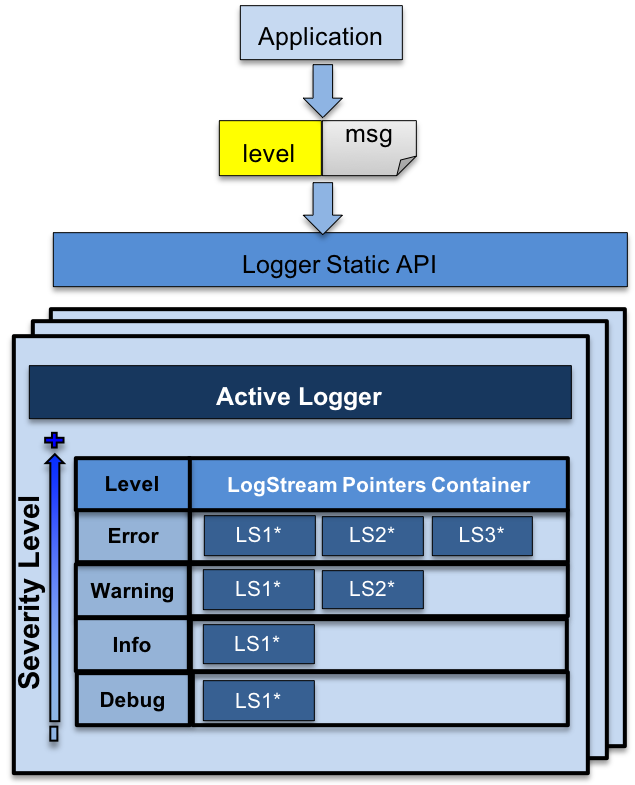

.. ## Copyright (c) 2017-2024, Lawrence Livermore National Security, LLC and
.. ## other Axom Project Developers. See the top-level LICENSE file for details.
.. ##
.. ## SPDX-License-Identifier: (BSD-3-Clause)

.. _sections/architecture:

Component Architecture
-----------------------

Slic provides a simple and easy to use logging interface for applications.

.. _figs/slic_architecture:

   Basic Component Architecture of Slic.

The basic component architecture of Slic, depicted in
:numref:`figs/slic_architecture`, consists of three main components:

#. A static logger API. This serves as the primary interface to the application.

#. One or more Logger object instances. In addition to the root logger, which
   is created when Slic is initialized, an application may create additional
   loggers. However, at any given instance, there is only a single *active*
   logger to which all messages are logged.

   * A Logger consists of *four* log message levels: ``ERROR``,
     ``WARNING``, ``INFO`` and ``DEBUG``.

   * Each :ref:`logMessageLevel` can have one or more :ref:`LogStream` instances,
     which, specify the output destination, format and filtering of
     messages.

#. One or more :ref:`LogStream` instances, bound to a particular logger, that
   can be shared between log message levels.

The application logs messages at an appropriate :ref:`logMessageLevel`, i.e.,
``ERROR``, ``WARNING``, ``INFO``, or, ``DEBUG`` using the static API.
Internally, the Logger routes the message to the corresponding
:ref:`LogStream` instances that are bound to the associated
:ref:`logMessageLevel`.

The following sections discuss some of these concepts in more detail.

.. _logMessageLevel:

Log Message Level
^^^^^^^^^^^^^^^^^^

The :ref:`logMessageLevel` indicates the severity of a message. Slic provides
four levels of messages ranked from highest to lowest as follows:

+---------------------+--------------------------------------------------------+
|   Message Level     |            Usage Description                           |
+=====================+========================================================+
| ``ERROR``           |  Indicates that the application encountered a critical |
|                     |  error or a faulty state. Includes also stacktrace.    |
+---------------------+--------------------------------------------------------+
| ``WARNING``         |  Indicates that the application encountered an error,  |
|                     |  but, the application should proceed.                  |
+---------------------+--------------------------------------------------------+
| ``INFO``            |  General information reported by an application.       |
+---------------------+--------------------------------------------------------+
| ``DEBUG``           |  Information useful to application developers.         |
+---------------------+--------------------------------------------------------+

.. note::

  ``ERROR`` messages by default will cause the application to abort. This
  behavior may be toggled by calling ``slic::enableAbortOnError()`` and
  ``slic::disableAbortOnError()``. See the `Slic Doxygen API Documentation`_
  for more details.

An application may adjust at runtime the severity level of messages to capture
by calling ``slic::setLoggingMsgLevel()``. For example, the following code
snippet, sets the severity level to ``WARNING``

.. code-block:: c++

    slic::setLoggingMsgLevel( slic::message::Warning );

This indicates that all messages with a level of severity of ``WARNING`` and
higher will be captured, namely ``WARNING`` and ``ERROR`` messages. Thereby,
enable the application to filter out messages with lower severity.

.. warning::

   All messages will be ignored until the first call to ``slic::setLoggingMsgLevel()``.

.. _LogStream:

Log Stream
^^^^^^^^^^^

The :ref:`LogStream` class, is an abstract base class that facilitates the
following:

* Specifying the :ref:`logMessageFormat` and output destination of log messages.

* Implementing logic for handling and filtering messages.

* Defines a pure abstract interface for all :ref:`LogStream` instances.

Since :ref:`LogStream` is an abstract base class, it cannot be instantiated
and used directly. Slic provides a set of :ref:`BuiltInLogStreams`, which provide
concrete implementations of the :ref:`LogStream` base class that support
common use cases for logging, e.g., logging to a file or output to
the console.

Applications requiring custom functionality, may extend the :ref:`LogStream`
class and provide a concrete :ref:`LogStream` instance implementation that
implements the abstract interface defined by the :ref:`LogStream` base class.
See the :ref:`addACustomLogStream` section for details.

A concrete :ref:`LogStream` instance can be attached to one or more
:ref:`logMessageLevel` by calling ``slic::addStreamToMsgLevel()`` and
``slic::addStreamToAllMsgLevels()``. See the `Slic Doxygen API Documentation`_
for more details.

.. _logMessageFormat:

Log Message Format
"""""""""""""""""""

The :ref:`logMessageFormat` is specified as a string consisting of keywords
that are encapsulated in  ``<...>``, which, Slic knows to interpret when
assembling the log message.

The list of keywords is summarized in the table below.

+---------------------+--------------------------------------------------------+
|   keyword           |            Replaced With                               |
+=====================+========================================================+
| **<TIMESTAMP>**     | A textual representation of the time a message is      |
|                     | logged, as returned by ``std::asctime()``.             |
+---------------------+--------------------------------------------------------+
| **<LEVEL>**         | The :ref:`logMessageLevel`, i.e., ``ERROR``,           |
|                     | ``WARNING``, ``INFO``, or ``DEBUG``.                   |
+---------------------+--------------------------------------------------------+
| **<MESSAGE>**       | The supplied message that is being logged.             |
+---------------------+--------------------------------------------------------+
| **<FILE>**          | The file from where the message was emitted.           |
+---------------------+--------------------------------------------------------+
| **<LINE>**          | The line location where the message was emitted.       |
+---------------------+--------------------------------------------------------+
| **<TAG>**           | A string tag associated with a given message, e.g., for|
|                     | filtering during post-processing, etc.                 |
+---------------------+--------------------------------------------------------+
| **<RANK>**          | The MPI rank(s) that emitted the message.              |
|                     | Only applicable when Axom is compiled with MPI enabled |
|                     | and with MPI-aware :ref:`LogStream` instances, such as,|
|                     | the :ref:`SynchronizedStream` and                      |
|                     | :ref:`LumberjackStream`.                               |
+---------------------+--------------------------------------------------------+
| **<RANK_COUNT>**    | The number of MPI ranks that emitted the message.      |
|                     | Only applicable when Axom is compiled with MPI enabled |
|                     | and with MPI-aware :ref:`LogStream` instances, such as,|
|                     | the :ref:`SynchronizedStream` and                      |
|                     | :ref:`LumberjackStream`.                               |
+---------------------+--------------------------------------------------------+

These keywords can be combined in a string to specify a template for a log
message.

For example, the following code snippet, specifies that all reported log
messages consist of the level, enclosed in brackets followed by the
user-supplied log message.

.. code-block:: c++

    std::string format = "[<LEVEL>]: <MESSAGE>";

To get the file and line location within the file where the message was
emitted, the format string above could be amended with the following:

.. code-block:: c++

    std::string format = "[<LEVEL>]: <MESSAGE> \n\t<FILE>:<LINE>";

This indicates that the in addition to the level and user-supplied, the
resulting log messages will have an additional line consisting of the file
and line where the message was emitted.

.. _defaultMessageFormat:

Default Message Format
"""""""""""""""""""""""

If the :ref:`logMessageFormat` is not specified, the :ref:`LogStream` base class
defines a default format that is set to the following:

.. code-block:: c++

    std::string DEFAULT_FORMAT = "*****\n[<LEVEL>]\n\n <MESSAGE> \n\n <FILE>\n<LINE>\n****\n"

.. _BuiltInLogStreams:

Built-In Log Streams
^^^^^^^^^^^^^^^^^^^^

The :ref:`BuiltInLogStreams` provided by Slic are summarized in the following
table, followed by a brief description for each.

+---------------------------------+------------------------------------------------+
|   Log Stream                    |            Use & Availability                  |
+=================================+================================================+
| :ref:`GenericOutputStream`      | Always available. Used in serial applications, |
|                                 | or, for logging on rank zero.                  |
+---------------------------------+------------------------------------------------+
| :ref:`SynchronizedStream`       | Requires MPI. Used with MPI applications.      |
+---------------------------------+------------------------------------------------+
| :ref:`LumberjackStream`         | Requires MPI. Used with MPI applications.      |
+---------------------------------+------------------------------------------------+

.. _GenericOutputStream:

Generic Output Stream
""""""""""""""""""""""

The :ref:`GenericOutputStream`, is a concrete implementation of the
:ref:`LogStream` base class, that can be constructed by specifying:

#. A C++ ``std::ostream`` object instance, e.g., ``std::cout``, ``std::cerr`` for
   console output, or to a file by passing a C++ ``std::ofstream`` object, and,

#. Optionally, a string that specifies the :ref:`logMessageFormat`.

For example, the following code snippet registers a :ref:`GenericOutputStream`
object that is bound to the the ``std::cout``.

.. code-block:: c++

    slic::addStreamToAllMsgLevels(
      new slic::GenericOutputStream( &std::cout, format ) );

Similarly, the following code snippet, registers a :ref:`GenericOutputStream`
object that is bound to a file.

.. code-block:: c++

    std::ofstream log_file;
    log_file.open( "logfile.dat" );

    slic::addStreamToAllMsgLevels(
      new slic::GenericOutputStream( &log_file, format ) );

.. _SynchronizedStream:

Synchronized Stream
"""""""""""""""""""""""""""

The :ref:`SynchronizedStream` is intended to be used with parallel MPI
applications, primarily for debugging. The :ref:`SynchronizedStream`
provides similar functionality to the :ref:`GenericOutputStream`, however, the
log messages are synchronized across the MPI ranks of the specified
communicator.

Similar to the :ref:`GenericOutputStream` the :ref:`SynchronizedStream`
is constructed by specifying:

#. A C++ ``std::ostream`` object instance, e.g., ``std::cout`, ``std::cerr`` for
   console output, or to a file by passing a C++ ``std::ofstream`` object.

#. The MPI communicator, and,

#. Optionally, a string that specifies the :ref:`logMessageFormat`.

The following code snippet illustrates how to register a
:ref:`SynchronizedStream` object with Slic to log messages to
``std::cout``.

.. code-block:: c++

    slic::addStreamToAllMsgLevels(
       new slic::SynchronizedStream( &std::cout, mpi_comm, format ) );

.. note::

   Since, the :ref:`SynchronizedStream` works across MPI ranks, logging
   messages using the :ref:`SlicMacros` or the static API directly
   only logs the messages locally. To send the messages to the output destination
   the application must call ``slic::flushStreams()`` explicitly, which, in
   this context is a collective call.

.. warning::

  In the event of an abort in :ref:`SynchronizedStream`, SLIC calls
  ``slic::outputLocalMessages()``, which will output the locally stored
  messages to the output destination for log messages (file or console) and
  then SLIC calls ``MPI_Abort()``. The call to ``slic::outputLocalMessages()``
  is non-collective, and does not guarantee all locally stored messages
  will be outputted by all ranks.

.. _LumberjackStream:

Lumberjack Stream
"""""""""""""""""

The :ref:`LumberjackStream` is intended to be used with parallel MPI
applications. In contrast to the :ref:`SynchronizedStream`, which logs
messages from all ranks, the :ref:`LumberjackStream` uses `Lumberjack`_
internally to filter out duplicate messages that are emitted from multiple
ranks.

The :ref:`LumberjackStream` is constructed by specifying:

#. A C++ ``std::ostream`` object instance, e.g., ``std::cout`, ``std::cerr`` for
   console output, or to a file by passing a C++ ``std::ofstream`` object.

#. The MPI communicator,

#. An integer that sets a limit on the number of duplicate messsages reported
   per rank, and,

#. Optionally, a string that specifies the :ref:`logMessageFormat`.

The following code snippet illustrates how to register a :ref:`LumberjackStream`
object with Slic to log messages to ``std::cout``.

.. code-block:: c++

    slic::addStreamToAllMsgLevels(
       new slic::LumberjackStream( &std::cout, mpi_comm, 5, format ) );

.. note::

   Since, the :ref:`LumberjackStream` works across MPI ranks, logging
   messages using the :ref:`SlicMacros` or the static API directly
   only logs the messages locally. To send the messages to the output destination
   the application must call ``slic::flushStreams()`` explicitly, which, in
   this context is a collective call.

.. warning::

  In the event of an abort in :ref:`LumberjackStream`, SLIC calls
  ``slic::outputLocalMessages()``, which will output the locally stored
  messages to the output destination for log messages (file or console) and
  then SLIC calls ``MPI_Abort()``. The call to ``slic::outputLocalMessages()``
  is non-collective, and does not guarantee all locally stored messages
  will be outputted by all ranks.

.. _addACustomLogStream:

Add a Custom Log Stream
^^^^^^^^^^^^^^^^^^^^^^^^

Slic can be customized by implementing a new subclass of the :ref:`LogStream`.
This section demonstrates the basic steps required to :ref:`addACustomLogStream`
by walking through the implementation of a new :ref:`LogStream` instance, which
we will call ``MyStream``.

.. note::

  ``MyStream`` provides the same functionality as the :ref:`GenericOutputStream`.
  The implementation presented herein is primarily intended for demonstrating
  the basic process for extending Slic by providing a custom :ref:`LogStream`.

Create a LogStream Subclass
"""""""""""""""""""""""""""

First, we create a new class, ``MyStream``, that is a subclass of the
:ref:`LogStream` class, as illustrated in the code snippet below.

.. code-block:: c++
   :linenos:
   :emphasize-lines: 1, 11-16, 18

   class MyStream : public LogStream
   {
    public:

      MyStream( ) = delete;
      MyStream( std::ostream* os, const std::string& format );

      virtual ~MyStream();

      /// \see LogStream::append
      virtual void append( message::Level msgLevel,
                          const std::string& message,
                          const std::string& tagName,
                          const std::string& fileName,
                          int line,
                          bool filter_duplicates );
    private:
      std::ostream* m_stream;

      // disable copy & assignment
      MyStream( const MyStream & ) = delete;
      MyStream& operator=(const MyStream&) = delete;

      // disable move & assignment
      MyStream( const MyStream&& ) = delete;
      MyStream& operator=(const MyStream&&) = delete;
   };

The class has a pointer to a C++ ``std::ostream`` object as a private class
member. The ``std::ostream`` object holds a reference to the output destination
for log messages, which can be any ``std::ostream`` instance, e.g., ``std::cout``,
``std::cerr``, or a file ``std::ofstream``, etc.

The reference to the ``std::ostream`` is specified in the class constructor and
is supplied by the application when a ``MyStream`` object is instantiated.

Since ``MyStream`` is a concrete instance of the :ref:`LogStream` base class,
it must implement the ``append()`` method, which is a pure *virtual* method.

Implement LogStream::append()
"""""""""""""""""""""""""""""

The ``MyStream`` class implements the ``LogStream::append()`` method of the
:ref:`LogStream` base class, as demonstrated in the code snippet below.

.. code-block:: c++
   :linenos:

    void MyStream::append( message::Level msgLevel,
                          const std::string& message,
                          const std::string& tagName,
                          const std::string& fileName,
                          int line,
                          bool AXOM_UNUSED_PARAM(filtered_duplicates) )
   {
      assert( m_stream != nullptr );

      (*m_stream) << this->getFormatedMessage( message::getLevelAsString(msgLevel),
                                               message,
                                               tagName,
                                               "",
                                               "",
                                               fileName,
                                               line );
   }

The ``append()`` method takes all the metadata associated with a message through
its argument list:

* The :ref:`logMessageLevel`

* The user-specified message

* A tag associated with the message, may be set ``MSG_IGNORE_TAG``

* The file where the message was emitted

* The line location within the file where the message was emitted

The ``append()`` method calls ``LogStream::getFormatedMessage()``, a method
implemented in the :ref:`LogStream` base class, which, applies the
:ref:`logMessageFormat` according to the specified format string supplied
to the ``MyStream`` class constructor, when the class is instantiated.

Register the new class with Slic
""""""""""""""""""""""""""""""""

The new :ref:`LogStream` class may be used with Slic in a similar manner to
any of the :ref:`BuiltInLogStreams`, as demonstrated in the code snippet below:

.. code-block:: c++

   slic::addStreamToAllMsgLevels( new MyStream( &std::cout, format ) );

.. #############################################################################
..  CITATIONS
.. #############################################################################

.. include:: citations.rst

