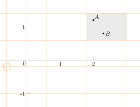

RectangularLattice
^^^^^^^^^^^^^^^^^^

The ``RectangularLattice`` is a helper class that maps all of N-D space into
a regular, rectangular grid of cells identified by integer coordinates.  The
grid is defined by an origin point and a vector indicating spacing in each dimension.

The figure shows an example ``RectangularLattice`` in 2D, with its origin
(circled) at (-0.6, -0.2) and spacing (1.2, 0.8).  Given a query point, the
``RectangularLattice`` will return the coordinates of the cell that contains the
point.  It will also return the bounding box of a cell, or the coordinates of a
cell's lower-left corner.

The following example shows the use of the ``RectangularLattice``.  First, include
the header and (if desired) declare type aliases.

.. literalinclude:: ../../examples/spin_introduction.cpp
   :start-after: _rectlattice_header_start
   :end-before: _rectlattice_header_end
   :language: C++

Use the ``RectangularLattice`` to find grid cells.

.. literalinclude:: ../../examples/spin_introduction.cpp
   :start-after: _rectlattice_use_start
   :end-before: _rectlattice_use_end
   :language: C++

Mortonizer
^^^^^^^^^^

The ``Mortonizer`` (along with its associated class ``MortonBase``)
implements the Morton index, an operation that associates each point
in N-D space with a point on a space-filling curve.  The ``PointHash`` class
adapts the ``Mortonizer`` to provide a hashing functionality for use with
``std::unordered_map`` or similar container classes.

To use the ``PointHash``, include the header and (as desired) declare type aliases.

.. literalinclude:: ../../examples/spin_introduction.cpp
   :start-after: _morton_header_start
   :end-before: _morton_header_end
   :language: C++

The ``RectangularLattice`` grid cell associated with a query point can be
stored, using a ``PointHash``, in a ``std::unordered_map``.

.. literalinclude:: ../../examples/spin_introduction.cpp
   :start-after: _morton_use_start
   :end-before: _morton_use_end
   :language: C++

The Morton index or Z-index curve is a fractal space-filling curve.  The first
four iterations of the 2D curve's construction are shown below, and a 3D
analogue exists as well.

(insert figures)
