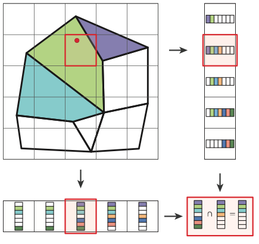

ImplicitGrid
^^^^^^^^^^^^

Where the ``UniformGrid`` divides a rectangular region of interest into bins,
the ``ImplicitGrid`` divides each axis of the region of interest into bins.
Each ``UniformGrid`` bin holds indexes of items that intersect that bin; each
``ImplicitGrid`` bin is a bitset that indicates the items intersecting that bin.

The following figure shows a 2D ``ImplicitGrid`` indexing a collection of
polygons.  A query point determines the bin to search for intersecting
polygons.  The application retrieves that bin's bitset from each axis and
computes bitwise AND operator.  The code takes that result and tests for query
point intersection (possibly an expensive operation) with each of the polygons
indicated by bits set "on."

The ``ImplicitGrid`` is designed for quick indexing and searching over a static
index space in a relatively coarse grid, making it suitable for repeated
construction as well as lookup.  The following example shows the use of the
``ImplicitGrid``.  It is similar to the figure but tests a point against 2D
triangles instead of polygons.

.. literalinclude:: ../../examples/spin_introduction.cpp
   :start-after: _igrid_header_start
   :end-before: _igrid_header_end
   :language: C++

After including the header and setting up types, set up the index.

.. literalinclude:: ../../examples/spin_introduction.cpp
   :start-after: _igrid_build_start
   :end-before: _igrid_build_end
   :language: C++

Inexpensive queries to the index reduce the number of calls to a
(possibly) expensive test routine.

.. literalinclude:: ../../examples/spin_introduction.cpp
   :start-after: _igrid_query_start
   :end-before: _igrid_query_end
   :language: C++

