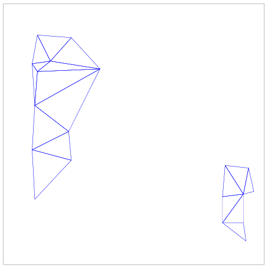
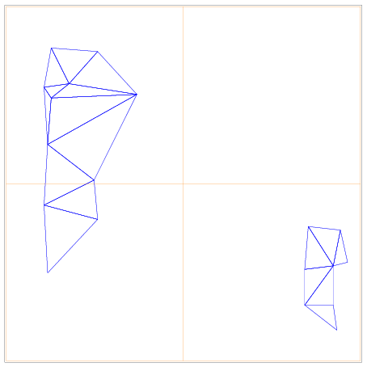
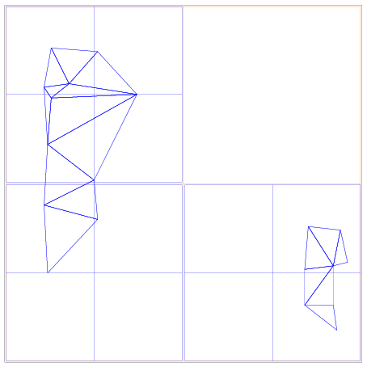
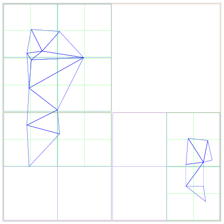

SpatialOctree
^^^^^^^^^^^^^

Axom provides an implementation of the octree spatial index.  The
``SpatialOctree`` recursively divides a bounding box into a hierarchy of
non-intersecting bounding boxes.  Each level of subdivision divides the bounding
box of interest along each of its dimensions, so 2D ``SpatialOctree`` objects
contain four child bounding boxes at each level, while 3D objects contain eight
children at each level.

The ``Octree`` class hierarchy is useful for building custom spatial acceleration
data structures, such as ``quest::InOutOctree``.

The figure below shows the construction of several levels of a 2D octree.

In contrast to a BVHTree, which computes a bounding box at each step,
the octree structure begins with a user-specified bounding box.

The octree divides all dimensions in half at each step.

Similar to the BVHTree, the Octree divides a bounding box only if an object
intersects that bounding box.  In contrast to the BVHTree, the bounding box bins
are non-intersecting, and division does not depend on the data in the bounding
box.  An :math:`N`-dimensional octree divides into :math:`2^N` bounding boxes at
each step.

The following code example shows use of the ``SpatialOctree``.
Include headers and define types:

.. literalinclude:: ../../examples/spin_introduction.cpp
   :start-after: _octree_header_start
   :end-before: _octree_header_end
   :language: C++

Then, instantiate the ``SpatialOctree`` and locate or refine blocks that contain
query points.

.. literalinclude:: ../../examples/spin_introduction.cpp
   :start-after: _octree_start
   :end-before: _octree_end
   :language: C++

Unlike the ``BVHTree`` class, the ``SpatialOctree`` is intended as a building
block for further specialization.  Please see the ``quest::InOutOctree`` as an
example of this.

Some ancillary classes used in the implementation of ``SpatialOctree`` include
``BlockData``, which ties data to a block; ``Brood``, used to construct and
organize sibling blocks; ``OctreeBase``, implementing non-geometric operations
such as refinement and identification of parent or child nodes; and
``SparseOctreeLevel`` and ``DenseOctreeLevel``, which hold the blocks at any one
level of the ``SpatialOctree``.  Of these, library users will probably be most
interested in providing a custom implementation of ``BlockData`` to hold
algorithm data associated with a box within an octree.  See the
``quest::InOutOctree`` class for an example of this.
