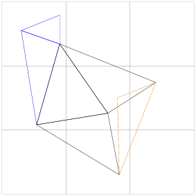

UniformGrid
^^^^^^^^^^^

The ``UniformGrid`` is inspired by and can be used to implement the
`Cell list <https://en.wikipedia.org/wiki/Cell_lists>`_.
This data structure tiles a rectilinear region of interest into
non-intersecting subregions (or "bins") of uniform size.  Each bin gets a
reference to every object in the region of interest that intersects that bin.
``UniformGrid`` can be used when a code compares each primitive
in a collection to every other spatially-close primitive, such as when
checking if a triangle mesh intersects itself.  The following naive
implementation is straightforward but runs in :math:`O(n^2)` time, where
:math:`n` is the number of triangles.

.. literalinclude:: ../../examples/spin_introduction.cpp
   :start-after: _naive_triintersect_start
   :end-before: _naive_triintersect_end
   :language: C++

We want to call ``intersect()`` only for triangles that can intersect, ignoring
widely-separated triangles.  The ``UniformGrid`` enables this optimization.  In
the following figure, the ``UniformGrid`` divides the region of interest into
three by three bins outlined in grey.  A triangle :math:`t` (shown in orange)
will be compared with neighbor triangles (shown in black) that fall into the
bins occupied by :math:`t`.  Other triangles (shown in blue) are too far away
to intersect and are not compared with :math:`t`.

.. Unlike the figures for geometric operations, this figure is "hand-drawn," not
   generated by running the example below.

First, construct the ``UniformGrid`` and load it with triangles.

.. literalinclude:: ../../examples/spin_introduction.cpp
   :start-after: _ugrid_triintersect_header_start
   :end-before: _ugrid_triintersect_header_end
   :language: C++

.. literalinclude:: ../../examples/spin_introduction.cpp
   :start-after: _ugrid_build_start
   :end-before: _ugrid_build_end
   :language: C++

Then, for every triangle, look up its possible neighbors

.. literalinclude:: ../../examples/spin_introduction.cpp
   :start-after: _ugrid_candidate_start
   :end-before: _ugrid_candidate_end
   :language: C++

and test the triangle against those neighbors.

.. literalinclude:: ../../examples/spin_introduction.cpp
   :start-after: _ugrid_triintersect_start
   :end-before: _ugrid_triintersect_end
   :language: C++

The ``UniformGrid`` has its best effect when objects are roughly the same size and 
evenly distributed over the region of interest, and when bins are close to the 
characteristic size of objects in the region of interest.  

