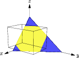
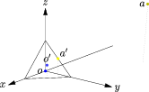
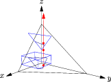
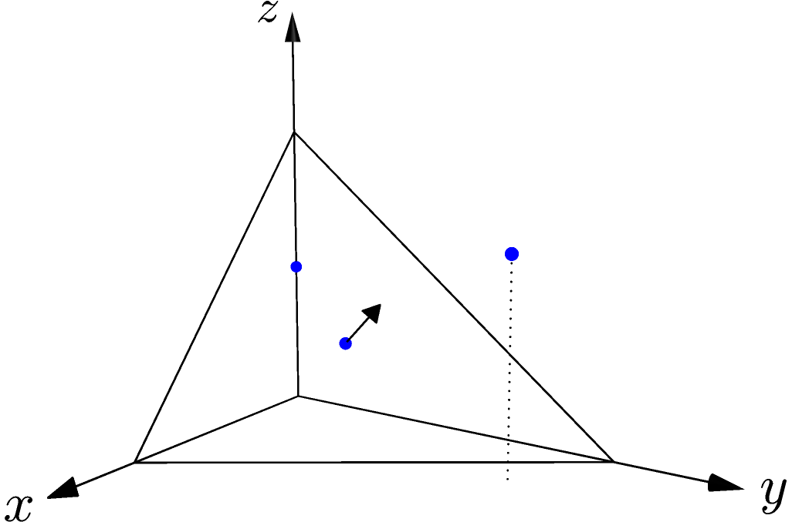

******************************************************
Introductory examples
******************************************************

Here is a collection of introductory examples showing Primal primitives and
operations.  We will instantiate several geometric primitives as needed, perform
geometric operations, and build the UniformGrid and BSPTree spatial index
objects around them.  These examples show representative overloads of each of
the Primal operations (see the `API documentation <../../foo.html>`_ for more
details).

Include header files for primitives (header files for operations will be shown
next to code examples).

.. literalinclude:: ../../examples/primal_introduction.cpp
   :start-after: _prims_header_start
   :end-before: _prims_header_end
   :language: C++

.. literalinclude:: ../../examples/primal_introduction.cpp
   :start-after: _using_start
   :end-before: _using_end
   :language: C++

Operations and Primitives
-------------------------

Clip triangle against bounding box
^^^^^^^^^^^^^^^^^^^^^^^^^^^^^^^^^^

The clip operation clips a triangle against a bounding box, returning the
resulting polygon.  The figure shows the triangle in blue and the polygon
resulting from ``clip()`` in yellow.

.. literalinclude:: ../../examples/primal_introduction.cpp
   :start-after: _clip_header_start
   :end-before: _clip_header_end
   :language: C++

.. literalinclude:: ../../examples/primal_introduction.cpp
   :start-after: _clip_start
   :end-before: _clip_end
   :language: C++

Closest point query
^^^^^^^^^^^^^^^^^^^

The closest point operation finds the point on a triangle that is closest to a
query point.  Query point :math:`o` (shown in dark blue), at the origin, is
closest to point :math:`o'` (light blue), which lies in the triangle's interior.
Query point :math:`a` (olive) is closest to point :math:`a'` (yellow), which
lies on the triangle's edge.

.. literalinclude:: ../../examples/primal_introduction.cpp
   :start-after: _closest_point_header_start
   :end-before: _closest_point_header_end
   :language: C++

.. literalinclude:: ../../examples/primal_introduction.cpp
   :start-after: _closest_point_start
   :end-before: _closest_point_end
   :language: C++

As the code example shows, ``closest_point()`` can take a pointer to an ``int``
as an optional third parameter.  If supplied, the function writes a value into
the ``int`` that indicates which of the triangle's vertices or sides contains
the closest point (or the interior).

Compute bounding box
^^^^^^^^^^^^^^^^^^^^

Primal's bounding boxes are rectangular right prisms.  That is, they are boxes
where neighboring walls are at right angles.

The BoundingBox class represents an axis-aligned bounding box, which has two
walls perpendicular to the X-axis, two perpendicular to the Y-axis, and two
perpendicular to the Z-axis.  This is sufficient for many computations; range
and intersection operations tend to be fast.

The OrientedBoundingBox class can be oriented in any way with respect to the 
coordinate axes.  This can provide a tighter fit to the bounded data, but 
construction, intersection, and range calculation are more costly.

Here a group of points is used to create both an (axis-aligned) BoundingBox
and an OrientedBoundingBox.  The points are drawn in blue, the BoundingBox in
black, and the OrientedBoundingBox in orange.

.. figure:: figs/showBoundingBoxes.png
   :figwidth: 300px
   :alt: Diagram showing (axis-aligned) BoundingBox and OrientedBoundingBox objects bounding the same set of points.

.. literalinclude:: ../../examples/primal_introduction.cpp
   :start-after: _bbox_header_start
   :end-before: _bbox_header_end
   :language: C++

.. literalinclude:: ../../examples/primal_introduction.cpp
   :start-after: _bbox_start
   :end-before: _bbox_end
   :language: C++

Primal also provides a ``merge_boxes()`` function to produce a bounding box that
contains two input bounding boxes.  This is available for client codes to use and
also supports the operation of the BVHTree spatial index.

Intersection
^^^^^^^^^^^^

The intersection test is provided by ``intersect()``.  It takes two primitives
and returns a boolean if the primitives intersect.  Some overloads return the
point of intersection in an output argument.  The overloads for
``intersection()`` are summarized in the table below.

+-------------------+-------------------+--------------------------------------+
|Arg 1              |Arg 2              |Additional arguments and notes        |
+===================+===================+======================================+
|Triangle           |Triangle           |include boundaries (default false)    |
+-------------------+-------------------+--------------------------------------+
|Ray                |Segment            |return intersection point. 2D only.   |
+-------------------+-------------------+--------------------------------------+
|Segment            |BoundingBox        |return intersection point             |
+-------------------+-------------------+--------------------------------------+
|Ray                |BoundingBox        |return intersection point             |
+-------------------+-------------------+--------------------------------------+
|BoundingBox        |BoundingBox        |                                      |
+-------------------+-------------------+--------------------------------------+
|Sphere             |Sphere             |specify tolerance                     |
+-------------------+-------------------+--------------------------------------+
|Triangle           |BoundingBox        |                                      |
+-------------------+-------------------+--------------------------------------+
|Triangle           |Ray                |return parameterized intersection     |
|                   |                   |point (on Ray), return barycentric    |
|                   |                   |intersection point (on Triangle)      |
+-------------------+-------------------+--------------------------------------+
|Triangle           |Segment            |return parameterized intersection     |
|                   |                   |point (on Segment), return barycentric|
|                   |                   |intersection point (on Triangle)      |
+-------------------+-------------------+--------------------------------------+
|OrientedBoundingBox|OrientedBoundingBox|specify tolerance                     |
+-------------------+-------------------+--------------------------------------+

The example below intersection tests between two triangles, a ray, and a
BoundingBox.

.. literalinclude:: ../../examples/primal_introduction.cpp
   :start-after: _intersect_header_start
   :end-before: _intersect_header_end
   :language: C++

.. literalinclude:: ../../examples/primal_introduction.cpp
   :start-after: _intersect_start
   :end-before: _intersect_end
   :language: C++

If a ray intersects a bounding box at more than one point, as in the example above,
the first point along the ray is reported as the intersection.  Thus, the ray's
entry point is shown in the diagram, rather than some point in the box's interior
or where it exits the box.

Orientation
^^^^^^^^^^^

Axom contains two overloads of ``orientation()``.  The 3D case tests a point against
a triangle and reports which side it lies on; the 2D case tests a point against a
line segment.  Here is an example use of the 3D point-triangle orientation test.

.. literalinclude:: ../../examples/primal_introduction.cpp
   :start-after: _orient_header_start
   :end-before: _orient_header_end
   :language: C++

.. literalinclude:: ../../examples/primal_introduction.cpp
   :start-after: _orient_start
   :end-before: _orient_end
   :language: C++

The triangle is shown with its normal vector pointing out of its centroid.  The
test point on the :math:`z` axis is on the negative side of the triangle.  The
centroid lies in the triangle---"on the boundary."  The remaining test point is
on the side of the triangle pointed into by the normal vector, the positive
side.

Distance
^^^^^^^^

The various overloads of ``squared_distance()`` calculate the squared 
distance between a query point and several different primitives:

- another point,
- a BoundingBox,
- a Segment,
- a Triangle.

.. figure:: figs/showDistance.png
   :figwidth: 300px
   :alt: Diagram showing 3D point-triangle orientation test.

.. literalinclude:: ../../examples/primal_introduction.cpp
   :start-after: _sqdist_header_start
   :end-before: _sqdist_header_end
   :language: C++

.. literalinclude:: ../../examples/primal_introduction.cpp
   :start-after: _sqdist_start
   :end-before: _sqdist_end
   :language: C++

The example shows the squared distance between the query point, shown in black
in the figure, and four geometric primitives.  For clarity, the diagram also shows
the projection of the query point and its closest points to the XY plane.

Spatial Index
-------------

A spatial index is a data structure used to speed up retrieval of geometric
objects.  Axom provides two spatial indices, the cell (or Verlet) list
implemented in the ``UniformGrid`` class and the binary space partition tree
implemented in the ``BSPTree`` class.  Both classes divide a bounding box
denoting a region of interest into bins that group objects together, avoiding
the need to process objects that do not fall into a bin of interest.  The
``UniformGrid`` tiles the region of interest into non-intersecting bins of
uniform size, adding an object to each bin that it intersects.  The ``BSPTree``
recursively subdivides the region of interest into a "tree" of bins, stopping
when a bin contains less than some number of objects or when the tree reaches a
specified height.

UniformGrid
^^^^^^^^^^^

The ``UniformGrid`` can be used when a code compares each primitive in a collection
to every other "close" primitive, such as when checking if a triangle mesh intersects
itself.  The following naive implementation is straightforward but runs
in :math:`O(n^2)` time, where :math:`n` is the number of triangles.

- naive implementation: compare each triangle to every other tri

If a code could avoid calling ``intersect()`` for widely-separated triangles, it would
surely save time.  The ``UniformGrid`` allows a code to compare each triangle to the
other triangles in its bin(s), disregarding far-away triangles that cannot intersect.

- UniformGrid example.  For each triangle,
  - find its bounding box
  - get the bins intersecting the bounding box
  - iterate over the contents of each bin, testing for intersection

The ``UniformGrid`` has its best effect when objects are roughly the same size and not
all clumped together.
