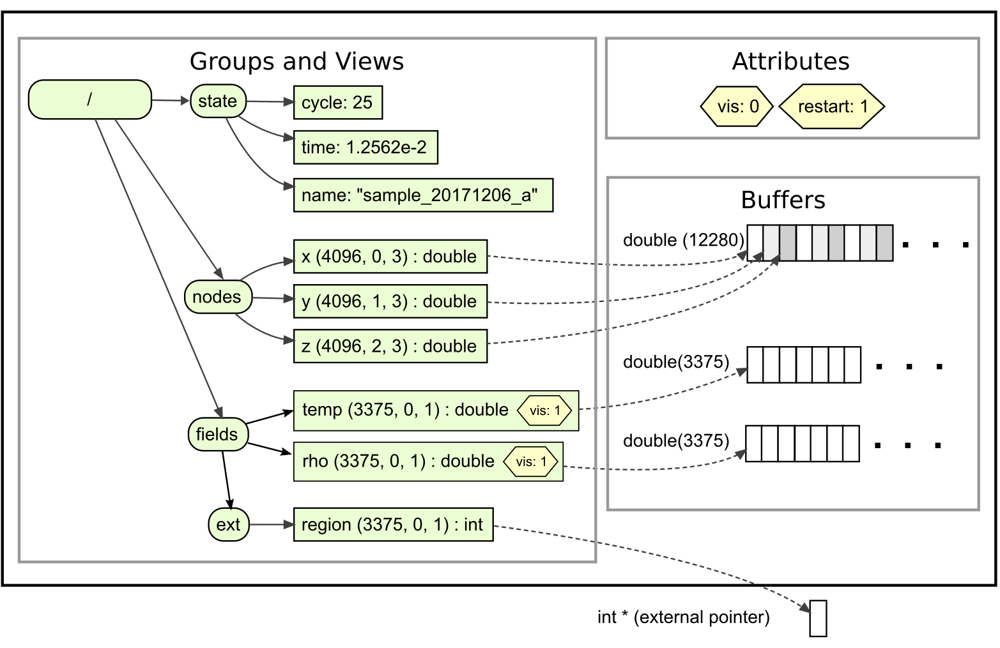

******************************************************
An introductory example
******************************************************

As an introduction to the core concepts in Sidre and how they work, here is an
example where we construct the Sidre Datastore shown in the following figure:

   ..

   +------------------------------------+-------------+
   | Symbol                             | Sidre class |
   +====================================+=============+
   | .. image:: figs/roundrectangle.png | Group       |
   |    :width: 120px                   |             |
   +------------------------------------+-------------+
   | .. image:: figs/rectangle.png      | View        |
   |    :width: 61px                    |             |
   +------------------------------------+-------------+
   | .. image:: figs/hexagon.png        | Attribute   |
   |    :width: 72px                    |             |
   +------------------------------------+-------------+

Here, a black rectangle represents the Datastore, which contains all Sidre objects.
Ovals represent Sidre Group objects.  Each Group has a name, 
zero or one parent Group, and zero or more child Groups (indicated by an
arrow from the parent to each child).  Note that the root Group (i.e. "/") is 
the only Group that has no parent.
Each Group also owns zero or more View objects.  Views are
shown as rectangles and an arrow points from the owning Group to each View.

Datastores contain a collection of Buffer objects, shown as segmented
rectangles.  View references to Buffers or to external pointers are shown as
dashed arrows.  Datastores also contains a list of Attributes, each outlined
with a hexagon, which define the metadata labels available to apply to Views and
the default value associated with each label.  In this example, the Datastore
has Attributes "vis" (with default value 0) and "restart" (with default
value 1).

A Sidre View object has a name and some data associated with it, as well as any
explicitly-set Attributes.  In this example, the Views "temp" and "rho" have the
Attribute "vis" set to 1.  This example shows various types of data that
can be described by a View, including scalars, strings, and arrays (both
"external" and managed by Sidre Buffer objects).  The array Views ("x", "y",
"z", "temp", "rho", "region") include a triple indicating the number of
elements, offset, and stride for the View.  Other aspects of View descriptions
are clarified in the C++ code shown next.  Sidre also provides full C and Fortran
APIs that can also be used to generate the same result.

.. literalinclude:: ../../examples/sidre_createdatastore.cpp
   :start-after: _first_example_create_start
   :end-before: _first_example_create_end
   :language: C++

C++ Sidre operations that create Buffers, Groups, and Views return a pointer to the
object that is created. This allows chaining operations.  (Chaining is supported
in the C++ API, but not in C or Fortran.)  From the previous example:

.. literalinclude:: ../../examples/sidre_createdatastore.cpp
   :start-after: _first_example_chain_1
   :end-before: _first_example_chain_2
   :language: C++

Many other Sidre operations return a pointer to the object on which the method
is called, which enables similar operation chaining.

Here is how to retrieve data items out of 
the hierarchy.

.. literalinclude:: ../../examples/sidre_createdatastore.cpp
   :start-after: _first_example_access_start
   :end-before: _first_example_access_end
   :language: C++

In the last section, the code accesses the arrays associated with the views "y",
"temp", and "region".  While "temp" and "region" have the default offset (0) and
stride (1), "y" has offset 1 and stride 3.  The pointer returned by
:code:`View::getPointer()` always points to the first element described by the
View (that is, it takes care of the offset), but using a stride greater than 1
must be done by the code itself.

Unix-like path syntax using the slash ("/") delimiter is supported for
traversing Sidre Group and View hierarchies.  This usage is shown in the last
line of the code example above.  The getView() method call retrieves the View
named "region" in the Group "ext" that is a child of the "fields" Group.
Character sequences before the first slash and between two consecutive slashes
are Group names (describing parent-child relationships).  For this method, and
others dealing with Views, the sequence following the last slash is the name of
a View.  Similar path syntax can be used to retrieve Groups, create Groups and
Views, and so forth.
