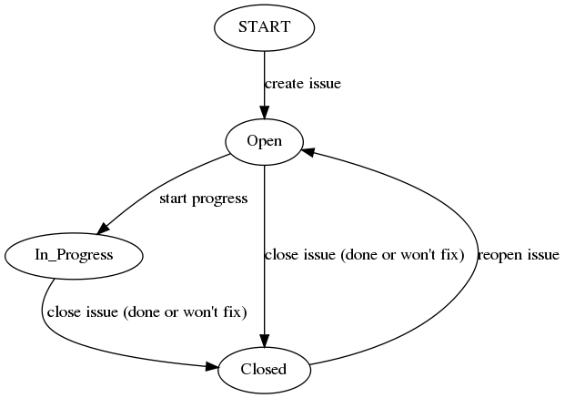

.. ##
.. ## Copyright (c) 2017-2018, Lawrence Livermore National Security, LLC.
.. ##
.. ## Produced at the Lawrence Livermore National Laboratory.
.. ##
.. ## LLNL-CODE-741217
.. ##
.. ## All rights reserved.
.. ##
.. ## This file is part of Axom.
.. ##
.. ## For details about use and distribution, please read axom/LICENSE.
.. ##

.. _jira-label:

*******************************************
JIRA: Issue Tracking and Release Cycles
*******************************************

We use our `Axom JIRA project space <https://lc.llnl.gov/jira/browse/ATK>`_ 
for issue tracking and work planning. In JIRA, you can create, edit and comment
on issues.  You can also assign issues to individuals, check on their status, 
group them together for sprint development, and search for issues in various 
ways.

This section describes Axom software development cycles and basic issue work 
flow. 

.. _releasecycle-label:

========================================
Sprint Cycles and Work Planning
========================================

The Axom project plans work regularly for sprint development cycles, which
are typically 2 or 3 months long. Although this is long for typical 
sprint-based development, we find that it works well for our project where 
multiple software components are under development concurrently since it 
gives component developers flexibility to plan and coordinate work with other 
components in a way that works best for them.

.. note:: Our sprint development cycles often coincide with software releases,
          but not always. We may do multiple releases in a sprint or a single 
          release may contain work from more than one sprint. Releases are 
          determined mostly by when it makes sense to push a set of features 
          out to our users.

In JIRA, the project maintains two ``Sprints``, called ``Current Sprint`` 
and ``Next Sprint``. The current sprint contains JIRA issues that are planned,
in progress, or closed in the current sprint work period. The next sprint
is used to stage issues for future development in the next sprint. The 
``Scrum Board`` maintained by the project is called ``Axom Development``; it
contains the two sprints and the project backlog, which contains issues issues
that have been identified but have not been planned for work.

At the end of the current sprint cycle and before starting the next, the team
meets to discuss any issues encountered in the current sprint. The goal is to
prevent issues that arise during development from being repeated. Then, issues
in the next sprint and the backlog are reviewed for working in the next sprint. 
Any issues in the next sprint that will not be worked on during the next
sprint cycle are moved to the backlog. Any issues in the backlog that will be
worked in the next sprint are moved to the next sprint. Next, the team 
decides which issues that were not completed in the current sprint should be
moved to the next sprint cycle. Hopefully, there are not many and typically 
all unresolved issues will propagate to the next sprint. Any unresolved issues 
that will not be worked on the next sprint are moved to the backlog. While
identifying issues for the next sprint, the team should attempt to make sure
that each issue is assigned to a developer to work on.

Finally, the Current Sprint is 'Completed' by clicking ``Complete Sprint`` on
the upper right of the sprint. JIRA will ask what to do with unresolved issues
and, based on the discussion in the previous paragraph, we move them to the 
next sprint.

Before starting a new sprint cycle, the sprint boards are renamed by swapping 
their names; ``Current Sprint`` becomes ``Next Sprint`` and ``Next Sprint`` 
becomes ``Current Sprint`` (just like swapping pointers!). Then, 
the new sprint is started with the ``Current Sprint`` board.
This involves setting the completion date for the sprint and configuring the 
sprint board so that issues are sorted into horizontal "swimlanes" one for 
each developer. There are three vertical columns on the sprint board that 
intersect the swimlanes to indicate issues that: have not been started, are 
in progress, are done.

Note that as development occurs during a sprint, work will be reviewed and
merged from feature branches to the develop branch using pull requests. 
Reviewing work in smaller increments is much easier than reviewing everything 
at once. 

.. note:: Developers must close issues in JIRA when they are complete.

Depending on the need to make changes available to users, we will 
merge the develop branch into the master branch and tag a new release on 
the master branch. This may happen at the end of a sprint or not. For a 
description of how the master and develop branches interact, 
see :ref:`gitflow-label`.

.. _issueworkflow-label:

================
Issue Workflow 
================

We have customized our JIRA issue workflow to make it simple and easy to 
understand. This section explains key elements of the workflow and how to
use it.

Issue states
-------------

For the Axom project, each issue has three possible states:

* Open.
    Every issue starts out in an open state. An open issue can
    be assigned to someone or left unassigned. When an issue is assigned, this
    means that the assignee owns the issue and is responsible for working
    on it. An open issue that is left unassigned means that it has not been 
    been discussed or reviewed, or we have not decided how to act on it. 
    In general, an open issue is not being worked on.
* In Progress.
    An issue in progress is one that is actively being worked on.
* Closed.
    When an issue is closed, work on it has been completed, or
    a decision has been made that it will not be addressed.

An 'open' issue can transition to either 'in progress' or 'closed'. An 'in 
progress' issue can transition to either 'open' (work on it has stopped, 
but it is not finished) or 'closed'. Finally, a 'closed' issue
can be re-opened, which changes its state to 'open'. The complete issue workflow
is shown in the figure below.

   This figure shows allowed state transitions in our JIRA issue workflow.

Creating a new issue
---------------------

To create a new issue, click the 'Create' button at the top of the Axom
JIRA project page and enter information in the issue fields. Filling in the
fields properly helps team members search through project issues more easily.
Note that issue fields marked with a red asterisk are required -- they must 
be set to create a new issue. Other fields are not required, but may be used 
to include helpful information. The main issue fields we use are:

  Project
    Axom will show up as the default. You shouldn't need
    to change this.
  Issue Type
    We use only three issue types: *Bug*, *New Feature*, and
    *Task*. A bug is something broken that needs to be fixed. A new feature
    is something that adds functionality, enhances an interface, etc. Task 
    is a "catch-all" issue type for any other issue.
  Summary
    Provide a short descriptive summary. A good (and brief)
    summary makes it easy to scan a list of issues to find one you are
    looking for.
  Priority
    Select an appropriate issue priority to identify its level
    of importance or urgency. Clicking on the question mark to the right of
    the priority field provides a description of each option.
  Components
    Each issue is labeled with the Axom component it applies to. 
    Component labels also include things like: build system, documentation, 
    testing, etc.
  Assignee
    Unless you are certain which team member should be assigned
    an issue, leave the issue 'Unassigned', which is the default in our
    JIRA configuration. This indicates that the issue 
    requires discussion and review before we decide how to treat it. 
  Reporter
    Unless you explicitly enter someone in this field, you, as
    the issue creator, will be the reporter. This is the correct choice in
    almost all cases.
  Description
    The description field should be used to include important
    details about the issue that will help the developer who will work on it.
  Environment
    The environment field can be useful when an issue affects a particular
    compiler or platform.
  Epic-link
    An *epic* is a special issue type in the Agile methodology that is used to
    define a larger body of work that can be comprised of many issues. 
    **However, that's not what we use epics for. See note below.**

You may also use the other fields that appear if you think they will help
describe the issue. However, the team seldom uses fields apart from the list
above.

.. important:: We use epics in JIRA and link our issues to them to get a 
               convenient label on each each issue when we look at a sprint 
               board or the issue backlog. We have an epic for each of our 
               components for this purpose and the epic name matches the 
               corresponding component name.
    
Starting and stopping work on an issue
---------------------------------------

When you begin work on an issue, you should note this by changing its state
from 'open' to 'in progress'. There are two ways to perform this transition.
The first is to open the issue and click the 'Start Progress' button at the 
top of the issue menu. Alternatively, if the issue is in the 'open' column 
on a sprint board, you can drag and drop it into the 'in progress' column.
Either way changes the issue status to 'in progress'.

If there is still work to do on the issue, but you will stop working on it
for a while, you can click the 'Stop Progress' button at the top of the
issue. Alternatively, if the issue is in the 'in progress' column on a sprint 
board, you can drag and drop it into the 'open' column.
Either way changes the issue status to *open*.

Closing an issue
-----------------

When work on an issue is complete (including testing, documentation, etc.), 
or the issue will not be addressed, it should be closed. To close an issue, 
click the 'Close' button and select the appropriate issue resolution. There 
are two options: *Done* and *Won't Fix*.  'Done' means that the issue is 
resolved. 'Won't Fix' means that the issue will not be addressed for some 
reason.

When closing an issue, adding information to the 'Comment' field is
helpful. For example, when an issue is closed as 'Won't Fix', it is helpful to
enter a brief explanation as to why this is so.

Issue assignee
--------------

Note that an assigned issue can be assigned to someone else to work on it.
An assigned issue can also be set back to 'Unassigned' if it needs further
discussion by the team.

JIRA tips
----------

Here are some links to short videos (a couple of minutes each) that
demonstrate how to use JIRA features:

   * `JIRA Instant Search Bar Demo <https://www.youtube.com/watch?v=ZmACxhzXLco&list=PLlALqRAjvdnGB_T0GAB1Fk2rVZgnJJAOa&index=3>`_
   * `JIRA System Files Demo <https://www.youtube.com/watch?v=O08oySq043w&list=PLlALqRAjvdnGB_T0GAB1Fk2rVZgnJJAOa&index=4>`_
   * `Creating and Editing JIRA Issues <https://www.youtube.com/watch?v=EsQ__dR6Nrw&list=PLlALqRAjvdnGB_T0GAB1Fk2rVZgnJJAOa&index=5>`_
