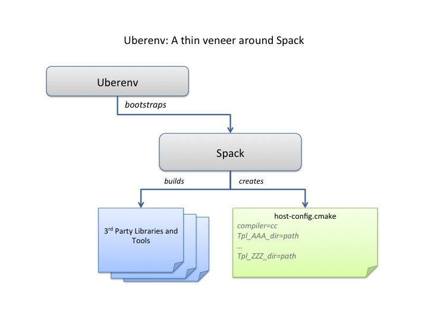

.. ## Copyright (c) 2017-2024, Lawrence Livermore National Security, LLC and
.. ## other Axom Project Developers. See the top-level LICENSE file for details.
.. ##
.. ## SPDX-License-Identifier: (BSD-3-Clause)

Configuration and Building
==========================

This section provides information about configuring and building
the Axom software after you have cloned the repository.
The main steps for using Axom are:

  #. Configure, build, and install third-party libraries (TPLs) on which Axom depends.
  #. Build and install Axom component libraries that you wish to use.
  #. Build and link your application with the Axom installation.

Depending on how your team uses Axom, some of these steps, such as
installing the Axom TPLs and Axom itself, may need to be done
only once. These installations can be shared across the team.

Requirements, Dependencies, and Supported Compilers
---------------------------------------------------

Basic requirements:
~~~~~~~~~~~~~~~~~~~

  * C++ compiler with C++14 support at a minimum
  * CMake with a minimum required version of 3.14 for CPU-only and CUDA builds,
    and a minimum version of 3.21 when building with HIP support
  * Fortran Compiler (optional)

Supported Compilers
~~~~~~~~~~~~~~~~~~~

Axom supports a wide variety of compilers. Please see the file 
``axom/scripts/spack/configs/<platform>/spack.yaml``
for the current list of supported and tested compilers for the platforms we
test on.

.. _dependencies-label:

External Dependencies
~~~~~~~~~~~~~~~~~~~~~~

Axom has two types of dependencies:

* **Libraries.** These contain code that Axom must link against.
* **Tools.** These are executables that we use during code development; e.g. 
  generate documentation, format code, etc.

Unless noted otherwise in the following discussion, Axom dependencies are 
optional.

.. note:: A typical Axom user need only understand how to enable Axom features
          and provide a valid installation path for each required library
          dependency for each enabled feature. 

Library Dependencies
""""""""""""""""""""

The following table lists:

  * Axom external library dependencies and links to documentation for
    each library
  * Which libraries are required or optional dependencies for Axom. While 
    most Axom libraries are not required, they are required to access all 
    capabilities of components listed.
  * The CMake variable that must be set to the path of each library 
    installation when configuring a build with the library

================== ==================================== ======================
  Library          Dependent Components                 Build system variable
================== ==================================== ======================
  `Adiak`_         Optional: Core                       ADIAK_DIR
  `Caliper`_       Optional: Core                       CALIPER_DIR
  `Conduit`_       Required: Inlet, Klee, Sidre         CONDUIT_DIR
  `c2c`_           Optional: Quest                      C2C_DIR
  `HDF5`_          Optional: Sidre                      HDF5_DIR
  `Lua`_           Optional: Inlet                      LUA_DIR
  `MFEM`_          Optional: Primal, Quest, Sidre       MFEM_DIR
  `RAJA`_          Optional: Mint, Spin, Quest          RAJA_DIR
  `SCR`_           Optional: Sidre                      SCR_DIR
  `Umpire`_        Optional: Core, Spin, Quest          UMPIRE_DIR
================== ==================================== ======================

.. _Adiak:  https://llnl.github.io/Adiak
.. _Caliper: https://software.llnl.gov/Caliper
.. _Conduit: https://llnl-conduit.readthedocs.io/en/latest
.. _c2c: https://rzlc.llnl.gov/c2c
.. _HDF5: https://www.hdfgroup.org/solutions/hdf5/
.. _Lua: https://www.lua.org/
.. _MFEM: https://mfem.org/
.. _RAJA: https://raja.readthedocs.io/en/main/
.. _SCR: https://computing.llnl.gov/projects/scalable-checkpoint-restart-for-mpi
.. _Umpire: https://umpire.readthedocs.io/en/latest/

Note that each  library dependency has a corresponding build system variable
(with the suffix ``_DIR``) to supply the path to the library's installation 
directory. For example, ``hdf5`` has a corresponding variable ``HDF5_DIR``.

.. note:: Optional `c2c` library is currently only available for configurations
          on LLNL clusters.

Tool Dependencies
"""""""""""""""""

The following table lists:

  * Axom external tool dependencies, with links to documentation for
    each tool
  * The purpose of each tool; i.e., how it is used in Axom development
  * The CMake variable that must be set to the path of the tool 
    installation to enable its use in Axom

================== ==================================== ======================
  Tool             Purpose                              Build System Variable
================== ==================================== ======================
  `clangformat`_   Code Style Checks                    CLANGFORMAT_EXECUTABLE
  `CppCheck`_      Static C/C++ code analysis           CPPCHECK_EXECUTABLE
  `Doxygen`_       Source Code Docs                     DOXYGEN_EXECUTABLE
  `Lcov`_          Code Coverage Reports                LCOV_EXECUTABLE
  `Shroud`_        Multi-language binding generation    SHROUD_EXECUTABLE
  `Sphinx`_        User Docs                            SPHINX_EXECUTABLE
================== ==================================== ======================

.. _clangformat: https://releases.llvm.org/10.0.0/tools/clang/docs/ClangFormat.html
.. _CppCheck: http://cppcheck.sourceforge.net/
.. _Doxygen: http://www.doxygen.nl/
.. _Lcov: http://ltp.sourceforge.net/coverage/lcov.php
.. _Shroud: https://shroud.readthedocs.io/en/develop/
.. _Sphinx: http://www.sphinx-doc.org/en/master/

Each tool has a corresponding build system variable (with the suffix 
``_EXECUTABLE``) to supply a path to the tool executable. For example, 
``sphinx`` has a corresponding build system variable ``SPHINX_EXECUTABLE``.

.. _tplbuild-label:

Building and Installing Third-party Libraries
---------------------------------------------

We use the `Spack Package Manager <https://github.com/spack/spack>`_
to manage and build TPL dependencies for Axom on Linux and MacOS systems.
Similarly, support for managing and building TPLs on Windows is provided 
through `Vcpkg <https://github.com/microsoft/vcpkg>`_.

To make the TPL management process easier and automatic (you don't really need 
to learn much about Spack or Vcpkg), we drive it with a Python script called 
``uberenv.py``, which is located in the ``scripts/uberenv`` directory. 
Running this script on Linux or MacOS does several things:

  * It clones the Spack repo from GitHub and checks out a specific version
    that we have tested.
  * It configures Spack compiler sets, adds custom package build rules, and 
    sets any options specific to Axom.
  * It invokes Spack to build a complete set of TPLs for each configuration and 
    generates a *host-config* file (i.e., CMake cache file) that includes all 
    details of the configuration and build dependencies.

On Windows, ``uberenv.py`` takes analogous steps:

  * It clones the vcpkg repo from GitHub.
  * It specifies configuration details such as the "triplet," specifying
    compiler, 64 vs 32-bits, and any other options specific to Axom.
  * It sets up vcpkg and then invokes vcpkg to build a set of TPLs.  It
    also generates a host-config file that includes configuration details
    and build dependencies.

The figure illustrates what the script does.

The uberenv script is run from the top-level Axom directory like this::

    $ python ./scripts/uberenv/uberenv.py --prefix {install path}  \
                                          --spec spec              \
                                        [ --mirror {mirror path} ]

For more details about ``uberenv.py`` and the options it supports, please
see the `uberenv docs <https://uberenv.readthedocs.io/en/latest/>`_

You can also see examples of how Spack spec names are passed to ``uberenv.py``
in the Python scripts we use to build TPLs for Axom development on
LC platforms at LLNL. These scripts are located in the directory
``scripts/llnl_scripts``.

.. note:: To get a full list of all Axom dependencies in an ``uberenv``
          ``spack`` build of our TPLs, please go to the TPL root directory
          and run the following Spack command: ``./spack/bin/spack spec axom``.
          The analogous command for an ``uberenv`` ``vcpkg`` build is:
          ``.\vcpkg depend-info axom``.

.. _building-axom-label:

Building and Installing Axom
----------------------------

This section provides essential instructions for building the Axom code.

Axom uses `BLT <https://github.com/LLNL/blt>`_, a CMake-based system, to
configure and build the code. There are two ways to configure Axom:

 * Using the helper Python script ``config-build.py``
 * Directly invoke CMake from the command line

Either way, we typically pass in many of the configuration options and 
variables using platform-specific *host-config* files.

.. _hostconfig-label:

Host-config files
~~~~~~~~~~~~~~~~~

Host-config files help make the Axom configuration process more automatic and
reproducible. A host-config file captures all build configuration
information used for a build, such as compiler version and options,
paths to all TPLs, etc. When passed to CMake 
(via the ``-C path/to/hostconfig/file/foo.cmake`` option), the host-config file 
initializes the CMake cache with the configuration contained in the file.

We noted earlier that the uberenv script generates a host-config file for each 
item in the Spack spec list given to it. These files are generated by Spack in 
the directory where the TPLs were installed. The name of each file contains 
information about the platform and spec.

For more information, see `BLT host-config documentation <https://llnl-blt.readthedocs.io/en/develop/tutorial/host_configs.html>`_.

Python helper script
~~~~~~~~~~~~~~~~~~~~

The easiest way to configure Axom for compilation is to use the
``config-build.py`` Python script located in the Axom top-level directory::

   $ ./config-build.py -hc path/to/host-config/file/<host-config file name>

The script runs CMake and passes it the given host-config file.
See :ref:`hostconfig-label` for more information.

Running the script, as above, will create two directories to hold the build 
and install contents for the platform and compiler with names that match
the name of the host-config file.

To build the code and install the header files, libraries, and documentation
in the install directory, go into the build directory and run ``make`` and
``make install``::

   $ cd {build directory}
   $ make
   $ make install

.. caution :: When building on LC systems, please don't compile on login nodes.
              You will incur the wrath of others and you really don't want that,
              do you?

.. tip :: Most make targets can be run in parallel by supplying the '-j' flag
          along with the number of threads to use. For example::

            $ make -j 8 
      
          runs make using 8 threads.

The Python helper script accepts other arguments that allow you to specify
explicitly the build and install paths and build type. Following CMake
conventions, we support three build types: ``Release``, ``RelWithDebInfo``, and
``Debug`` (default). To see the script options, run the script without any arguments::

   $ ./config-build.py

You can also pass extra CMake configuration variables to the script. For 
example::

   $ ./config-build.py -hc path/to/host-config/<file name> \
                       -DBUILD_SHARED_LIBS=ON               \
                       -DENABLE_FORTRAN=OFF

This will configure CMake to build shared libraries and disable Fortran
for the generated configuration.

Run CMake directly
~~~~~~~~~~~~~~~~~~

You can also configure Axom by running CMake directly and passing it the
appropriate arguments. For example, to configure, build and install a release
build with the gcc compiler, you could pass a host-config file to CMake::

   $ mkdir build-gcc-release
   $ cd build-gcc-release
   $ cmake -C {host config file for gcc compiler}           \
           -DCMAKE_BUILD_TYPE=Release                       \
           -DCMAKE_INSTALL_PREFIX=../install-gcc-release    \
           ../src/
   $ make
   $ make install

.. note::
   Spack generates a host-config for us with many defaults that can be overridden
   on the command line. For example, ``CMAKE_BUILD_TYPE`` is set to ``Release``.
   This can be overriden like the above command after the ``-C`` option.

Alternatively, you could forego the host-config file entirely and pass all the
arguments you need, including paths to third-party libraries,
directly to CMake; for example::

   $ mkdir build-gcc-release
   $ cd build-gcc-release
   $ cmake -DCMAKE_C_COMPILER={path to gcc compiler}        \
           -DCMAKE_CXX_COMPILER={path to g++ compiler}      \
           -DCMAKE_BUILD_TYPE=Release                       \
           -DCMAKE_INSTALL_PREFIX=../install-gcc-release    \
           -DCONDUIT_DIR={path/to/conduit/install}          \
           {many other args}                                \
           ../src/
   $ make
   $ make install

CMake Configuration Options
---------------------------

The tables in this section summarize the main build system options in Axom.

Axom components, tests, examples, etc.
~~~~~~~~~~~~~~~~~~~~~~~~~~~~~~~~~~~~~~~~~~~~~~

+------------------------------+---------+----------------------------------------+
| OPTION                       | Default | Description                            |
+==============================+=========+========================================+
| AXOM_ENABLE_ALL_COMPONENTS   | ON      | Enable all components by default       |
+------------------------------+---------+----------------------------------------+
| AXOM_ENABLE_<FOO>            | ON      | Enable the Axom component named 'Foo'  |
|                              |         |                                        |
|                              |         | (e.g. AXOM_ENABLE_SIDRE)               |
|                              |         | for the Sidre component.               |
|                              |         |                                        |
|                              |         | Overrides AXOM_ENABLE_ALL_COMPONENTS   |
|                              |         | for the specified component.           |
+------------------------------+---------+----------------------------------------+
| AXOM_ENABLE_EXAMPLES         | ON      | Build Axom examples                    |
+------------------------------+---------+----------------------------------------+
| AXOM_ENABLE_TESTS            | ON      | Build Axom unit tests                  |
+------------------------------+---------+----------------------------------------+
| ENABLE_BENCHMARKS            | OFF     | Build Axom benchmarks                  |
+------------------------------+---------+----------------------------------------+
| AXOM_ENABLE_DOCS             | ON      | Enable Axom documentation to be built  |
|                              |         | as a make target                       |
+------------------------------+---------+----------------------------------------+
| AXOM_ENABLE_TOOLS            | ON      | Enable Axom development tools          |
+------------------------------+---------+----------------------------------------+
| AXOM_DEPRECATED_TYPES        | WARN    | WARN, ALLOW or ERROR on using          |
|                              |         | deprecated types                       |
+------------------------------+---------+----------------------------------------+

If ``AXOM_ENABLE_ALL_COMPONENTS`` is OFF, you must explicitly enable a desired
component (other than 'core', which is always enabled). Similarly, if 
``AXOM_ENABLE_ALL_COMPONENTS`` is ON, you can disable individual components by
setting ``AXOM_ENABLE_<FOO>`` to OFF for the component you want turned off. 

See `Axom software documentation <../../../index.html>`_
for a list of Axom components and their dependencies. Note that when enabling 
an external dependency for an Axom component, the CMake variable ``BAR_DIR`` 
must be set to a valid path to the dependency installation. See 
:ref:`dependencies-label` for a complete listing of configuration variables 
to specify paths to Axom external dependencies. 

.. note:: ``AXOM_ENABLE_EXAMPLES``, ``AXOM_ENABLE_TESTS``, and 
          ``AXOM_ENABLE_DOCS`` are *CMake-dependent options*. Thus, if a 
          variable without the ``AXOM_`` prefix is ON, such as ``ENABLE_TESTS``,
          tests can be enabled in other packages in a project build and turned 
          off in Axom by setting the Axom prefix form ``AXOM_ENABLE_TESTS`` to 
          OFF.

Axom build options, compiler support, and parallelism
~~~~~~~~~~~~~~~~~~~~~~~~~~~~~~~~~~~~~~~~~~~~~~~~~~~~~~

+------------------------------+---------+----------------------------------------+
| OPTION                       | Default | Description                            |
+==============================+=========+========================================+
| AXOM_DEBUG_DEFINE            | DEFAULT | Controls whether the `AXOM_DEBUG`      |
|                              |         | compiler define is enabled             |
|                              |         |                                        |
|                              |         | By DEFAULT, it is enabled for          |
|                              |         | `Debug` and `RelWithDebInfo` configs   |
|                              |         | but this can be overridden by setting  |
|                              |         | `AXOM_DEBUG_DEFINE` to `ON` or `OFF`   |
+------------------------------+---------+----------------------------------------+
| ENABLE_ALL_WARNINGS          | ON      | Enable extra compiler warnings         |
|                              |         | in all build targets                   |
+------------------------------+---------+----------------------------------------+
| ENABLE_WARNINGS_AS_ERRORS    | OFF     | Compiler warnings treated as errors    |
+------------------------------+---------+----------------------------------------+
| BUILD_SHARED_LIBS            | OFF     | Build shared libraries.                |
|                              |         | Default is Static libraries            |
+------------------------------+---------+----------------------------------------+
| ENABLE_FORTRAN               | OFF     | Enable Fortran compiler support        |
+------------------------------+---------+----------------------------------------+
| AXOM_ENABLE_MPI              | OFF     | Enable MPI                             |
+------------------------------+---------+----------------------------------------+
| AXOM_ENABLE_OPENMP           | OFF     | Enable OpenMP                          |
+------------------------------+---------+----------------------------------------+
| AXOM_ENABLE_CUDA             | OFF     | Enable CUDA                            |
+------------------------------+---------+----------------------------------------+
| AXOM_ENABLE_HIP              | OFF     | Enable HIP                             |
+------------------------------+---------+----------------------------------------+

Note that, in most Axom components, node-level parallelism features, enabled with 
OpenMP, CUDA (NVIDIA GPUs), and HIP (AMD GPUs), are implemented using RAJA. See
:ref:`dependencies-label` for instructions to set the directory location of a
RAJA installation. In addition, enabling such features may require additional build 
options to be provided, which are summarized in the following table.

+------------------------------+------------------------------------------+
| OPTION                       | Description                              |
+==============================+==========================================+
| RAJA_DIR                     | RAJA installation directory as described |
|                              | in :ref:`dependencies-label`.            |
|                              |                                          |
|                              | RAJA must be built with support enabled  |
|                              | for OpenMP, CUDA, or HIP to use features |
|                              | enabled by those parallel programming    |
|                              | models in Axom.                          |
+------------------------------+------------------------------------------+
| CUDA_TOOLKIT_ROOT_DIR        | Path to CUDA software stack installation |
+------------------------------+------------------------------------------+
| CMAKE_CUDA_COMPILER          | Path to CUDA compiler (e.g. nvcc)        |
+------------------------------+------------------------------------------+
| CMAKE_CUDA_ARCHITECTURES     | Target architecture(s) for CUDA          |
+------------------------------+------------------------------------------+
| HIP_ROOT_DIR                 | Path to HIP software stack installation  |
+------------------------------+------------------------------------------+
| CMAKE_HIP_ARCHITECTURES      | Target architecture(s) for HIP           |
+------------------------------+------------------------------------------+

.. note :: To configure the version of the C++ standard, you can supply one of the
           following values for **BLT_CXX_STD**:  'c++11' or 'c++14'.
           Axom requires at least 'c++14', the  default value.

Tools and features primarily intended for developers
~~~~~~~~~~~~~~~~~~~~~~~~~~~~~~~~~~~~~~~~~~~~~~~~~~~~~

+------------------------------------------+---------+----------------------------------------+
| OPTION                                   | Default | Description                            |
+==========================================+=========+========================================+
| ENABLE_CODECOV                           | ON      | Enable code coverage via gcov          |
+------------------------------------------+---------+----------------------------------------+
| AXOM_QUEST_ENABLE_EXTRA_REGRESSION_TESTS | OFF     | Enable an expanded set of tests for    |
|                                          |         | the Axom Quest component               |
+------------------------------------------+---------+----------------------------------------+

Axom source code macro constants
~~~~~~~~~~~~~~~~~~~~~~~~~~~~~~~~~~~~~~~~~~~~~~~~~~~~~~

Axom developers, please note that Axom provides macro constants to control 
conditionally-compiled code based on which built-in and third-party libraries 
are being used and which Axom components are enabled. Please see
:ref:`codemacros-conditional-label` for more information.

Make targets
------------

Our system provides a variety of make targets to build individual Axom
components, documentation, run tests, examples, etc. After running CMake
(using either the Python helper script or directly), you can see a listing of
all available targets by passing 'help' to make; i.e.,::

   $ make help

The name of each target should be sufficiently descriptive to indicate
what the target does. For example, to run all tests and make sure the
Axom components are built properly, execute the following command::

   $ make test

.. _appbuild-label:

Compiling and Linking with an Application
-----------------------------------------

Please see :ref:`using_in_your_project` for examples of how to use Axom in your project.
