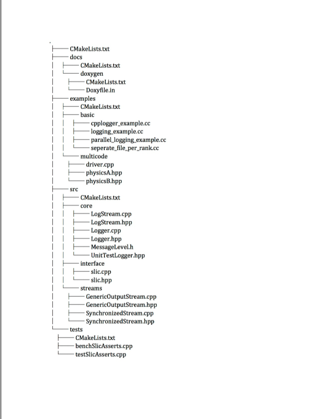

How to add a new Component to the Build System
==============================================
1. Create the folder for the new component, inside the components directory.

     `<https://lc.llnl.gov/stash/projects/ATK/repos/asctoolkit/browse/src/components>`_  

*  NOTES:  Create a python file to create a template for a new component.

2. Edit the **CMakeLists.txt** in the src/components directory. Use the **add_component** macro to add the new component. 

      **CMakeLists.txt file:** ::

         ## add components examples

         add_component(COMPONENT_NAME common DEFAULT_STATE ON)
         add_component(COMPONENT_NAME slic DEFAULT_STATE ON)
         add_component(COMPONENT_NAME meshapi DEFAULT_STATE ON)
         add_component(COMPONENT_NAME sidre DEFAULT_STATE ON)

3. Inside the **src/components/<component_name>** add a new **CMakeLists.txt** .
   Each component directory may also have **docs**, **examples**, **src** and **tests** directories. 

    **Example: slic directory structure:**

4. Optionally each component can have its own **uncrustify.cfg** file detailing formatting choices for the code.

    **Details of Master 'CMakeLists.txt:** ::

 
             ################################
             # Datastore
             ################################
               project(sidre)

             ################################
             # Add the sidre sources
             ################################
                add_subdirectory(src)

             ################################
             # Add examples
             ################################
                if (BUILD_EXAMPLES)
                   add_subdirectory(examples)
                endif()

             ################################
             # Add tests
             ################################
                if (BUILD_TESTS)
                   add_subdirectory(tests)
                endif()

                add_code_check_targets(uncrustify.cfg)

             ################################
             # Add docs
             ################################
                if (BUILD_DOCS)
                   add_subdirectory(docs)
                endif()

             ################################
             # Create CMake importable
             # exports for all of our targets
             ################################
                install(EXPORT ${PROJECT_NAME}-targets DESTINATION lib/cmake)    

5. Create another **CMakeLists.txt** file in the *src* directory of the component. 
    This contains a list of the headers and sources.

6. Now create the **copy_headers_target** and the **make_library**  *targets* for the component.

7. Finally create the **install** target for the component.

