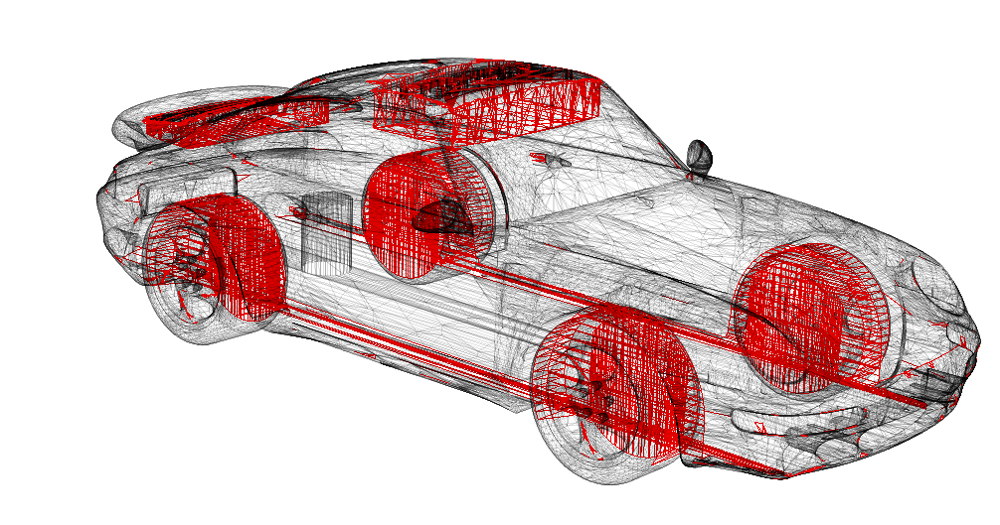

## Axom tutorial

This tutorial showcases several features of Axom by incrementally building up an application that checks for self-intersections and degeneracies among the triangles in a triangle mesh. The resulting application matches functionality from Axom's [mesh_tester utility](https://github.com/LLNL/axom/blob/develop/src/tools/mesh_tester.cpp).

A triangle mesh of a car with intersecting triangles highlighted in red

 

* [Lesson 00](lesson_00/README.md) provides a brief overview of Axom and develops a simple application against an installed version of Axom
* [Lesson 01](lesson_01/README.md) uses Axom to load an [STL triangle mesh](https://en.wikipedia.org/wiki/STL_(file_format)) and print out the number of triangles in the mesh. It uses Axom's logging component `slic` as well as functionality from its spatial querying component, `quest`.
* [Lesson 02](lesson_02/README.md) adds a naive algorithm that checks every pair of triangles in the mesh for self-intersections, showcasing computational geometry primitives and operations from Axom's `primal` component.
* [Lesson 03](lesson_03/README.md) ports this naive algorithm to [RAJA](https://github.com/llnl/raja) for performance-portable execution on available computing resources, using sequential (CPU), threaded (OpenMP) and GPU devices using `cuda` and `hip` backends.
* [Lesson 04](lesson_04/README.md) uses a spatial index from Axom's `spin` component to further accelerate our self-intersection algorithm.
